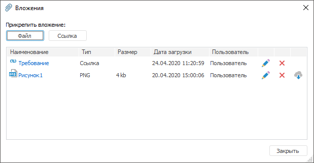
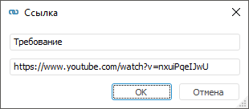

# Прикрепление вложений к ячейкам

Прикрепление вложений к ячейкам
-

# Прикрепление вложений к ячейкам

Для пояснения данных в ячейке таблицы доступно прикрепление вложений
 в виде файлов или ссылок. Для прикрепления вложений используйте диалог
 «Вложения».

Для открытия диалога «Вложения»
 выделите ячейку и:

	- нажмите кнопку  «Список
	 вложений» вкладки «Главная»
	 ленты инструментов;

	- выполните команду «Список
	 вложений» контекстного меню;

	- нажмите на пиктограмму  в ячейке, если к
	 ней уже были прикреплены вложения.

Примечание.
 Прикрепление вложений к ячейкам недоступно при работе с [глобальным кешем](UiNav.chm::/02_Navigator/Cache_In_Blob.htm).

Кнопка  «Список вложений» и команда «Список вложений»
 доступны если:

	- в качестве источника использован [стандартный
	 куб](UiNavObj.chm::/Cube/CreateCube/Master_Standart/UiMd_Cube_CreateCube_Master_Standart_2.htm#attachment), [представление-куб](UiNavObj.chm::/Cube/CreateCube/Master_Conception/UiMd_Cube_CreateCube_Master_Conception.htm)
	 или [виртуальный
	 куб](UiNavObj.chm::/Cube/CreateCube/Master_Virtual_Cube/UiMd_Cube_CreateCube_Master_Virtual.htm), настроенный для привязки вложений;

	- выделена одна ячейка, принадлежащая области данных, не отображающая
	 значения [вычисляемых
	 элементов](Work_with_dimensions/Edited_elements.htm), [агрегированных
	 значений фиксированных измерений](DataEntryForms.chm::/desktop/Table/Table_Area_Structure.htm#aggregation) или [итогов](Totals/Calculate_totals.htm);

	- у пользователя есть права на чтение.

В диалоге указаны все вложения, прикрепленные к данной ячейке. Прикрепить
 можно любое количество вложений.

Для каждого вложения указаны:

	- Наименование. Наименование
	 прикрепленного файла или заданное наименование ссылки;

	- Тип. Формат файла или
	 ссылка;

	- Размер. Размер для файла
	 в килобайтах;

	- Дата загрузки. Дата
	 прикрепления или обновления вложения;

	- Пользователь. [Полное
	 наименование пользователя](Admin.chm::/03_Admin/Users/Admin_UserProp_Common.htm#discription), который создал вложение.
	 Если полное наименование не задано, отображается [имя
	 пользователя](Admin.chm::/03_Admin/Users/Admin_UserProp_Common.htm#discription).

Для закрытия диалога нажмите кнопку «Закрыть».

Операции с вложениями:

[Добавление
 вложения](javascript:TextPopup(this))

	Для выполнения операции у пользователя должны быть [права](Admin.chm::/03_Admin/Admin_AdminObjects.htm)
	 на чтение и редактирование.

	Для прикрепления файла нажмите кнопку «Файл»,
	 будет открыт стандартный диалог выбора файла. Укажите файл и нажмите
	 кнопку «Открыть». Размер файла
	 не должен превышать 200 МБ. При попытке загрузить файл большего размера
	 будет выведено сообщение о превышении допустимого размера файла. При
	 прикреплении файла размером от 20 до 200 МБ будет выведено сообщение
	 о том, что загрузка файла займет время. Для продолжения загрузка файла
	 нажмите «Да», для отмены прикрепления
	 файла нажмите «Нет». Для отмены
	 выведения данного сообщения в рамках текущей сессии установите флажок
	 «Больше не показывать это сообщение».

	Для прикрепления ссылки нажмите кнопку «Ссылка»,
	 будет открыт диалог «Ссылка»:

	

	Укажите:

		- Наименование. Наименование
		 вложения должно нести смысловую нагрузку. Поле не обязательно
		 для заполнения. Если наименование не задано, то вместо наименования
		 в диалоге «Вложения» будет
		 отображаться ссылка;

		- Адрес ссылки.

[Открытие вложения](javascript:TextPopup(this))

	Для выполнения операции у пользователя должны быть [права](Admin.chm::/03_Admin/Admin_AdminObjects.htm)
	 на чтение.

	Для открытия файла или перехода по ссылке щёлкните по наименованию.

	В настольном приложении все файлы открываются автоматически. Файл
	 открывается при помощи приложения, установленного в операционной системе.
	 Если приложение не найдено, то будет предложено выбрать приложение
	 вручную.

	В веб-приложении все файлы скачиваются в папку загрузок.

[Редактирование
 вложения](javascript:TextPopup(this))

	Для выполнения операции у пользователя должны быть [права](Admin.chm::/03_Admin/Admin_AdminObjects.htm)
	 на чтение и редактирование.

	Для редактирования вложения нажмите кнопку .
	 Будет открыт стандартный диалог выбора файла или диалог «Ссылка».

[Сохранение файла](javascript:TextPopup(this))

	Для выполнения операции у пользователя должны быть [права](Admin.chm::/03_Admin/Admin_AdminObjects.htm)
	 на чтение.

	Для сохранения файла на локальный компьютер нажмите кнопку . Будет
	 открыть стандартный диалог для выбора пути сохранения файла. Указанный
	 путь сохраняется и будет использован при последующих сохранениях.

[Удаление вложения](javascript:TextPopup(this))

	Для выполнения операции у пользователя должны быть [права](Admin.chm::/03_Admin/Admin_AdminObjects.htm)
	 на чтение и редактирование.

	Для удаления вложения нажмите кнопку .

Операции с вложениями не поддерживаются в истории операций и кнопки
 / на панели
 быстрого доступа остаются недоступными.

Операции с вложениями не влияют на активность кнопки  «Сохранить изменения».

После добавления вложения в ячейке будет отображаться пиктограмма . При
 наведении курсора на пиктограмму она становится активной.

См. также:

[Таблица](Table.htm)

		Справочная
		 система на версию 10.9
		 от 18/08/2025,
		 © ООО «ФОРСАЙТ»,
