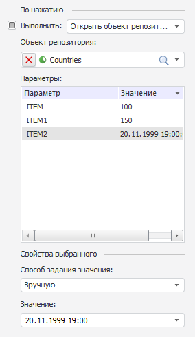

# Открытие объекта репозитория с параметрами

Открытие объекта репозитория с параметрами
-

# Открытие объекта репозитория с параметрами

Если при нажатии на [гиперссылку](Working_with_hyperlinks.htm)
 назначено открытие объекта репозитория, то при указании объекта с параметрами
 на вкладке «Расшифровка» боковой
 панели станут доступны следующие настройки:

Примечание.
 При нажатии на [элемент измерения](Working_with_hyperlinks.htm),
 для которого настроено открытие объекта с параметрами, должен открываться
 объект с учетом заданных значений параметров.

В поле «Параметры» отображается
 список всех параметров указанного оъекта.

Если параметру было задано значение по умолчанию, то оно будет отображаться
 в столбце «Значение».

Значение параметров может быть изменено или определено заново.

Примечание.
 Возможность передачи параметров в отчет реализована только для [параметров
 отчета](UiReport.chm::/desktop/Reports/UiReport_Reports_Param.htm), передавать значения в параметры источника возможности
 нет.

В зависимости от способа задания определяется значение параметра:

	- Значение атрибута. В
	 качестве значения параметра будет передаваться значение выбранного
	 атрибута измерения/уровня;

	- Параметр отчета. В качестве
	 значения параметра будет передаваться значение выбранного параметра
	 открытого отчета;

	- Параметр источника данных.
	 В качестве значения параметра будет передаваться значение выбранного
	 параметра источника отчета. Данный пункт отсутствует в регламентном
	 отчете;

	- Вручную. В качестве
	 значения параметра задается пользовательское значение.

См. также:

[Расшифровка
 элементов измерения](Working_with_hyperlinks.htm) | [Подстановки расшифровки](Hyperlinks_sub.htm)

		Справочная
		 система на версию 10.9
		 от 18/08/2025,
		 © ООО «ФОРСАЙТ»,
