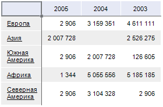
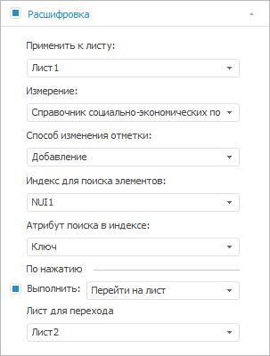
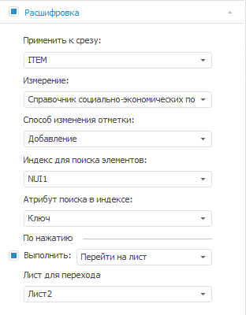

# Расшифровка элементов измерения

Расшифровка элементов измерения
-

# Расшифровка элементов измерения

Элементы измерений, имеющие дочерние элементы, по умолчанию отображаются
 в виде гиперссылки.

Примечание.
 В инструменте «Отчёты» по умолчанию
 гиперссылки отображаются как простой текст.

Пример таблицы с гиперссылками:

Примечание.
 При переходе по гиперссылке можно настроить действие, отличное от действия
 по умолчанию.

## Отображение/скрытие гиперссылок
 в таблице

Для отображения/скрытия гиперссылок снимите/установите флажок «Гиперссылки как простой текст» на
 вкладке «[Параметры](../Parameters/Parameters.htm)»
 боковой панели.

[Для отображения
 вкладки «Параметры»](javascript:TextPopup(this))

		- Выделите одну или несколько ячеек таблицы.

		- Перейдите в группу вкладок «Таблица»
		 боковой панели и выберите вкладку «Параметры».

## Действие при переходе по гиперссылке

По умолчанию при нажатии на гиперссылку осуществляется [переход
 к элементам дочернего уровня иерархии](../Working_with_table_data/Drill_down.htm). При переходе по гиперссылке
 также можно настроить следующие действия:

	- смена отметки;

	- переход на другой лист/к другому объекту;

	- выделение ячеек;

	- открытие ссылки/файла/объекта репозитория.

Примечание.
 Для измерения и для всех его уровней можно настроить различные варианты
 расшифровки.

Для выбора действия, которое будет происходить при переходе по гиперссылке:

	- Перейдите на вкладку боковой панели «Расшифровка».

[Для
 отображения вкладки](javascript:TextPopup(this))

			- Выделите [измерение](../Work_with_dimensions/Select_dimensions_elements_in_table.htm#select_dim)
			 или [его
			 уровень](../Work_with_dimensions/Select_dimensions_elements_in_table.htm#select_level) в таблице. Для этого:

				- в раскрывающемся списке на вкладке ленты «Формат» в группе «Текущий фрагмент» выберите
				 пункт с названием измерения или его уровня;

				- выделите диапазон, включающий ячейку из шапки или
				 боковика таблицы, нажмите на кнопку 
				 и выберите пункт с названием измерения или его уровня.

			- Перейдите в группу вкладок «Измерение»/«Уровень» боковой панели
			 и выберите вкладку «Расшифровка».

	 Вкладка «Расшифровка» в экспресс-отчёте Вкладка «Расшифровка» в регламентном отчёте

		

		

	- Для активации настроек на вкладке «Расшифровка»
	 установите флажок в заголовке вкладки.

	- В экспресс-отчёте из раскрывающегося списка «Применить
	 к листу» выберите лист отчёта, к которому будут применяться
	 настройки. В аналитической панели и регламентном отчёте из раскрывающегося
	 списка «Применить к срезу»
	 выберите срез отчёта, к которому будут применяться настройки.

	- Для изменения отметки в измерении при переходе на другой лист
	 отчёта или открытии документа выполните следующие действия:

		- Из раскрывающегося списка «Измерение»
		 выберите измерение, в котором будет изменяться отметка при переходе
		 по гиперссылке. Список содержит все измерения, на которых построена
		 таблица данных.

		- Из раскрывающегося списка «Способ
		 изменения отметки» выберите один из вариантов изменения
		 отметки в выбранном измерении:

			- Не выбран. Отметка
			 измерения изменена не будет;

			- Замена. Вся
			 имеющаяся отметка в измерении будет снята и выделен только
			 элемент, гиперссылка которого была нажата;

			- Инвертирование.
			 В измерении будет изменена на противоположную отметка элемента,
			 гиперссылка которого была нажата;

			- Добавление.
			 В измерении будет отмечен элемент, гиперссылка которого была
			 нажата, только если ранее по данному элементу отметка отсутствовала.

		- Из раскрывающегося списка «Индекс
		 для поиска элементов» выберите индекс измерения, выбранного
		 в поле «Измерение». Данный
		 индекс будет использоваться для поиска элемента, гиперссылка которого
		 была нажата. По умолчанию выбран пункт «Не
		 определено», при этом индекс выбирается автоматически.

		- Из раскрывающегося списка «Атрибут
		 поиска в индексе» выберите атрибут измерения, для которого
		 производится настройка расшифровки. По значению данного атрибута
		 будет производиться поиск значения атрибута индекса, выбранного
		 в списке «Индекс для поиска элементов».
		 По умолчанию будет «Не определено»,
		 при этом атрибут выбирается автоматически.

	- Установите флажок «Выполнить»,
	 чтобы был доступен выбор действия, которое будет выполняться при нажатии
	 на гиперссылку элемента измерения:

		- Открыть файл. При
		 нажатии на гиперссылку будет открыт выбранный файл. В тексте доступно
		 использование [подстановок](Hyperlinks_sub.htm);

Примечание.
 Действие доступно только в настольном приложении.

		- Открыть ссылку.
		 При нажатии на гиперссылку произойдет переход по заданной ссылке. В
		 тексте доступно использование [подстановок](Hyperlinks_sub.htm);

Примечание.
 При работе в веб-приложении ссылка должна начинаться с «http://» или «https://».

		- Перейти на лист.
		 При нажатии на гиперссылку произойдет переход на выбранный лист.
		 Действие отсутствует в аналитической панели;

		- Показать диапазон ячеек.
		 При нажатии на гиперссылку произойдет выделение выбранных ячеек.
		 Доступны следующие варианты определения диапазона ячеек:

			- для описания прямоугольной области задайте адрес верхней
			 левой и нижней правой ячейки через символ «:», например: «A1:B3»;

			- для описания одной ячейки введите ее адрес, например:
			 «C3»;

			- для описания комбинированной области укажите несколько
			 областей через символ «;», например: «A1:B3;C3»;

		- Показать объект.
		 При нажатии на гиперссылку произойдет переход к выбранному объекту
		 отчёта. Действие доступно только в настольном приложении;

		- Открыть объект репозитория.
		 При нажатии на гиперссылку будет открыт выбранный объект репозитория.
		 Существует возможность указать [объект
		 репозитория с параметрами](Open_objects_with_params.htm). Также, используя язык Fore, можно
		 задать [подстановку](Hyperlinks_sub.htm) для открытия
		 различных объектов репозитория, ключи или идентификаторы которых
		 хранятся в значениях атрибута справочника;

		- Выполнить функцию.
		 При нажатии на гиперссылку выполняется функция. Действие присутствует
		 только в регламентном отчёте.

		Задайте параметры функции:

			- Модуль. Выберите
			 модуль/форму среды разработки, [подключенный
			 к регламентному отчёту](UiReport.chm::/desktop/Reports/Event/UiReport_Reports_Event.htm);

			- Функция. Укажите
			 имя процедуры/функции, которую необходимо запустить в настольном
			 приложении при нажатии на гиперссылку;

			- JS-функция.
			 Укажите имя js-функции, которую необходимо запустить в веб-приложении
			 при нажатии на гиперссылку. Это может быть как системная,
			 так и пользовательская js-функция.

Примечание.
 Использование js-функции оставлено для совместимости с предыдущими версиями.

В результате выполнения шагов будет настроено действие, выполняемое
 при переходе по гиперссылке.

См. также:

[Выделение
 элементов измерения в таблице](../Work_with_dimensions/Select_dimensions_elements_in_table.htm)

		Справочная
		 система на версию 10.9
		 от 18/08/2025,
		 © ООО «ФОРСАЙТ»,
