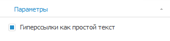
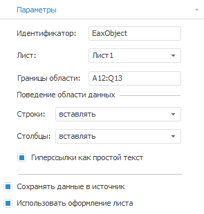
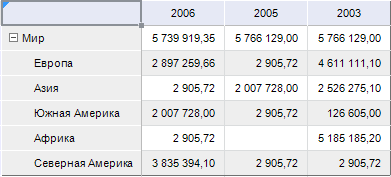
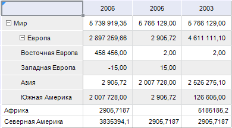

# Общие параметры таблицы

Общие параметры таблицы
-

# Общие параметры таблицы

Общие параметры таблицы данных настраиваются на вкладке «Параметры»
 боковой панели.

[Для открытия
 вкладки «Параметры»](javascript:TextPopup(this))

		- Выделите одну или несколько ячеек таблицы.

		- Перейдите в группу вкладок «Таблица»
		 и выберите вкладку «Параметры».

Вкладка «Параметры» в экспресс-отчете
 и аналитической панели:

Вкладка «Параметры» в регламентном
 отчете:

## Отображение гиперссылок как простого текста

По умолчанию наименования элементов отображаются без гиперссылок в виде
 простого текста.

Для отображения элементов в виде гиперссылок снимите флажок «Гиперссылки
 как простой текст» на вкладке «Параметры»
 боковой панели.

Примечание.
 В виде гиперссылок отображаются только те элементы измерения, которые
 имеют дочерние элементы.

По умолчанию при нажатии на гиперссылку будет выполнен [переход
 к элементам дочернего уровня иерархии](../Working_with_table_data/Drill_down.htm). Для изменения действия, выполняемого
 при нажатии на гиперссылку, используйте вкладку «[Расшифровка](../Hyperlinks/Working_with_hyperlinks.htm#hyperlink_click_actions)»
 на боковой панели. Вкладка доступна, если выделен измерение или уровень.

## Параметры таблицы данных в регламентном
 отчете

В регламентном отчете для таблицы данных можно задать следующие общие
 параметры:

	- Идентификатор. Идентификатор
	 таблицы данных как объекта на листе;

	- Лист. Список листов
	 доступных для перемещения табличных данных. По умолчанию отображается
	 наименование табличного листа, на котором расположена область данных;

	- Границы области. Диапазон
	 ячеек таблицы данных;

	- Поведение области данных.
	 Поведение строк и столбцов при добавлении новых элементов в таблицу:

		- Фиксированное. Количество
		 строк/столбцов таблицы данных будет фиксированным (определенным
		 в параметре «Границы области»)
		 и при отметке элементов измерения изменяться не будет;

		- Захват смежных.
		 При увеличении количества строк/столбцов таблицы данных строки/столбцы,
		 не входящие в таблицу, будут перенесены в смежные строки/столбцы
		 табличного листа;

[Пример](javascript:TextPopup(this))

	До добавления элементов:

	

	После добавления элементов:

	

		- Вставка. При увеличении
		 количества строк таблицы данных на лист отчета будет добавлено
		 необходимое количество строк. Тем самым информация, расположенная
		 в строках ниже, будет смещена вниз;

	- Сохранять данные в источник.
	 Установка флажка позволяет сохранять измененные данные таблицы в источник
	 данных. Если флажок снят, то [сохранить
	 измененные данные в источник](../Working_with_table_data/Edit_and_save_data.htm) невозможно;

	- Использовать оформление листа.
	 Если флажок установлен, оформление, применяемое для табличного листа
	 будет применяться и для расположенной на нем таблицы данных. Если
	 флажок снят, изменение оформления табличного листа не будет влиять
	 на оформление таблицы данных.

[Пример](javascript:TextPopup(this))

	Флажок установлен:

	

	Флажок снят:

	

См. также:

[Работа с таблицей данных](UiAnalyticalArea.chm::/Table.htm)

		Справочная
		 система на версию 10.9
		 от 18/08/2025,
		 © ООО «ФОРСАЙТ»,
