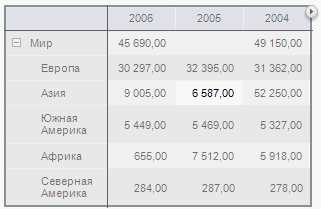
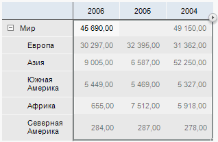
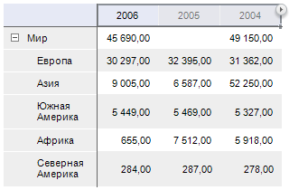
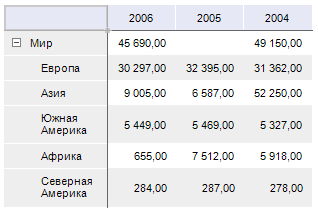
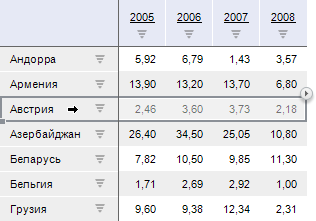

# Выделение элементов таблицы

Выделение элементов таблицы
-

# Выделение элементов таблицы

Таблица данных состоит из нескольких основных [элементов](Table.htm),
 каждый из которых имеет собственные настройки. Если выделен элемент таблицы,
 настройки, установленные на боковой панели и на вкладке ленты «Формат»,
 будут применяться к выделенному элементу. При выделении отдельной ячейки
 настройки будут применяться ко всей таблице.

Примечание.
 При выделении элемента таблицы группа вкладок боковой панели «Таблица»
 будет переименована в соответствии с выделенным элементом:

   • Заголовок.
 При выделении боковика или шапки;

   • Уголок. При
 выделении уголка;

   • Таблица. При
 выделении ячейки с данными или всей таблицы;

   • Данные. При
 выделении всех ячеек с данными;

   • Формат. При
 выделении столбца или строки целиком;

   • Уровень. При
 выделении наименований элементов уровня измерения;

   • Измерение.
 При выделении наименований элементов измерения;

   • Итоги. При
 выделении ячеек, столбцов или строк итогов.

В инструменте«[Анализ временных рядов](UiDw.chm::/UiDw_Title.htm)» для работы с таблицей и со
 всеми её элементами используйте группу вкладок «Формат».
 Данная группа не изменяет своего названия в зависимости от выделенного
 элемента таблицы.

Аналогичным образом осуществляется [выделение
 измерений и уровней](Work_with_dimensions/Select_dimensions_elements_in_table.htm).

## Выделение всей таблицы

Для выделения всей таблицы выполните одно из действий:

	- выделите любую ячейку таблицы данных, нажмите на кнопку 
	 и выберите пункт «Вся таблица»;

	- в раскрывающемся списке на вкладке ленты «Формат»
	 в группе «Текущий фрагмент»
	 выберите пункт «Вся таблица»;

	- выделите любую ячейку и нажмите сочетание клавиш CTRL+A.

После выполнения действия будет выделена вся таблица данных:

## Выделение данных

Для выделения данных выполните одно из действий:

	- выделите любую ячейку с данными, нажмите на кнопку  и выберите пункт «Данные»;

	- в раскрывающемся списке на вкладке ленты «Формат»
	 в группе «Текущий фрагмент»
	 выберите пункт «Данные».

После выполнения действия будут выделены данные таблицы:

## Выделение шапки

Для выделения шапки выполните одно из действий:

	- выделите любую ячейку таблицы данных, нажмите на кнопку 
	 и выберите пункт «Шапка»;

	- в раскрывающемся списке на вкладке ленты «Формат»
	 в группе «Текущий фрагмент»
	 выберите пункт «Шапка».

После выполнения действия будет выделена шапка таблицы:

При повторном нажатии на кнопку  будет доступно [выделение
 измерения](Work_with_dimensions/Select_dimensions_elements_in_table.htm) установленного по столбцам.

## Выделение боковика

Для выделения боковика выполните одно из действий:

	- выделите любую ячейку таблицы данных, нажмите на кнопку 
	 и выберите пункт «Боковик»;

	- в раскрывающемся списке на вкладке ленты «Формат»
	 в группе «Текущий фрагмент»
	 выберите пункт «Боковик».

После выполнения действия будет выделен боковик таблицы:

При повторном нажатии на кнопку  будет доступно [выделение
 измерения](Work_with_dimensions/Select_dimensions_elements_in_table.htm) установленного по строкам.

## Выделение уголка

Для выделения уголка выполните одно из действий:

	- нажмите на [уголок](Table.htm) таблицы;

	- в раскрывающемся списке на вкладке ленты «Формат»
	 в группе «Текущий фрагмент»
	 выберите пункт «Уголок».

После выполнения действия будет выделен уголок таблицы:

## Выделение строки/столбца

Для выделения отдельного элемента таблицы выделите его нажав на заголовок
 элемента в шапке/боковике:

См. также:

[Работа с таблицей данных](UiAnalyticalArea.chm::/Table.htm)
 | [Оформление
 таблицы и ее элементов](TableView/Formatting/Formatting_table.htm)
 | [Размещение
 элементов таблицы](TableView/Layout/Layout.htm)

		Справочная
		 система на версию 10.9
		 от 18/08/2025,
		 © ООО «ФОРСАЙТ»,
