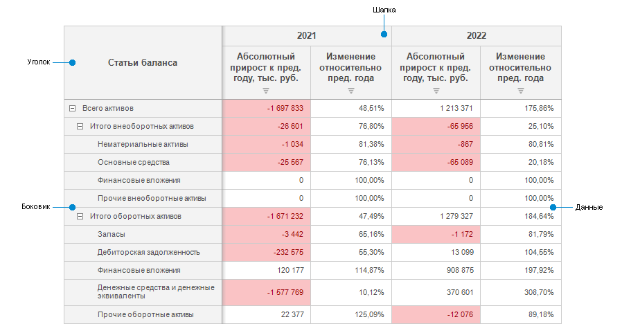

# Таблица

Таблица
-

# Таблица

Таблица данных представляет собой электронную таблицу, построенную на
 основе [источника
 данных](uiexpress.chm::/purpose/UiExpress_Tree_Multivariate_Object.htm), и используется в следующих инструментах продукта
 «Форсайт. Аналитическая платформа»: «[Аналитические
 запросы (OLAP)](UIExpress.chm::/purpose/UiExpress_Purpose.htm)», «[Аналитические
 панели](UIAdhoc.chm::/UiAdhoc_Purpose.htm)», «[Отчёты](UIReport.chm::/UiReport_purpose.htm)»,
 «[Анализ временных рядов](UiDw.chm::/UiDw_Title.htm)».

Структура таблицы состоит из нескольких основных элементов, каждый из
 которых имеет собственные настройки:

Элементы таблицы:

	- [Уголок](TableView/Corner_show_dims.htm).
	 Верхняя левая ячейка таблицы, позволяющая отображать наименования
	 измерений по строкам или столбцам;

	- [Боковик](Select_areas.htm#select_sidehead).
	 Элемент таблицы, который отображает наименования элементов измерения,
	 размещенного по строкам;

	- [Шапка](Select_areas.htm#select_heading).
	 Элемент таблицы, который отображает наименования элементов измерения,
	 размещенного по столбцам;

	- [Данные](Select_areas.htm#select_data).
	 Элемент таблицы, состоящий из ячеек с данными.

Для настройки одного из элементов таблицы необходимо его [выделить](Select_areas.htm).

Примечание.
 При выделении элемента таблицы группа вкладок боковой панели «Таблица»
 будет переименована в соответствии с выделенным элементом: если выделены
 боковик или шапка, вкладка будет называться «Заголовок»,
 если выделен уголок - «Уголок»,
 если выделены данные - «Данные».

## Настройка таблицы данных

[Общие
 параметры таблицы](javascript:TextPopup(this))

	В экспресс-отчете доступна [настройка
	 общих параметров таблицы данных](Parameters/Parameters.htm) как объекта на табличном листе.

[Настройка
 внешнего вида таблицы](javascript:TextPopup(this))

	[Автоподгонка размера
	 ячеек](TableView/Autofit_cells.htm)

	[Масштабирование таблицы](TableView/Zoom.htm)

	[Отображение легенды метрик](TableView/Legend.htm)

	[Отображение наименований
	 измерений в уголке таблицы](TableView/Corner_show_dims.htm)

	[Отображение разметки таблицы](TableView/Mark_up.htm)

	[Оформление таблицы
	 и ее элементов](TableView/Formatting/Formatting_table.htm)

	[Поворот таблицы](TableView/Rotate_table.htm)

	[Размещение элементов таблицы](TableView/Layout/Layout.htm)

	[Отображение сносок в таблице](TableView/Table_footnotes.htm)

[Работа
 с данными таблицы](javascript:TextPopup(this))

	[Детализация и обобщение](Working_with_table_data/Drill_down.htm)

	[Изменение
	 и сохранение данных](Working_with_table_data/Edit_and_save_data.htm)

	[Поиск и замена](Working_with_table_data/Search.htm)

	[Сортировка](Working_with_table_data/Sorting_table_data.htm)

	[Исключение данных
	 из таблицы](Working_with_table_data/Delete_data.htm)

	[Фильтрация](Working_with_table_data/Filtering.htm)

	[Отображение прав
	 доступа к данным в виде пиктограмм](TableView/Formatting/Cells_icons.htm)

	[Копирование и вставка
	 данных из буфера обмена](Working_with_table_data/Insert.htm)

[Работа
 с гиперссылками в таблице](javascript:TextPopup(this))

	[Отображение/скрытие
	 гиперссылок в таблице](Hyperlinks/Working_with_hyperlinks.htm#show_hide_hyperlinks)

	[Действия
	 при переходе по гиперссылке](Hyperlinks/Working_with_hyperlinks.htm#hyperlink_click_actions)

[Работа
 с измерениями в таблице](javascript:TextPopup(this))

	[Выделение
	 элементов измерения в таблице](Work_with_dimensions/Select_dimensions_elements_in_table.htm)

	[Настройка метрик
	 для таблицы](Work_with_dimensions/Table_metrics.htm)

	[Размещение
	 элементов измерения](TableView/Layout/Layout_Dim.htm#dimension_layout)

	[Настройка вычисляемых
	 элементов](Work_with_dimensions/Edited_elements.htm)

	[Фиксация элементов измерения
	 в таблице](Work_with_dimensions/Fixing.htm)

	[Работа с гиперссылками
	 в таблице](Hyperlinks/Working_with_hyperlinks.htm)

	[Изменение
	 отметки из таблицы](Working_with_table_data/Change_selection.htm)

[Анализ
 данных в таблице](javascript:TextPopup(this))

	[Преобразование данных](Analysis/Convert_data.htm)

	[Ранжирование данных](Analysis/Ranking_data.htm)

	[Условное форматирование](Analysis/Conditional_formatting.htm)

	[Индикатор роста](Analysis/Growth_rate.htm)

	[Спарклайны](Analysis/Sparklines.htm)

	[Распределение](Analysis/distribution.htm)

	[Статистические характеристики](Analysis/Statistics.htm)

	[Валидация данных](Analysis/Data_validation.htm)

	[Расширенная аналитика](Analysis/AdvancedAnalytics.htm)

	[Интеллектуальный
	 анализ данных](DataMining.chm::/DataMining_Starting.htm)

[Расчет
 итоговых значений](javascript:TextPopup(this))

	[Отображение итоговых
	 значений](Totals/Calculate_totals.htm#show_totals)

	[Параметры
	 расчета итогов](Totals/Calculate_totals.htm#totals_parameters)

	[Оформление
	 данных и заголовков итогов](Totals/Calculate_totals.htm#formatting_totals)

	[Скрытие итогов](Totals/Calculate_totals.htm#hide_totals)

[Прикрепление
 вложений к ячейкам](javascript:TextPopup(this))

	Для пояснения данных в ячейке таблицы доступно [прикрепление
	 вложений](Attachments.htm) в виде файлов или ссылок.

См. также:

[Общие
 параметры таблицы](Parameters/Parameters.htm)

		Справочная
		 система на версию 10.9
		 от 18/08/2025,
		 © ООО «ФОРСАЙТ»,
