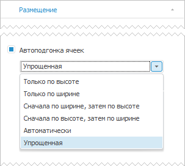
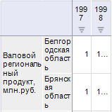
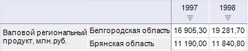
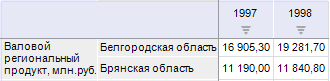
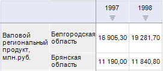
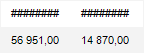

# Автоподгонка размера ячеек

Автоподгонка размера ячеек
-

# Автоподгонка размера ячеек

Автоподгонка используется для оптимального подбора размера ячеек. Настройка
 автоподгонки осуществляется при установленном флажке «Автоподгонка
 ячеек» на вкладке «[Размещение](Layout/Layout.htm#all_table_layout)»
 [боковой
 панели](GetStarted.chm::/Interface/Interface_Description.htm#side_panel):

Автоподгонка ячеек содержит настройки:

[Только по высоте](javascript:TextPopup(this))

	Устанавливается минимальная требуемая высота для отображения текста
	 самой высокой ячейки в строке таблицы:

	

[Только по
 ширине](javascript:TextPopup(this))

	Ширина столбца устанавливается минимально требуемой для отображения
	 текста самой длинной ячейки в столбце таблицы:

	

[Сначала
 по ширине, затем по высоте](javascript:TextPopup(this))

	Сначала выполняется автоподгонка размера столбцов, затем строк:

	

[Сначала
 по высоте, затем по ширине](javascript:TextPopup(this))

	Сначала выполняется автоподгонка размера строк, затем столбцов:

	

[Автоматически](javascript:TextPopup(this))

	Автоподгонка ячеек выполняется автоматически согласно установленным
	 параметрам:

		- Строк текста в ячейке не
		 более. При установленном флажке ширина столбца подбирается
		 таким образом, чтобы для отображения текста самой длинной строки
		 в столбце ячейки требовалось не более N строк, указанных в соответствующем
		 редакторе чисел. Если невозможно подобрать необходимую ширину
		 столбца, то заголовок в нем обрезается после указанного числа
		 строк. По умолчанию флажок установлен, число строк - 8;

		- Столбцов в таблице не менее.
		 При установленном флажке в таблице данных всегда будет отображаться
		 минимум N столбцов, указанных в соответствующем редакторе чисел.
		 По умолчанию флажок установлен, число столбцов - 1.

[Упрощенная](javascript:TextPopup(this))

	Автоподгонка ширины и высоты ячеек выполняется согласно установленным
	 настройкам:

		- Максимальная
		 ширина боковика.
		 Ширина боковика определяется исходя из самой длинной строки. Если
		 её длина превышает максимальную ширину боковика, то в качестве
		 ширины берется максимальное значение ширины боковика. По умолчанию
		 максимальная ширина боковика принимает значение 500px.

		Если ширина боковика изменена вручную, то установленный размер
		 учитывается при дальнейшей автоподгонке;

		- Максимальная
		 высота строки. Высота строки определяется с учетом подобранной
		 ширины боковика. Если ширина боковика не позволяет разместить
		 самую длинную строку в одну строку, то строка размещается в несколько
		 строк. Если высота строки больше максимальной высоты строки, то
		 в качестве высоты берется максимальное значение высоты строки.
		 По умолчанию максимальная высота строки принимает значение 50px.

	Упрощенная автоподгонка применяется для 25 строк/столбцов из начала,
	 середины и конца таблицы.

	Высота и ширина шапки определяется автоматически исходя из самого
	 длинного слова или значения в подгоняемой ячейке с переносом по словам.

	Если текст в шапке или боковике не полностью входит в ячейку, то
	 часть текста, которая не поместилась, заменяется многоточием.

По умолчанию используется упрощенная автоподгонка ячеек.

Примечание.
 Для [повышения
 производительности](setup.chm::/01_SysReq/Performance_Recommendations.htm) продукта «Форсайт. Аналитическая платформа»
 не рекомендуется использовать автоподгонку ячеек. Можно задать высоту
 ячейки вручную с помощью свойства [ITabSheet.DefaultHeight](TabSheet.chm::/Interface/ITabSheet/ITabSheet.DefaultHeight.htm),
 ширину ячейки - [ITabSheet.DefaultWidth](TabSheet.chm::/Interface/ITabSheet/ITabSheet.DefaultWidth.htm).
 Размер ячеек будет использоваться по умолчанию при создании новых строк
 и столбцов.

## Особенности автоподгонки размера ячеек

При использовании автоподгонки размера ячеек учитывайте следующие особенности:

	- если после автоподгонки значение не полностью входит в ячейку,
	 то оно заменяется решетками:

Для отображения значения измените ширину
 ячейки вручную.

	- если в таблице содержатся скрытые [строки](UiReport.chm::/desktop/Table/OperationRow/UiReport_Table_Row.htm#hiding_rows)
	 и [столбцы](UiReport.chm::/desktop/Table/OperationColumn/UiReport_Table_Column.htm#hiding_columns),
	 то после автоподгонки размеры скрытых ячеек не изменяются;

	- если в таблице содержатся [свернутые](Layout/Layout_Dim.htm#expander)
	 экспандеры, то после автоподгонки размеры скрытых ячеек дочерних элементов
	 экспандеров не изменяются.

См. также:

[Размещение
 элементов таблицы](Layout/Layout.htm)

		Справочная
		 система на версию 10.9
		 от 18/08/2025,
		 © ООО «ФОРСАЙТ»,
