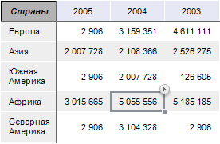
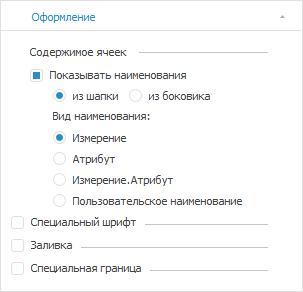

# Настройка содержимого уголка таблицы

Настройка содержимого уголка таблицы
-

# Настройка содержимого уголка таблицы

Уголок - это левая верхняя ячейка таблицы, не содержащая данные. Для
 уголка доступна настройка отображения содержимого: произвольного текста,
 наименований из шапки/боковика.

Пример уголка таблицы с наименованием «Страны»:

Примечание.
 Настройка содержимого уголка таблицы доступна только в [экспресс-отчёте](UIExpress.chm::/purpose/UiExpress_Purpose.htm),
 [аналитической
 панели](UIAdhoc.chm::/UiAdhoc_Purpose.htm) и [регламентном
 отчёте](UIReport.chm::/UiReport_purpose.htm).
 Для регламентного отчёта в веб-приложении будет отображаться содержимое
 уголка, настроенное в настольном приложении.

Для настройки содержимого уголка таблицы:

	- [Выделите уголок](../Select_areas.htm#select_corner).

	- Выполните одно из действий:

		- перейдите на вкладку «Оформление» в группе вкладок
		 «Уголок» на боковой панели:

		- используйте контекстное меню уголка.

	- Настройте отображение содержимого уголка:

		- [произвольный
		 текст](Corner_show_dims.htm#custom_text);

		- [наименования
		 из шапки/боковика](Corner_show_dims.htm#heading_sidehead).

	- Настройте [форматирование](Corner_show_dims.htm#formatting)
	 содержимого уголка при необходимости.

После выполнения действий содержимое уголка таблицы будет настроено.

Для скрытия содержимого уголка таблицы выберите пункт «Пусто»
 в контекстном меню уголка.

## Отображение произвольного текста

Для задания произвольного текста в уголке таблицы:

	- Выберите пункт «Произвольный
	 текст» в контекстном меню уголка.

	- Введите произвольный текст.

После выполнения действий в уголке таблицы будет содержаться заданный
 произвольный текст.

При создании [формул](uireport.chm::/desktop/organizational_management/Function/UiReport_Function.htm)
 непосредственно в уголке таблицы в регламентных отчетах их значения рассчитаны
 не будут, и формула будет отображена как простой текст.

## Отображение наименований из шапки/боковика

Для отображения наименований из шапки/боковика в уголке таблицы:

	- Выполните одно из действий:

		- установите флажок «Показывать
		 наименования» на вкладке «Оформление»
		 в группе вкладок «Уголок»
		 на боковой панели и выберите один из вариантов:

			- из шапки. Наименование
			 берется от измерений/атрибутов [шапки](../Select_areas.htm);

			- из боковика.
			 Наименование берется от измерений/атрибутов [боковика](../Select_areas.htm);

		- выберите один из пунктов контекстного
		 меню уголка: «Наименования из
		 шапки» или «Наименования
		 из боковика».

	- Выберите вид наименования:

		- Измерение. Отображается
		 наименование измерения;

		- Атрибут. Отображается
		 наименование атрибута измерения;

		- Измерение.Атрибут.
		 Отображается наименование измерения и атрибута;

		- Пользовательское наименование.
		 Отображается наименование, заданное пользователем. При включении
		 пользовательского наименования хотя бы для одной строки или столбца
		 в уголке, все ячейки уголка становятся редактируемыми. Наименование
		 настраивается для каждого столбца/строки уголка. При переключении
		 вида наименования на отображение атрибута/измерения пользовательское
		 наименование сбрасывается.

После выполнения действий в уголке таблицы будут содержаться наименования
 из шапки/боковика.

Если в таблице отображаются [спарклайны](../Analysis/Sparklines.htm)
 и/или [используется нумерация](Layout/Layout_Dim.htm#headings_layout),
 то в соответствующей ячейке уголка можно задать любое наименование для
 столбца/строки вне зависимости от выбранного вида наименования из шапки/боковика.

## Общие настройки форматирования

Для настройки форматирования текста уголка используйте флажки на вкладке
 «[Оформление](Corner_show_dims.htm#formatting_tab)»
 в группе вкладок «Уголок» на боковой
 панели:

	- Специальный шрифт. Параметры
	 [шрифта](Formatting/Font_settings.htm);

	- Заливка. Параметры [заливки](Formatting/formattingColor.htm);

	- Специальная граница.
	 Параметры отображения [границ](Formatting/formattingBorders.htm).

## Копирование содержимого уголка таблицы

Для копирования содержимого уголка таблицы выполните одно из действий:

	- выполните команду  «Копировать»
	 в контекстном меню уголка;

Примечание.
 В [аналитической
 панели](UIAdhoc.chm::/UiAdhoc_Purpose.htm) команда называется «Таблица
 > Копировать».

	- [выделите уголок](../Select_areas.htm#select_corner)
	 и используйте сочетание клавиш CTRL+C или CTRL+INS.

См. также:

[Размещение
 элементов таблицы](Layout/Layout.htm)

		Справочная
		 система на версию 10.9
		 от 18/08/2025,
		 © ООО «ФОРСАЙТ»,
