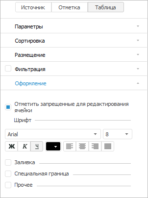
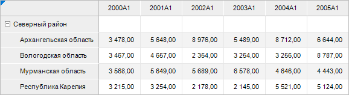
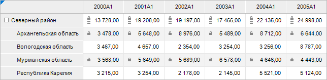

# Отображение пиктограмм в ячейках

Отображение пиктограмм в ячейках
-

# Отображение пиктограмм в ячейках

Для визуализации отсутствия возможности редактирования ячеек доступно
 включение отображения пиктограмм. Возможность редактирования отсутствует:

	- для ячеек, на которые у пользователя нет прав;

	- для ячеек [вычисляемых
	 элементов](../../Work_with_dimensions/Edited_elements.htm);

	- для агрегированых ячеек, у которых в качестве источника данных
	 использован куб с настроенной [агрегацией](uinavobj.chm::/Cube/CreateCube/Master_Standart/UiMd_Cube_CreateCube_Master_Standart_7.htm).

Отображение пиктограмм в ячейках доступно при работе с [регламентным отчетом](uireport.chm::/UiReport_purpose.htm),
 [формой
 ввода](DataEntryForms.chm::/DataEntryForms_Purpose.htm), [аналитической панелью](UIAdhoc.chm::/Launching.htm),
 [экспресс-отчетом](UIExpress.chm::/purpose/UiExpress_Organizational_Starting.htm).

Настройка прав доступа к объектам зависит от выбранного метода разграничения
 доступа и производится в [менеджере
 безопасности](Admin.chm::/03_Admin/Admin_AdminObjects.htm).
 Если пользователю доступно только чтение и/или запрещено изменение данных,
 то в отчётах пользователь будет видеть данные, но не сможет их редактировать.
 Если пользователю запрещено чтение и изменение данных, то ячейки будут
 пустые.

Настройка прав доступа к данным:

	- справочника НСИ определяется выбранным методом разграничения
	 доступа. В зависимости от выбранного метода различаются [способы настройки](Admin.chm::/03_Admin/Admin_ElementAccess.htm);

	- куба производится при создании [сегментов куба](UiNavObj.chm::/Cube/segments/segments.htm)
	 в веб-приложении и [объектов
	 полномочий](BPM.chm::/Desktop/Facility_Agreement/Create_Authorization_Object.htm) в настольном приложении;

	- базы данных временных рядов производится в окне «[Права
	 доступа к данным](Admin.chm::/03_Admin/DataAccess/Admin_Data_Access_Right.htm)».
	 Для открытия окна:

		- нажмите кнопку «Права доступа
		 к данным» на вкладке «[Дискреционный
		 контроль](admin.chm::/03_Admin/Admin_AdminObjects_Discretionary.htm#data_access_permissions)» окна «[Параметры
		 управления доступом](Admin.chm::/03_Admin/Admin_AdminObjects.htm)» в менеджере безопасности;

		- выполните команду «Права
		 доступа» контекстного меню объекта в навигаторе объектов.

Для включения отображения пиктограмм выделите таблицу
 и:

	- установите флажки «Отображать
	 пиктограммы для вычисляемых ячеек» и «Отображать
	 права доступа в виде пиктограмм» группы «Параметры»
	 панели параметров для [регламентного
	 отчёта](uireport.chm::/Web/Table/Attribute/Parameters.htm) и [формы ввода](dataentryforms.chm::/Web/Common/Parameters.htm)
	 в веб-приложении;

	- установите флажки «Отображать
	 пиктограммы для вычисляемых ячеек» и «Отображать
	 права доступа в виде пиктограмм» при [настройке
	 базовых свойств](dataentryforms.chm::/Desktop/Table/Basic_Properties.htm#cell_icons) табличной области формы ввода в
	 настольном приложении;

	- установите флажок «Отметить
	 запрещенные для редактирования ячейки» на вкладке «Оформление»
	 в группе «Таблица» боковой
	 панели для [регламентного
	 отчёта](uireport.chm::/Desktop/organizational_management/Starting.htm) в настольном приложении, [аналитической панели](UIAdhoc.chm::/Launching.htm)
	 и [экспресс-отчета](UIExpress.chm::/purpose/UiExpress_Organizational_Starting.htm)
	 в веб-приложении и настольном приложении:

После выполнения действий в ячейках таблицы будут отображены пиктограммы:

	- .
	 Отображается в ячейках с недоступными для редактирования значениями,
	 если пользователю разрешено только чтение и/или запрещено изменение
	 источника данных. Для отображения пиктограммы в [регламентном отчёте](UIReport.chm::/UiReport_purpose.htm)
	 дополнительно должен быть установлен флажок «[Подсветка
	 прав доступа](UiReport.chm::/desktop/AreaData/Operation/UiReport_AreaData_Operation_Access.htm)»;

	- .
	 Отображается в ячейках с [вычисляемыми элементами](../../Work_with_dimensions/Edited_elements.htm),
	 рассчитанными по формулам. Для отображения пиктограммы в [аналитической панели](UiAdhoc.chm::/UiAdhoc_Purpose.htm)
	 дополнительно должен быть установлен флажок «[Редактирование данных](UiAdhoc.chm::/Document/Document.htm)».

Примечание.
 Цвет пиктограмм зависит от [стиля
 таблицы](Table_styles.htm) или [заливки](UiNav.chm::/GUI/Format/UiReport_Table_Attribute_View.htm)
 ячеек в отчёте: для тёмных цветов заливки используется светлый значок,
 для светлых - тёмный.

## Пример использования настройки отображения пиктограмм

Для примера использования настройки отображения пиктограмм используем
 таблицу «Валовой региональный продукт,
 млн. руб.»:

Сделаем элемент «Северный район»
 [вычисляемым элементом](../../Work_with_dimensions/Edited_elements.htm),
 для этого [редактируем
 его формулу](UiNav.chm::/GUI/ExpressionEditor.htm).
 После редактирования у вычисляемого элемента будет отображаться пиктограмма
 :

Настроим [права
 доступа в источнике данных](Admin.chm::/03_Admin/DataAccess/Admin_Data_Access_Right.htm): установим ограничения на
 изменение данных для Архангельской и Мурманской областей. Так как в таблице
 одновременно располагаются ячейки, на которые у пользователя нет прав,
 а также ячейки вычисляемых элементов, то в таблице будут отображены сразу
 все пиктограммы:

Добавим ограничение на изменение данных для Северного района:

В результате настройки отображения пиктограмм в ячейках Северного района
 будут одновременно выведены обе пиктограммы.

Примечание.
 В регламентном отчете существует возможность включения [отображения
 пиктограмм](uireport.chm::/desktop/AreaData/Operation/UiReport_AreaData_Operation_Access.htm)  для ячеек, в которых
 ограничены права на чтение или запись. Отображения пиктограмм  для ячеек вычисляемых элементов
 при этом не происходит.

См. также:

[Оформление
 таблицы и ее элементов](Formatting_table.htm)

		Справочная
		 система на версию 10.9
		 от 18/08/2025,
		 © ООО «ФОРСАЙТ»,
