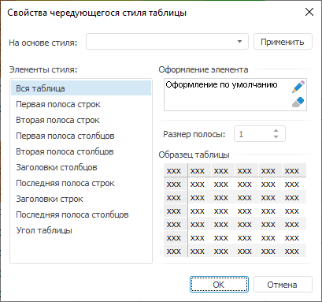

# Настройка пользовательских стилей таблицы

Настройка пользовательских стилей таблицы
-

# Настройка пользовательских стилей таблицы

Пользовательские стили таблицы
 доступны в настольном приложении и настраиваются при помощи диалога «Свойства чередующегося стиля таблицы».

Примечание.
 В регламентных отчетах существует две схожие настройки: стиль таблицы
 ([табличного
 визуализатора](uireport.chm::/desktop/AreaData/DataTable.htm)) и оформление ячеек листа в виде [таблицы
 с чередующимися стилями](uireport.chm::/desktop/Table/Attribute/UiReport_Table_Styles.htm).

[Для открытия
 диалога](javascript:TextPopup(this))

		- Нажмите кнопку , расположенную в группе
		 «Стиль таблицы» на вкладке
		 «Таблица» или «Формат»
		 ленты инструментов.

		- Выберите пункт «Настроить
		 стиль».

Доступны следующие настройки:

	- На основе
	 стиля. В раскрывающемся списке
	 выберите один из предустановленных стилей таблицы (Синий, Тёмно-синий
	 и прочие) и нажмите кнопку «Применить».
	 Выбранный стиль скопируется в редактируемый;

	- Элементы стиля.
	 Список содержит все элементы стиля, для которых можно настроить параметры
	 оформления. При выборе элемента данного списка справа будут отображены
	 его текущие настройки;

	- Оформление элемента. Для
	 изменения оформления выбранного элемента стиля нажмите кнопку . Будет открыт [диалог форматирования](UiNav.Chm::/GUI/Format.htm),
	 содержащий различные настройки оформления. При нажатии на кнопку  будут установлены
	 параметры оформления по умолчанию;

	- Размер полосы. С
	 помощью редактора чисел или клавиатуры установите размер полосы в
	 строках;

	- Образец таблицы. В
	 данной области отображается внешний вид таблицы, который она примет
	 после применения установленных параметров. Проверьте, соответствует
	 ли внешний вид таблицы ожидаемому результату.

См. также:

[Стили
 таблицы](Table_styles.htm) | [Оформление таблицы и ее элементов](Formatting_table.htm)

		Справочная
		 система на версию 10.9
		 от 18/08/2025,
		 © ООО «ФОРСАЙТ»,
