# Настройка формата данных

Настройка формата данных
-

# Настройка формата данных

Для настройки данных используйте:

	- вкладку «Оформление»/«Оформление данных» боковой панели;

[Для
 открытия вкладки](javascript:TextPopup(this))

			- [Выделите
			 данные](../../Select_areas.htm#select_data), [строку/столбец](../../Select_areas.htm#select_sidehead1),
			 [измерение](../../Work_with_dimensions/Select_dimensions_elements_in_table.htm#select_dim),
			 [уровень](../../Work_with_dimensions/Select_dimensions_elements_in_table.htm#select_level)
			 или итог.

			- Перейдите в группу вкладок «Данные»
			 боковой панели, которая доступна при выделении данных, и выберите
			 вкладку «Оформление»/«Оформление данных».

	Примечание.
	 При выделении элемента таблицы группа вкладок боковой панели «Таблица» будет переименована в соответствии
	 с выделенным элементом:

	    • Заголовок.
	 При выделении боковика или шапки;

	    • Уголок.
	 При выделении уголка;

	    • Таблица.
	 При выделении ячейки с данными или всей таблицы;

	    • Данные.
	 При выделении всех ячеек с данными;

	    • Формат. При выделении столбца или строки
	 целиком;

	    • Уровень.
	 При выделении наименований элементов уровня измерения;

	    • Измерение.
	 При выделении наименований элементов измерения;

	    • Итоги.
	 При выделении ячеек, столбцов или строк итогов.

Для изменения настроек формата данных, установите
 флажок «Специальный формат»:

В раскрывающемся списке выберите один из
 поддерживаемых форматов данных. В зависимости от выбранного формата будут
 доступны различные настройки:

[Общий](javascript:TextPopup(this))

	Равносильно отмене форматирования.

[Числовой](javascript:TextPopup(this))

	Формат установлен по умолчанию. При выборе
	 числового формата доступны следующие настройки:

	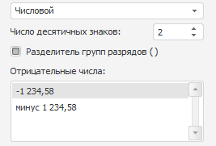

			- Число десятичных знаков.
			 Задаёт число отображаемых знаков после запятой;

			- Разделитель групп разрядов.
			 При установке флажка будут отображаться разделители разрядов
			 (пробелы);

			- Отрицательные числа.
			 Выберите вид отображения отрицательных чисел.

[Денежный](javascript:TextPopup(this))

	При выборе денежного формата доступны
	 следующие настройки:

	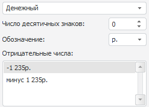

			- Число десятичных знаков.
			 Задаёт число отображаемых знаков после запятой;

			- Обозначение.
			 Задаёт обозначение валюты;

			- Отрицательные числа.
			 Выберите вид отображения отрицательных чисел.

	Формат вывода зависит от текущих региональных
	 настроек операционной системы.

[Дата](javascript:TextPopup(this))

	При выборе формата «Дата»
	 доступны следующие настройки:

	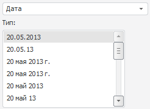

	Выберите формат отображения даты из списка
	 «Тип».

[Время](javascript:TextPopup(this))

	При выборе формата «Время»
	 доступны следующие настройки:

	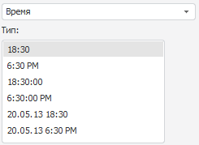

	Выберите формат отображения времени из
	 списка «Тип».

[Процентный](javascript:TextPopup(this))

	При выборе процентного формата
	 доступны следующие настройки:

	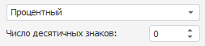

	Задайте число отображаемых знаков после
	 запятой.

	При использовании процентного формата
	 значение чисел умножается на 100 и добавляется знак «% ». Ввод чисел
	 в ячейку при данном формате будет по-разному обрабатываться в зависимости
	 от использования знака «%». Например, при вводе «40%» в ячейке будет
	 отражено «40%», при этом значение в ячейке «0,4». Если вводится «40»,
	 то в ячейке отображается «4000%», при этом значение в ячейке будет
	 «40».

[Экспоненциальный](javascript:TextPopup(this))

	Данный формат используется для представления
	 числа в экспоненциальном виде.

	При выборе экспоненциального формата
	 доступны следующие настройки:

	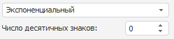

	Определите число отображаемых знаков
	 после запятой.

[Текстовый](javascript:TextPopup(this))

	Равносильно отмене форматирования. Текстовый
	 формат устанавливается по умолчанию для ячеек, содержащих нечисловые
	 значения.

[Дополнительный](javascript:TextPopup(this))

	При выборе дополнительного формата доступны
	 следующие настройки:

	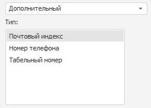

	Для автоматического преобразования значения
	 выберите предустановленный вариант:

			- Почтовый индекс;

			- Номер телефона;

			- Табельный номер.

[Пользовательский](javascript:TextPopup(this))

	Содержит кодовые представления всех доступных
	 форматов данных. Если ни один из форматов не подходит, то можно добавить
	 собственный.

	- группу кнопок «Число»,
	 которая доступна на вкладках «Главная»
	 (в регламентном отчете) или «Таблица»/
	 «Формат» (в экспресс-отчете
	 и аналитической панели):

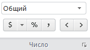

Примечание.
 Группа «Формат числа» на вкладке
 ленты «Формат» доступна, если
 в таблице [выделены данные](../../Select_areas.htm#select_data).

В раскрывающемся списке выберите один из
 поддерживаемых форматов данных.

Для быстрой настройки формата данных используйте
 кнопки:

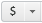 - преобразование в денежный
 формат. При нажатии на стрелку доступно меню для выбора валюты;

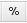 - преобразование в процентный
 формат;

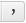 - преобразование в числовой
 формат и отображение разделителя групп разрядов с двумя десятичными знаками
 после запятой;

 - уменьшение/увеличение
 разрядности числа. Применяется для отображения менее/более точных значений.

При нажатии на значок  будет открыт диалог «Форматирование» на вкладке «[Формат числа](UiNav.Chm::/GUI/Format/UiReport_Table_Attribute_Format.htm)».

Примечание.
 Оформление элементов таблицы применяется в соответствии с [порядком оформления](UiNav.chm::/GUI/applystyle.htm)
 и может быть перекрыто другим оформлением.

См. также:

[Оформление
 таблицы и ее элементов](Formatting_table.htm)

		Справочная
		 система на версию 10.9
		 от 18/08/2025,
		 © ООО «ФОРСАЙТ»,
