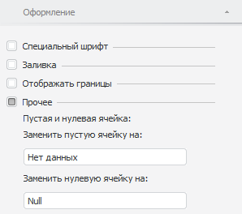
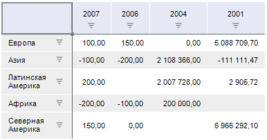
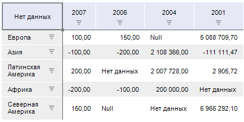
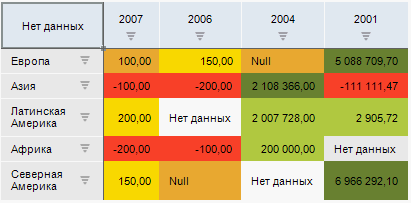

# Заполнение пустых и нулевых ячеек

Заполнение пустых и нулевых ячеек
-

# Заполнение пустых и нулевых ячеек

Пустые ячейки или ячейки с нулевым значением могут быть заполнены произвольным
 содержимым.

Примечание.
 Заполнение пустых и нулевых ячеек зависит от прав доступа к данным, которые
 содержатся в ячейках. Права доступа определяются с помощью [объектов
 полномочий](BPM.chm::/Desktop/Facility_Agreement/Create_Authorization_Object.htm) или [сегментами куба](UiNavObj.chm::/Cube/segments/segments.htm).
 По умолчанию используется полный доступ к данным. Если свойство [ITabCellStyle.AccessRights](tabsheet.chm::/Interface/ITabCellStyle/ITabCellStyle.AccessRights.htm)
 возвращает значение [TabAccessRights.NoAccess](tabsheet.chm::/Enums/TabAccessRights.htm)
 или [TabAccessRights.Write](tabsheet.chm::/Enums/TabAccessRights.htm),
 то заполнение пустых и нулевых ячеек будет недоступно.

Заполнение пустых и нулевых ячеек осуществляется на вкладке «Оформление»
 боковой панели.

[Для открытия
 вкладки](javascript:TextPopup(this))

	- [Выделите элемент таблицы](../../Select_areas.htm), [измерения](../../Work_with_dimensions/Select_dimensions_elements_in_table.htm#select_dim),
	 [уровня](../../Work_with_dimensions/Select_dimensions_elements_in_table.htm#select_level)
	 или итогов.

	- Перейдите в группу вкладок «Таблица»
	 боковой панели и выберите вкладку «Оформление»/«Оформление данных».

Примечание.
 При выделении элемента таблицы группа вкладок боковой панели «Таблица»
 будет переименована в соответствии с выделенным элементом:

    • Заголовок.
 При выделении боковика или шапки;

    • Уголок.
 При выделении уголка;

    • Таблица.
 При выделении ячейки с данными или всей таблицы;

    • Данные.
 При выделении всех ячеек с данными;

    • Формат. При выделении столбца или строки
 целиком;

    • Уровень.
 При выделении наименований элементов уровня измерения;

    • Измерение.
 При выделении наименований элементов измерения;

    • Итоги.
 При выделении ячеек, столбцов или строк итогов.

Для заполнения пустых или нулевых ячеек:

	- Установите флажок «Прочее»
	 на вкладке «Оформление» боковой
	 панели.

Примечание.
 Флажок недоступен, если в таблице выделены [боковик](../../Select_areas.htm#select_sidehead)
 или [шапка](../../Select_areas.htm#select_sidehead).

	- Введите текст, число или символы, которые будут отображены в
	 пустых или нулевых ячейках в соответствующих полях:

До замены:

После замены:

Значения, которыми заполняются пустые ячейки, в том числе и числовые,
 не будут [сохранены
 в источнике](../../Working_with_table_data/Edit_and_save_data.htm). Пустые ячейки не будут учитываться при выполнении [анализа данных](../../Analysis/Data_analysis_in_a_table.htm)
 или [вычислении итогов](../../Totals/Calculate_totals.htm).
 Значения нулевых ячеек с замененным содержимым будут рассматриваться как
 0:

См. также:

[Оформление
 таблицы и ее элементов](Formatting_table.htm)

		Справочная
		 система на версию 10.9
		 от 18/08/2025,
		 © ООО «ФОРСАЙТ»,
