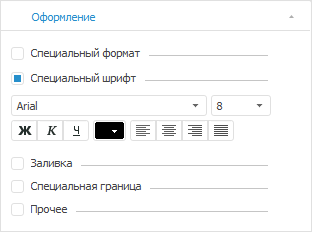
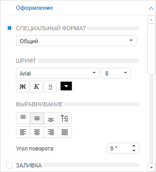
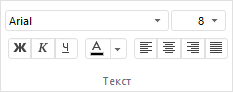
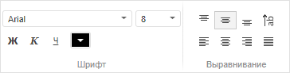
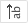

# Настройка шрифта

Настройка шрифта
-

# Настройка шрифта

Настройка шрифта элемента таблицы осуществляется с помощью:

	- вкладки «Оформление»
	 боковой панели.

[Для
 открытия вкладки](javascript:TextPopup(this))

	- [Выделите элемент таблицы](../../Select_areas.htm), [измерения](../../Work_with_dimensions/Select_dimensions_elements_in_table.htm#select_dim),
	 [уровня](../../Work_with_dimensions/Select_dimensions_elements_in_table.htm#select_level)
	 или итогов.

	- Перейдите в группу вкладок «Таблица»
	 боковой панели и выберите вкладку «Оформление»/«Оформление данных».

Примечание.
 При выделении элемента таблицы группа вкладок боковой панели «Таблица»
 будет переименована в соответствии с выделенным элементом:

    • Заголовок.
 При выделении боковика или шапки;

    • Уголок.
 При выделении уголка;

    • Таблица.
 При выделении ячейки с данными или всей таблицы;

    • Данные.
 При выделении всех ячеек с данными;

    • Формат. При выделении столбца или строки
 целиком;

    • Уровень.
 При выделении наименований элементов уровня измерения;

    • Измерение.
 При выделении наименований элементов измерения;

    • Итоги.
 При выделении ячеек, столбцов или строк итогов.

Для изменения настроек шрифта установите
 флажок «Специальный шрифт».
 Будут доступны настройки шрифта для выделенного элемента таблицы.

Вид вкладки отличается в настольном приложении
 и веб-приложении:

	Настольное приложение Веб-приложение

		

		

	- группы кнопок «Текст»
	 на вкладке «Формат» на ленте
	 инструментов в настольном приложении:

	- групп кнопок «Шрифт»
	 и «Выравнивание» на ленте
	 инструментов в веб-приложении:

Настройки шрифта:

	- Шрифт.
	 Выберите один из шрифтов, установленных в операционной системе;

	- Размер
	 шрифта. Установите требуемый размер шрифта. Размер задаётся
	 в пунктах, и его можно выбрать из раскрывающегося списка или ввести
	 вручную. Диапазон допустимых значений: [1, 72];

	- Начертание
	 текста. Нажмите кнопки, задающие начертание шрифта:

		- Ж. Полужирное начертание;

		- К.
		 Курсивное начертание;

		- Ч.
		 Подчеркивание текста.

При нажатой кнопке будет использоваться соответствующий
 стиль начертания. Доступно использование нескольких стилей одновременно,
 например, нажатие кнопок «Ж» и
 «К» даёт полужирное
 курсивное начертание;

	- Цвет
	 шрифта. Выберите цвет шрифта в раскрывающейся палитре цветов;

	- Выравнивание
	 текста в ячейке. Задайте выравнивание текста относительно ячейки:

		- По
		 горизонтали. Выберите один из следующих способов выравнивания
		 текста в ячейке по горизонтали:

			- . По левому краю. Используется по
			 умолчанию;

			- . По центру;

			- . По правому краю;

			- . По ширине;

		- По вертикали. Выберите один
		 из следующих способов выравнивания текста в ячейке по вертикали.
		 Данная настройка доступна только для веб-приложения:

			- . По
			 верхнему краю;

			- . По
			 середине. Используется по умолчанию;

			- . По
			 нижнему краю;

	- Поворот
	 текста в ячейке. Задайте при необходимости поворот текста относительно
	 ячейки. Данная настройка доступна только для веб-приложения:

		- Угол
		 поворота. Укажите угол в градусах, на который необходимо
		 повернуть текст ячейки против часовой стрелки;

		- Поворот
		 на 90 градусов. Нажмите кнопку
		  «Повернуть текст на 90
		 градусов» для поворота текста
		 на 90 градусов против часовой стрелки.

Примечание.
 Оформление элементов таблицы применяется в соответствии с [порядком оформления](UiNav.chm::/GUI/applystyle.htm)
 и может быть перекрыто другим оформлением.

См. также:

[Оформление
 таблицы и ее элементов](Formatting_table.htm)

		Справочная
		 система на версию 10.9
		 от 18/08/2025,
		 © ООО «ФОРСАЙТ»,
