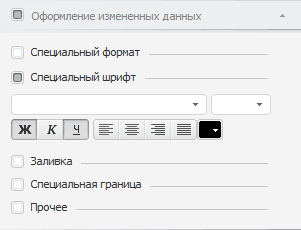

# Оформление измененных данных

Оформление измененных данных
-

# Оформление измененных данных

Для данных, [измененных](../../Working_with_table_data/Edit_and_save_data.htm)
 в таблице, но еще не сохраненных в отчете, можно настроить отдельное оформление.

Настройки оформления измененных данных осуществляются на вкладке «Оформление измененных данных» боковой
 панели:

[Для открытия
 вкладки](javascript:TextPopup(this))

		- Убедитесь, что в таблице есть [измененные](../../Working_with_table_data/Edit_and_save_data.htm),
		 не сохраненные данные.

		- [Выделите данные](../../Select_areas.htm#select_data)
		 таблицы.

		- Перейдите в группу вкладок «Данные»,
		 которая доступна при выделении данных, и выберите вкладку «Оформление измененных данных».

Для активации настроек оформления измененных данных установите флажок
 в заголовке вкладки:

Вкладка содержит настройки:

	- [формата данных](Data_format.htm);

	- [шрифта](Font_settings.htm);

	- [заливки](formattingColor.htm);

	- [границ](formattingBorders.htm).

По умолчанию для измененных данных применяется жирное начертание шрифта.

Примечание.
 Оформление элементов таблицы применяется в соответствии с [порядком оформления](UiNav.chm::/GUI/applystyle.htm)
 и может быть перекрыто другим оформлением.

См. также:

[Редактирование
 и сохранение данных](../../Working_with_table_data/Edit_and_save_data.htm) | [Оформление таблицы
 и ее элементов](Formatting_table.htm)

		Справочная
		 система на версию 10.9
		 от 18/08/2025,
		 © ООО «ФОРСАЙТ»,
