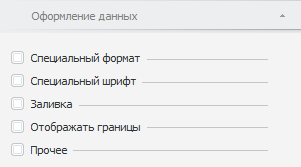
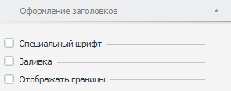

# Оформление измерений и уровней в таблице

Оформление измерений и уровней в таблице
-

# Оформление измерений и уровней в таблице

В таблице данных можно настроить отдельное оформление для:

	- данных и заголовков измерений;

	- данных и заголовков уровней измерений.

Для настройки оформления уровней измерения убедитесь, что в справочнике,
 на котором построен куб, являющийся источником данных для таблицы, добавлены
 уровни:

	- Табличный справочник.
	 Задайте уровни справочника на странице «[Уровни](UiNavObj.chm::/reference_book/Master_Table_reference_book/UiMd_reference_book_Master_Table_page4.htm)» мастера;

	- Вычисляемый справочник.
	 Задайте уровни справочника на странице «[Уровни](UiNavObj.chm::/reference_book/Master_Calculation_reference_book/UiMd_reference_book_Master_Calculation_page3.htm)» мастера;

	- Календарный справочник.
	 Задайте уровни справочника на странице «[Структура
	 календаря](UiNavObj.chm::/reference_book/Master_Calendar_reference_book/UiMd_reference_book_Master_Calendar_page2.htm)»
	 мастера;

	- Справочник НСИ. Задайте
	 уровни справочника на вкладке «[Уровни](UiNavObj.chm::/reference_book/Master_RDS_reference_book/Level.htm)».

Оформление данных измерения/уровня
 настраивается при помощи вкладки «Оформление
 данных» боковой панели.

[Для открытия
 вкладки](javascript:TextPopup(this))

		- Выделите [измерение](../../Work_with_dimensions/Select_dimensions_elements_in_table.htm#select_dim)
		 или [уровень](../../Work_with_dimensions/Select_dimensions_elements_in_table.htm#select_level).
		 Группа вкладок боковой панели «Таблица»
		 будет переименована в «Измерение»/«Уровень».

		- Перейдите в группу вкладок «Измерение»/«Уровень» и выберите вкладку
		 «Оформление данных».

Оформление заголовков измерения/уровня
 настраивается при помощи вкладки «Оформление
 заголовков» боковой панели.

[Для открытия
 вкладки](javascript:TextPopup(this))

		- Выделите [измерение](../../Work_with_dimensions/Select_dimensions_elements_in_table.htm#select_dim)
		 или [уровень](../../Work_with_dimensions/Select_dimensions_elements_in_table.htm#select_level).
		 Группа вкладок боковой панели «Таблица»
		 будет переименована в «Измерение»/«Уровень».

		- Перейдите в группу вкладок «Измерение»/«Уровень» и выберите вкладку
		 «Оформление заголовков».

Доступные настройки:

	- [Настройка формата данных](Data_format.htm) (только
	 для данных);

	- [Настройка шрифта](Font_settings.htm);

	- [Настройка заливки](formattingColor.htm);

	- [Настройка границ](formattingBorders.htm);

	- [Заполнение пустых и нулевых ячеек
	 таблицы](Empty_cells.htm) (только для данных).

Примечание.
 Оформление элементов таблицы применяется в соответствии с [порядком оформления](UiNav.chm::/GUI/applystyle.htm)
 и может быть перекрыто другим оформлением. При использовании в таблице
 [объединения с поджатием](../Layout/Merging_Dimensions.htm#format)
 оформление зависит от используемого типа наименования.

См. также:

[Оформление
 таблицы и ее элементов](Formatting_table.htm)

		Справочная
		 система на версию 10.9
		 от 18/08/2025,
		 © ООО «ФОРСАЙТ»,
