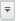

# Стиль элементов таблицы

Стиль элементов таблицы
-

# Стиль элементов таблицы

Для быстрого оформления отдельных [элементов
 таблицы](../../Select_areas.htm#select_all_table) используются стили ячеек.

Доступные стили поделены на следующие категории:

	- Стандартные. Предустановленные
	 стили без возможности редактирования;

	- Стили документа. Стили,
	 созданные в текущем отчете;

	- Подключенная таблица стилей.
	 Стили из подключенной [таблицы стилей](UiNav.chm::/StylesTable/StylesTablePurpose.htm).

[Применение стиля](javascript:TextPopup(this))

	Для применения стиля ячеек к выбранному [элементу
	 таблицы](../../Select_areas.htm#select_all_table) в группе «Стиль ячейки»
	 на вкладке «Формат» ленты
	 инструментов щёлкните по шаблону стиля или выполните команду «Применить» в контекстном меню стиля.

	К элементу таблицы будет применён выбранный стиль.

[Создание стиля](javascript:TextPopup(this))

	Для создания стиля ячеек:

		- Выделите элемент таблицы, оформление которого будет сохранено
		 как стиль ячейки.

		- Нажмите кнопку ,
		 расположенную в группе «Стиль
		 ячейки» на вкладке «Формат»
		 ленты инструментов.

		- Выберите пункт раскрывающегося меню «Создать
		 новый стиль».

		- В открывшемся окне введите название созданного стиля и нажмите
		 кнопку «OK».

	Созданный стиль будет добавлен в категорию стилей документа.

[Работа с созданным
 стилем](javascript:TextPopup(this))

	Работа со стилем ячеек производится через контекстное меню стиля
	 в группе «Стиль ячеек», расположенной
	 на вкладке «Формат» ленты
	 инструментов.

	Доступны следующие действия:

		- редактирование стиля.
		 Будет открыт [диалог
		 форматирования](UiNav.Chm::/GUI/Format.htm)
		 для стиля;

		- переименование стиля;

		- удаление стиля;

		- экспорт во внешние стили.

	Примечание.
	 При работе в веб-приложении доступен только экспорт во внешние стили.

[Экспорт
 созданного стиля](javascript:TextPopup(this))

	Для экспорта созданного стиля ячеек во внешние стили:

		- Перейдите на вкладку «Формат»
		 ленты инструментов.

		- Выберите шаблон стиля в группе «Стиль
		 ячейки». Затем:

			- нажмите кнопку 
			 и выберите пункт «Экспорт
			 во внешние стили»;

			- выполните команду «Экспорт
			 во внешние стили» в контекстном меню стиля.

		- В открывшемся окне выберите [таблицу
		 стилей](UiNav.chm::/StylesTable/StylesTablePurpose.htm).

	Выбранный стиль будет экспортирован в заданную [таблицу стилей](UiNav.chm::/StylesTable/StylesTablePurpose.htm).

	Если идентификатор экспортируемого стиля совпадает с идентификатором
	 стиля из [таблицы
	 стилей](UiNav.chm::/StylesTable/StylesTablePurpose.htm),
	 будет выдано сообщение для выбора действия:

	

	Установите флажок «Применить во
	 всех подобных случаях», чтобы выбранное действие применялось
	 во всех подобных ситуациях.

	Выберите действие со стилем:

		- Оставить оба. Экспортируемый
		 стиль будет добавлен в таблицу стилей с новым уникальным идентификатором;

		- Заменить. Стиль
		 в текущей таблице стилей будет заменён на экспортируемый;

		- Пропустить. Стиль
		 не будет экспортирован в таблицу стилей;

		- Отмена. Операция
		 экспорта стиля будет отменена.

[Подключение
 и отключение таблицы стилей](javascript:TextPopup(this))

	Примечание.
	 Подключение и отключение [таблицы стилей](UiNav.chm::/StylesTable/StylesTablePurpose.htm)
	 доступно только в настольном приложении. Стили из подключенной таблицы
	 стилей доступны из веб-приложения и настольного приложения.

	Для оформления элементов таблицы можно использовать внешние стили
	 ячеек, сохранённые в [таблице
	 стилей](UiNav.chm::/StylesTable/StylesTablePurpose.htm).
	 Для подключения таблицы стилей:

		- Перейдите на вкладку «Формат»
		 ленты инструментов.

		- Нажмите кнопку ,
		 расположенную в группе «Стиль
		 ячейки».

		- Выполните команду «Настроить
		 внешние стили».

	Примечание.
	 В инструменте «Отчеты»
	 данная команда также расположена в раскрывающемся меню кнопки «Стили ячеек», расположенной в группе
	 «Стиль таблицы» на вкладке
	 «Главная» ленты инструментов.

		- Будет открыт диалог «Параметры».
		 На вкладке «Общее» в раскрывающемся
		 списке «Набор стилей оформления»
		 выберите необходимую [таблицу
		 стилей](UiNav.chm::/StylesTable/StylesTablePurpose.htm).

	Примечание.
	 В инструменте «Отчеты» используйте
	 вкладку «[Настройки](UiReport.chm::/desktop/Reports/UiReport_Reports_Param3.htm)» в
	 диалоге «Параметры».

	Таблица стилей будет подключена. Стили из таблицы стилей, которые
	 можно применить для оформления ячеек, будут добавлены в отдельную
	 категорию.

	Примечание.
	 К одному отчёту можно подключить только одну таблицу стилей.

	Для отключения таблицы стилей выберите пункт «Отключить
	 внешние стили». Перед отключением будет предложено скопировать
	 используемые стили в стили документа.

См. также:

[Настройка
 пользовательских стилей таблицы](Custom_styles.htm) | [Оформление
 таблицы и ее элементов](Formatting_table.htm) | [Стили таблицы](Table_styles.htm)

		Справочная
		 система на версию 10.9
		 от 18/08/2025,
		 © ООО «ФОРСАЙТ»,
