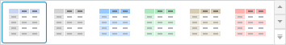

# Стили таблицы

Стили таблицы
-

# Стили таблицы

Для оформления таблицы можно использовать:

	- стили таблицы;

	- [стили элементов таблицы](Table_Elements_Styles.htm);

Примечание.
 Оформление элементов таблицы применяется в соответствии с [порядком оформления](UiNav.chm::/GUI/applystyle.htm)
 и может быть перекрыто другим оформлением.

## Стиль таблицы

Стиль задается для всей таблицы целиком. Стили бывают стандартные или
 настроенные пользователем.

### Стандартные стили

Настройка стандартного стиля оформления таблицы производится с помощью
 стилей, расположенных на ленте инструментов:

Для выбора стандартного стиля таблицы:

	- [Выделите таблицу](../../Select_areas.htm#select_all_table).

	- Перейдите на вкладку «Таблица»
	 или «Формат» ленты инструментов.

	- В группе «Стиль таблицы»
	 выберите один из представленных стилей.

Примечание.
 В веб-приложении для смены стилей используется вкладка ленты инструментов
 «Таблица: Конструктор».

### Пользовательский стиль таблицы

При работе с таблицами данных в различных инструментах продукта «Форсайт. Аналитическая платформа»
 доступна настройка пользовательских стилей таблиц. Пользовательский стиль
 аналогично стандартному применяется ко всей таблице.

Примечание.
 Настройка пользовательских стилей таблицы доступна только в настольном
 приложении.

Для настройки пользовательского стиля:

	- Нажмите кнопку , расположенную в группе
	 «Стиль таблицы» на вкладке
	 «Таблица» или «Формат»
	 ленты инструментов.

	- Выберите пункт «Настроить стиль».

Будет открыт диалог «[Свойства
 чередующегося стиля таблицы](Custom_styles.htm)». Настройте в нём новый стиль.

См. также:

[Настройка
 пользовательских стилей таблицы](Custom_styles.htm) | [Оформление
 таблицы и ее элементов](Formatting_table.htm)

		Справочная
		 система на версию 10.9
		 от 18/08/2025,
		 © ООО «ФОРСАЙТ»,
