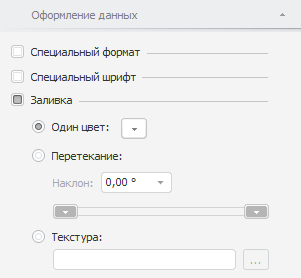
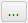

# Настройка заливки

Настройка заливки
-

# Настройка заливки

Настройка заливки [выделенного элемента](../../Select_areas.htm)
 таблицы осуществляется при помощи:

	- кнопки 
	 «Заливка» на вкладке ленты
	 «Формат». В раскрывающемся
	 меню кнопки выберите цвет заливки;

	- вкладки «Оформление»
	 боковой панели.

[Для открытия
 вкладки «Оформление»](javascript:TextPopup(this))

	- [Выделите элемент таблицы](../../Select_areas.htm), [измерения](../../Work_with_dimensions/Select_dimensions_elements_in_table.htm#select_dim),
	 [уровня](../../Work_with_dimensions/Select_dimensions_elements_in_table.htm#select_level)
	 или итогов.

	- Перейдите в группу вкладок «Таблица»
	 боковой панели и выберите вкладку «Оформление»/«Оформление данных».

Примечание.
 При выделении элемента таблицы группа вкладок боковой панели «Таблица»
 будет переименована в соответствии с выделенным элементом:

    • Заголовок.
 При выделении боковика или шапки;

    • Уголок.
 При выделении уголка;

    • Таблица.
 При выделении ячейки с данными или всей таблицы;

    • Данные.
 При выделении всех ячеек с данными;

    • Формат. При выделении столбца или строки
 целиком;

    • Уровень.
 При выделении наименований элементов уровня измерения;

    • Измерение.
 При выделении наименований элементов измерения;

    • Итоги.
 При выделении ячеек, столбцов или строк итогов.

Для использования заливки установите флажок «Заливка».
 Будут доступны настройки заливки для выделенного элемента таблицы:

Доступные настройки:

	- Один цвет. Установите
	 переключатель, чтобы выбрать цвет заливки. В раскрывающейся палитре
	 выберите цвет заливки;

	- Перетекание. Установите
	 переключатель для настройки градиентной заливки:

		- Наклон. В числовом
		 редакторе выберите или введите угол наклона градиента;

		- В цветовых палитрах установите цвет начала и конца градиента;

	- Текстура. Установите
	 переключатель для выбора изображения в качестве заливки ячеек таблицы.
	 Нажмите на кнопку  для выбора изображения.

Примечание.
 Оформление элементов таблицы применяется в соответствии с [порядком оформления](UiNav.chm::/GUI/applystyle.htm)
 и может быть перекрыто другим оформлением.

См. также:

[Оформление
 таблицы и ее элементов](Formatting_table.htm)

		Справочная
		 система на версию 10.9
		 от 18/08/2025,
		 © ООО «ФОРСАЙТ»,
