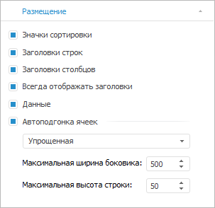

# Размещение элементов таблицы

Размещение элементов таблицы
-

# Размещение элементов таблицы

Отобразить/скрыть элементы таблицы можно при помощи вкладки «Размещение»
 на боковой панели и ленте инструментов. Вид вкладки и набор настроек зависит
 от выбранного элемента таблицы. [Настройка размещения
 элементов измерения](Layout_Dim.htm) выполняется при выделении [шапки/боковика](../../Select_areas.htm)
 или [измерения/уровня](../../Work_with_dimensions/Select_dimensions_elements_in_table.htm).

[Для открытия
 вкладки «Размещение»](javascript:TextPopup(this))

		- [Выделите всю таблицу](../../Select_areas.htm).

		- Перейдите в группу вкладок «Таблица»
		 и выберите вкладку «Размещение».

## Настройки всей таблицы

Если выделена [вся
 таблица](../../Select_areas.htm#select_all_table), то на вкладке «Размещение»
 будут доступны настройки, применяемые ко всей таблице:

На вкладке доступны следующие настройки:

	- Значки сортировки. Определяет,
	 отображать ли значки сортировки . По умолчанию
	 флажок снят, значки не отображаются. В инструментах «Аналитические
	 запросы (OLAP)» и «Аналитические
	 панели» по умолчанию флажок установлен, значки отображаются;

Примечание.
 При наличии в шапке/боковике нескольких измерений сортировка применяется
 только к самому нижнему/правому уровню шапки/боковика соответственно.

	- Заголовки строк. Определяет,
	 отображать ли [боковик таблицы](../../Select_areas.htm).
	 По умолчанию флажок установлен, боковик отображается;

	- Заголовки столбцов.
	 Определяет, отображать ли [шапку таблицы](../../Select_areas.htm).
	 По умолчанию флажок установлен, шапка отображается;

	- Всегда отображать заголовки.
	 Определяет, отображать ли боковик при отсутствии отметки по измерениям
	 шапки и отображать ли шапку при отсутствии отметки по измерениям боковика.
	 По умолчанию флажок снят;

	- Данные. Определяет,
	 отображать ли [данные в таблице](../../Select_areas.htm).
	 По умолчанию флажок установлен, данные отображаются;

	- Автоподгонка ячеек.
	 Определяет, используется ли [автоподгонка
	 размера ячеек](../Autofit_cells.htm). По умолчанию флажок установлен, размер ячеек подбирается
	 автоматически. По умолчанию выбран упрощенный тип автоподгонки.

Примечание.
 Для [повышения
 производительности](setup.chm::/01_SysReq/Performance_Recommendations.htm) продукта «Форсайт. Аналитическая платформа»
 не рекомендуется использовать автоподгонку ячеек. Можно задать высоту
 ячейки вручную с помощью свойства [ITabSheet.DefaultHeight](TabSheet.chm::/Interface/ITabSheet/ITabSheet.DefaultHeight.htm),
 ширину ячейки - [ITabSheet.DefaultWidth](TabSheet.chm::/Interface/ITabSheet/ITabSheet.DefaultWidth.htm).
 Размер ячеек будет использоваться по умолчанию при создании новых строк
 и столбцов.

См. также:

[Настройка
 содержимого уголка таблицы](../Corner_show_dims.htm) | [Отображение
 разметки таблицы](../Mark_up.htm) | [Поворот таблицы](../Rotate_table.htm)

		Справочная
		 система на версию 10.9
		 от 18/08/2025,
		 © ООО «ФОРСАЙТ»,
