# Размещение элементов измерения

Размещение элементов измерения
-

# Размещение элементов измерения

Настроить размещение элементов измерения можно при помощи вкладки «Размещение» боковой панели и кнопки
  «Размещение»
 на вкладке «Конструктор» ленты
 инструментов. Вид вкладки и набор настроек зависит от выбранного элемента
 таблицы, измерения, уровня.

[Для открытия
 вкладки «Размещение»](javascript:TextPopup(this))

		- [Выделите шапку, боковик](../../Select_areas.htm),
		 [измерение
		 или уровень](../../Work_with_dimensions/Select_dimensions_elements_in_table.htm), для которого требуется настроить размещение.

		- Выберите вкладку «Размещение»
		 на боковой панели в группе вкладок с настройками элемента таблицы,
		 измерения, уровня.

	Группа вкладок будет переименована в
	 соответствии с выделенным элементом таблицы, измерения, уровня:

			- Заголовок.
			 При выделении боковика или шапки;

			- Измерение.
			 При выделении измерения;

			- Уровень.
			 При выделении уровня;

			- Формат.
			 Для аналитической панели не зависимо от выделенного выбранного
			 элемента таблицы, измерения, уровня.

Доступны настройки:

	- [настройки шапки и боковика
	 таблицы](Layout_Dim.htm#headings_layout) при помощи вкладки «Размещение»
	 боковой панели;

	- [настройки измерений
	 и уровней таблицы](Layout_Dim.htm#dimension_layout) при помощи вкладки «Размещение»
	 боковой панели;

	- [управление отображением
	 иерархии](Layout_Dim.htm#view_layout);

	- [объединение измерений в боковике/шапке](Merging_Dimensions.htm)
	 при помощи кнопки  «Размещение» на вкладке «Конструктор»
	 ленты инструментов.

## Настройки шапки и боковика таблицы

На вкладке «Размещение» настраивается
 расположение элементов шапки и боковика.

Если выделены [шапка](../../Select_areas.htm#select_heading)
 или [боковик](../../Select_areas.htm#select_sidehead) таблицы,
 на вкладке «Размещение» будут
 доступны настройки, применяемые только к шапке и боковику таблицы:

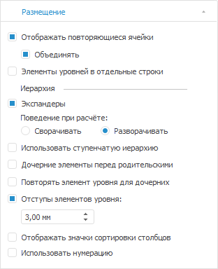

На вкладке доступны операции:

[Размещение
 элементов уровней в отдельных столбцах](javascript:TextPopup(this))

	Для размещения элементов разных уровней в разных столбцах установите
	 флажок «Элементы уровней в отдельные
	 столбцы». Слева показана исходная таблица, справа - таблица
	 после установки флажка:

	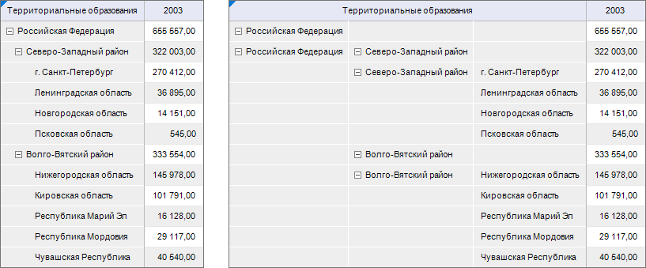

[Отображение/скрытие
 повторяющихся ячеек](javascript:TextPopup(this))

	Повторяющиеся ячейки появляются при установке флажка «Элементы
	 уровней в отдельные столбцы» на вкладке «Размещение»
	 боковой панели.

	Для отображения/скрытия повторяющихся ячеек в таблице данных установите/снимите
	 флажок «Отображать повторяющиеся
	 ячейки». По умолчанию повторяющиеся ячейки отображаются. Если
	 флажок снят, наименование уровня будет отображаться в отдельной строке
	 перед элементами уровня и в объединенной ячейке напротив элементов
	 уровня. Слева показана таблица с установленным флажком «Элементы
	 уровней в отдельные столбцы», справа - с установленными флажками
	 «Элементы уровней в отдельные столбцы»
	 и «Отображать повторяющиеся ячейки»:

	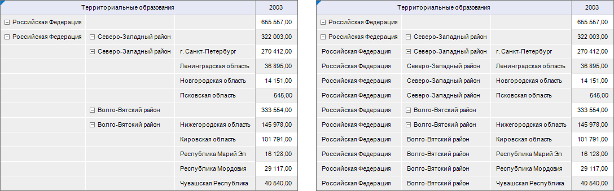

	При установке флажка «Объединять»
	 повторяющиеся элементы будут отображаться только для первой ячейки
	 уровня, при снятии флажка - элементы будут повторяться для каждого
	 элемента уровня. Слева показана таблица с установленными флажками
	 «Элементы уровней в отдельные столбцы»
	 и «Отображать повторяющиеся ячейки»,
	 справа - с установленными флажками «Элементы
	 уровней в отдельные столбцы», «Отображать
	 повторяющиеся ячейки» и «Объединять»:

	

	Флажок «Объединять» установлен
	 по умолчанию и доступен, если установлен флажок «Отображать
	 повторяющиеся ячейки».

[Отображение/скрытие
 экспандеров](javascript:TextPopup(this))

	Для отображения/скрытия экспандеров для родительских элементов иерархии:

		- Установите/снимите флажок «Экспандеры»
		 на вкладке «Размещение»
		 боковой панели.

		- Определите поведение экспандеров при обновлении отчета.
		 Для этого установите один из переключателей:

			- Сворачивать.
			 При обновлении отчета иерархия измерений будет сворачиваться;

			- Разворачивать.
			 При обновлении отчета иерархия измерений будет разворачиваться.

	Примечание.
	 Для табличной области доступна возможность настройки пиктограмм экспандеров.
	 Для получения подробной информации о настройке пользовательских экспадеров
	 обратитесь к статье «[Отображение пользовательских
	 экспандеров](User_expanders.htm)».

	Пример таблицы с экспандерами:

	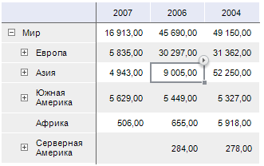

	При скрытии экспандеров все нераскрытые дочерние элементы будут
	 раскрыты в таблице:

	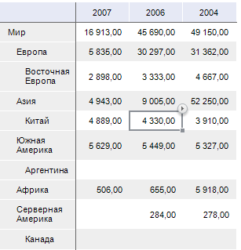

[Использование
 ступенчатой иерархии](javascript:TextPopup(this))

	Если по столбцам/строкам расположено несколько измерений, то для
	 разграничения элементов измерений в боковике/шапке рекомендуется использовать
	 ступенчатую иерархию.

	Для применения ступенчатой иерархии установите флажок «Использовать
	 ступенчатую иерархию».

	Пример таблицы без использования ступенчатой иерархии:

	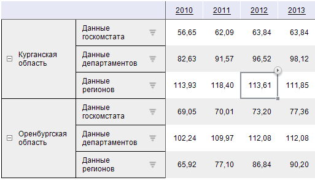

	Пример таблицы с использованием ступенчатой иерархии:

	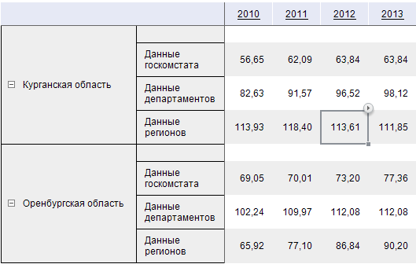

[Размещение дочерних элементов перед
 родительскими](javascript:TextPopup(this))

	Для отображения дочерних элементов иерархии перед родительскими
	 установите флажок «Дочерние элементы
	 перед родительскими»:

	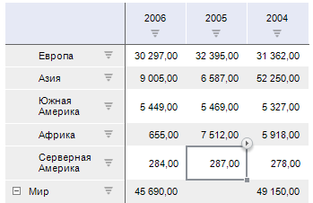

[Размещение
 родительских элементов до и после дочерних](javascript:TextPopup(this))

	Для отображения родительских элементов иерархии до и после дочерних,
	 установите флажок «Повторять элемент
	 уровня для дочерних»:

	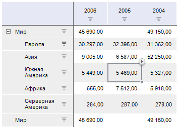

[Отступы
 элементов уровня](javascript:TextPopup(this))

	Чтобы установить отступы для наименований дочерних элементов, введите
	 или выберите в числовом редакторе «Отступы
	 элементов уровня» размер отступа в миллиметрах.

	В таблице ниже установлен отступ 15 мм, и дочерние элементы отображены
	 перед родительскими:

	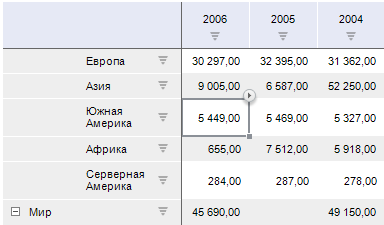

[Отображение/скрытие
 значков сортировки](javascript:TextPopup(this))

	Для отображения/скрытия значков сортировки 
	 установите/снимите флажок «Отображать
	 значки сортировки строк/столбцов».

[Использование
 нумерации](javascript:TextPopup(this))

	Для отображения/скрытия нумерации элементов заголовков строк/столбцов
	 установите/снимите флажок «Использовать
	 нумерацию».

	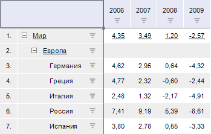

## Настройки измерений и уровней таблицы

На вкладке «Размещение» настраивается
 расположение элементов измерения.

Если [выделено
 измерение или уровень](../../Work_with_dimensions/Select_dimensions_elements_in_table.htm) таблицы, на вкладке «Размещение»
 будут доступны настройки, применяемые к измерению/уровню таблицы:

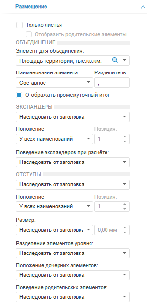

Настройки размещения для измерений аналогичны настройкам шапки/боковика.
 По умолчанию настройки размещения будут унаследованы от шапки/боковика
 для измерения и от измерения для уровней.

[Только
 листья / Отобразить родительские элементы](javascript:TextPopup(this))

	При установке флажка «Только листья»
	 в таблице будут отображены листья - только те элементы измерений,
	 которые не имеют дочерних элементов.

	Для отображения родительских элементов листьев установите флажок
	 «Отобразить родительские элементы».
	 После чего в таблице будут отображены листья и их родительские элементы.
	 Если на уровне родительского элемента расположен хотя бы один лист,
	 то все элементы этого уровня будут отображаться в таблице вне зависимости
	 от состояния флажка «Отобразить родительские
	 элементы».

	Примечание.
	 Отображение родительских элементов доступно только для измерений,
	 если установлен флажок «Только листья»
	 и используется опция «[Разделение
	 элементов уровня](Layout_Dim.htm#split_dim)» (аналог флажка «[Элементы уровней в отдельные
	 столбцы](Layout_Dim.htm#repeating_cells)» для шапки/боковика). Если разделение элементов
	 уровня не настроено, то при установке флажка «Отобразить
	 родительские элементы» будет предложено включить опцию для
	 настроек измерения.

[Объединение](javascript:TextPopup(this))

	Флажок «Объединение» доступен
	 при установленном флажке «[В
	 один столбец/строку с предыдущим](Merging_Dimensions.htm#in_one_column_row_with_the_previous)»:

	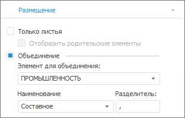

	После установки флажка станут доступными параметры:

		- Элементы для объединения.
		 Выберите элемент, который будет объединен с предыдущим в одну
		 ячейку. Отображаются все элементы текущего измерения. По умолчанию
		 выбран первый элемент списка;

		- Наименование. Выберите
		 тип наименования в объединенной ячейке из списка:

			- Исходное. Выводит
			 наименование исходного элемента;

			- Из объединенного.
			 Выводит наименование объединенного элемента;

			- Составное. Выводит
			 наименование исходного и объединенного элементов;

	Примечание.
	 В зависимости от выбранного наименования будет [меняться
	 оформление](Merging_Dimensions.htm#format), применяемое к объединенным элементам.

		- Разделитель. Задайте
		 в поле ввода разделитель между наименованиями объединенных элементов.
		 Пункт доступен при выборе типа наименования «Составное».

	Выбор параметров приведет к установке флажка «[Элементы
	 в одну ячейку с элементами предыдущего](Merging_Dimensions.htm#elements_in_one_cell_with_elements_of_the_previous)».

	Примечание.
	 Настройка объединения доступна для всех измерений, кроме самого верхнего
	 в шапке и крайнего левого в боковике.

[Отображать промежуточный
 итог](javascript:TextPopup(this))

	Доступно в веб-приложении для инструментов «[Аналитические
	 запросы (OLAP)](UIExpress.chm::/purpose/UiExpress_Purpose.htm)» и «[Аналитические
	 панели](UIAdhoc.chm::/UiAdhoc_Purpose.htm)».

	Для отображения/скрытия итогов для данного измерения установите/снимите
	 флажок «Отображать итог» в
	 контекстном меню измерения. По умолчанию флажок установлен.

[Экспандеры](javascript:TextPopup(this))

	Первый раскрывающийся список регулирует видимость экспандеров:

		- Наследовать от.
		 Поведение будет аналогично флажку «Экспандеры»
		 в [настройках шапки/боковика](#expander);

		- С экспандерами.
		 Экспандеры данного уровня/измерения будут отображены;

		- Без экспандеров.
		 Экспандеры данного уровня/измерения будут скрыты.

	Пример таблицы с экспандерами:

	

	При скрытии экспандеров все нераскрытые дочерние элементы будут
	 раскрыты в таблице:

	

	Раскрывающийся список «Положение»
	 определяет положение экспандеров при использовании нескольких [наименований
	 измерения](UiSelection.chm::/Selection/Element_Names.htm):

		- У всех наименований.
		 Экспандеры отображаются для каждого наименования;

		- Фиксированное. Экспандеры
		 отображаются только для наименования, указанного в поле «Позиция».

	Примечание.
	 Настройка положения доступна только для измерений.

	Пример фиксированного отображения экспандеров:

	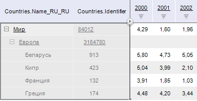

	Раскрывающий список «Поведение
	 экспандеров при расчёте» определяет поведение экспандеров при
	 обновлении отчета или изменении отметки:

		- Наследовать от.
		 Поведение будет аналогично переключателю экспандеров «Поведение
		 при расчёте» в [настройках шапки/боковика](#expander);

		- Сворачивать. При
		 обновлении отчета или изменении отметки иерархия измерения будет
		 сворачиваться;

		- Разворачивать. При
		 обновлении отчета или изменении отметки иерархия измерения будет
		 разворачиваться.

[Отступы](javascript:TextPopup(this))

	Настройки отступов доступны только для измерений.

	Первый раскрывающийся список регулирует наличие отступов для дочерних
	 элементов иерархии:

		- Наследовать от.
		 Поведение будет аналогично флажку «Отступы
		 элементов уровня» в [настройках шапки/боковика](#margin);

		- С отступами. Данное
		 измерение будет содержать отступы для элементов уровней;

		- Без отступов. Данное
		 измерение не будет содержать отступы для элементов уровней.

	Пример таблицы с отступами и отображением дочерних элементов перед
	 родительскими:

	

	Раскрывающийся список «Положение»
	 определяет положение отступов при использовании нескольких [наименований
	 измерения](UiSelection.chm::/Selection/Element_Names.htm):

		- У всех наименований.
		 Отступы отображаются для каждого наименования;

		- Фиксированное. Отступы
		 задаются только для наименования, указанного в поле «Позиция».

	Пример фиксированного отображения отступов:

	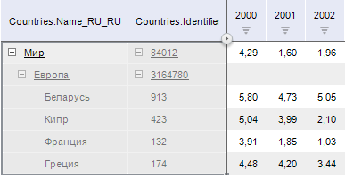

	Раскрывающийся список «Размер»
	 определяет размер отступов.

		- Наследовать от.
		 Размер отступов будет аналогичен значению поля «Отступы
		 элементов уровня» в [настройках шапки/боковика](#margin);

		- Вручную. Размер
		 отступов измерения задается вручную в соседнем поле.

[Разделение
 элементов уровня](javascript:TextPopup(this))

	При выбранном пункте «Наследовать
	 от» поведение будет аналогично флажку «Элементы
	 уровня в отдельные столбцы» в [настройках
	 шапки/боковика](#locating_child_elements).

	Для размещения разных уровней в одном столбце выберите пункт «Не разделять».

	Для размещения разных уровней в отдельных столбцах выберите пункт
	 «Разделять»:

	

[Положение
 дочерних элементов](javascript:TextPopup(this))

	При выбранном пункте «Наследовать
	 от» поведение будет аналогично флажку «Дочерние
	 элементы перед родительскими» в [настройках
	 шапки/боковика](#locating_child_elements).

	Для отображения дочерних элементов иерархии после родительских выберите
	 пункт «После родительских».

	Для отображения дочерних элементов иерархии перед родительскими
	 выберите пункт «Перед родительскими»:

	

[Поведение
 родительских элементов](javascript:TextPopup(this))

	При выбранном пункте «Наследовать
	 от» поведение будет аналогично флажку «Повторять
	 элемент уровня для дочерних» в [настройках
	 шапки/боковика](#parent_after).

	Для отображения родительских элементов только до или после дочерних
	 выберите пункт «Не повторять».

	Для повторения родительских элементов иерархии до и после дочерних
	 выберите пункт «Повторять»:

	

## Управление отображением иерархии

Если настроено отображение экспандеров для [измерений](Layout_Dim.htm#expander)
 и их [уровней](Layout_Dim.htm#expanders), то можно быстро свернуть/развернуть
 иерархию. Для этого:

	- выполните команду «Свернуть
	 все»/«Развернуть все»
	 контекстного меню элемента шапки/боковика. Применяется для всей шапки
	 или всего боковика;

	- выполните команду «Свернуть
	 все > Наименование
	 измерения»/«Развернуть все
	 > Наименование
	 измерения» контекстного меню элемента шапки/боковика. Применяется
	 для измерения. Сворачиваться/разворачиваться будет иерархия только
	 выбранного измерения;

	- выполните команду «Свернуть
	 все > Наименование
	 измерения > Наименование уровня»/«Развернуть все > Наименование измерения >
	 Наименование
	 уровня» контекстного меню элемента шапки/боковика. Применяется
	 для уровня. Сворачиваться/разворачиваться будет иерархия только выбранного
	 уровня, кроме самого нижнего.

Примечание.
 При сворачивании/разворачивании иерархии перевычисление отчета не происходит.

Изменение отображения иерархии влияет только на вид таблицы, и не влияет
 на отметку элементов.

Совет.
 Для изменения отметки элементов измерения обратитесь к разделу «[Настройка
 измерений и отметка элементов](UiSelection.chm::/selection/dimension.htm#operation_with_elements)».

См. также:

[Размещение
 элементов таблицы](Layout.htm)

		Справочная
		 система на версию 10.9
		 от 18/08/2025,
		 © ООО «ФОРСАЙТ»,
