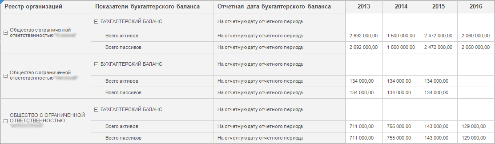
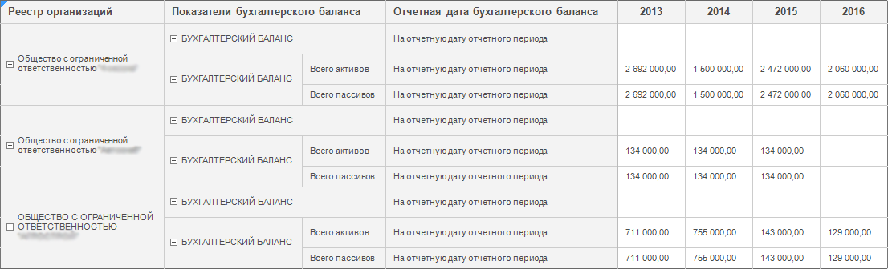
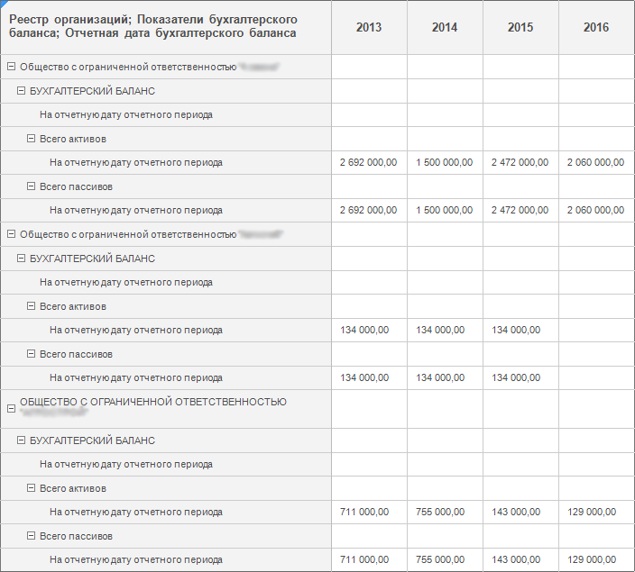
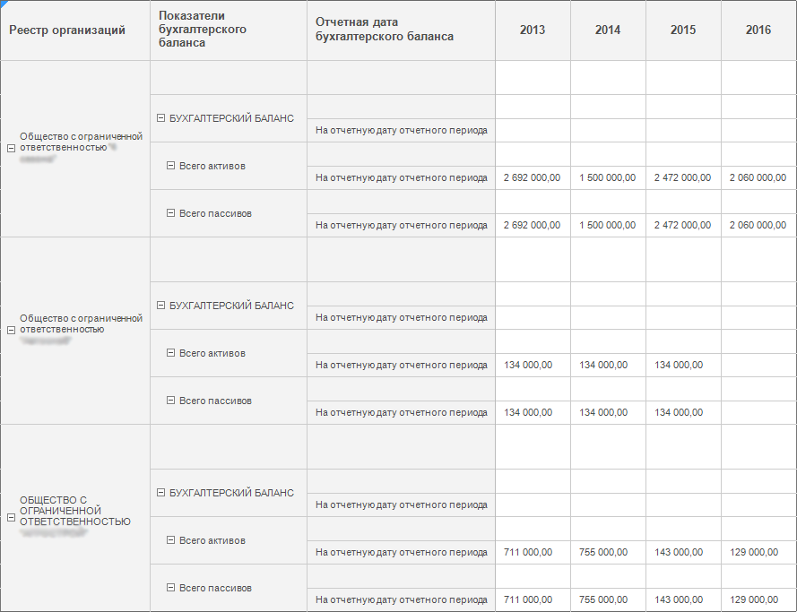
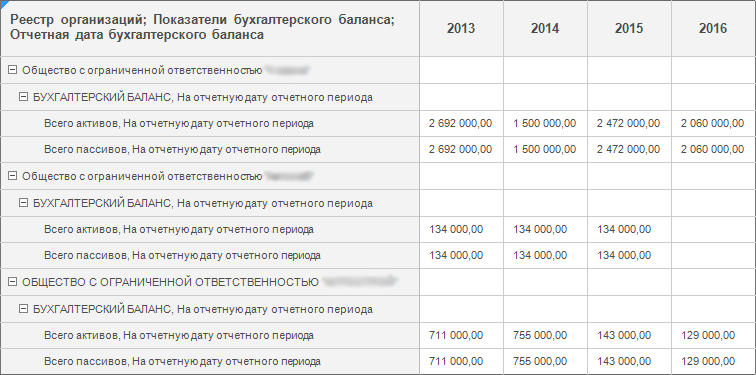
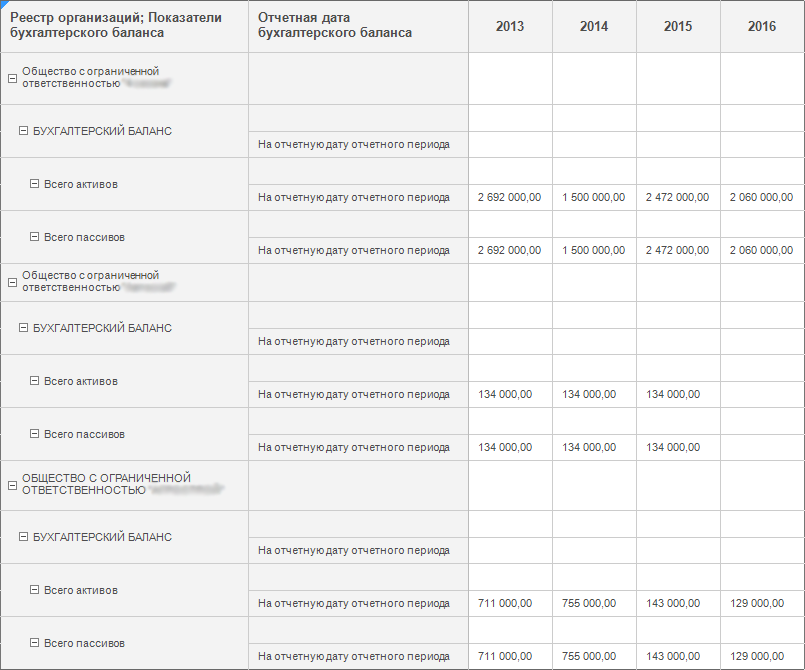
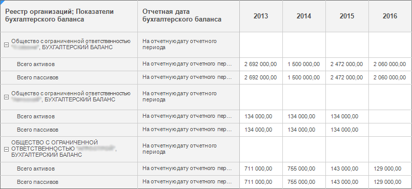
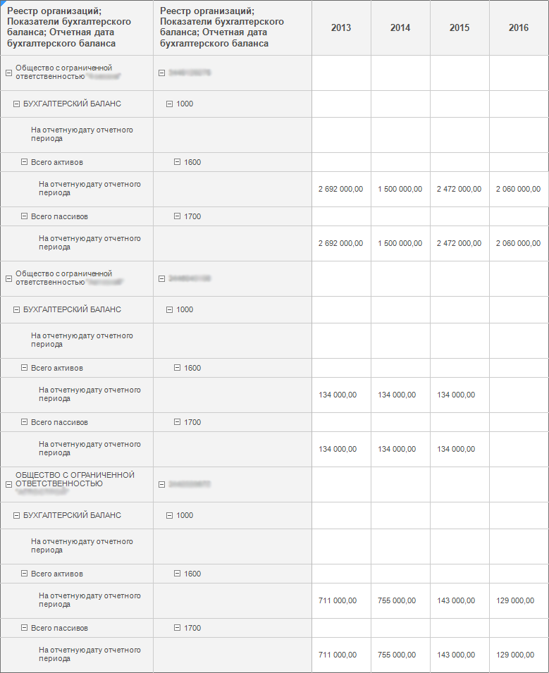

# Объединение измерений в боковике/шапке

Объединение измерений в боковике/шапке
-

# Объединение измерений в боковике/шапке

Для создания более компактного вида таблицы используйте объединение
 измерений в боковике по строкам, в шапке по столбцам.

В таблице с несколькими измерениями доступны следующие варианты объединения
 измерений:

	- [полное](Merging_Dimensions.htm#example_full).
	 Все измерения боковика/шапки объединены в одном столбце/строке;

	- [полное с поджатием](Merging_Dimensions.htm#example_full_with_tucking).
	 Все измерения боковика/шапки объединены в одном столбце/строке с указанием
	 элемента измерения, который дополнительно будет объединен с элементом
	 предыдущего измерения;

Примечание.
 Полное объединение с поджатием доступно для всех измерений, кроме первого.

	- [частичное](Merging_Dimensions.htm#example_part).
	 Объединены только выбранные измерения боковика/шапки в одном столбце/строке;

Примечание.
 Частичное объединение возможно, если таблица содержит три или более измерений
 в боковике/шапке.

	- [частичное
	 с поджатием](Merging_Dimensions.htm#example_part_with_tucking). Объединены только выбранные измерения боковика/шапки
	 в одном столбце/строке с указанием элемента измерения, который дополнительно
	 будет объединен с элементом предыдущего измерения.

Примечание.
 Частичное объединение с поджатием возможно:

1. Если у первого из объединяемых измерений нет предшествующих измерений.

2. Если у измерения, которое не участвует в объединении, отображается
 только один элемент относительно элемента последнего измерения, участвующего
 в объединении.

Объединение/разделение измерений настраивается с помощью раскрывающегося
 меню кнопки  «Размещение»
 на вкладке «Конструктор» ленты
 инструментов. Меню содержит флажки:

	- Все
	 измерения. Объединяет уровни всех измерений. При установке
	 флажка «Все измерения» флажок
	 «Уровни во всех измерениях»
	 устанавливается автоматически. Визуально флажок «Все
	 измерения» имеет вид:

		-  - отображается при полном объединении;

		-  - отображается при частичном объединении;

Примечание.
 Для применения объединения уровней всех измерений при использовании [табличного](UiNavObj.chm::/reference_book/Master_Table_reference_book/UiMd_reference_book_Master_Table_page4.htm)
 или [вычисляемого](UiNavObj.chm::/reference_book/Master_Calculation_reference_book/UiMd_reference_book_Master_Calculation_page3.htm)
 справочников убедитесь, что в них настроены уровни.

	- Уровни
	 во всех измерениях. Объединяет уровни в каждом измерении. Установлен
	 по умолчанию;

	- Соответствующие
	 наименования. Объединяет [дополнительные
	 наименования](UiSelection.chm::/Selection/Element_Names.htm) измерений. Если в таблице выбрано
	 отображение нескольких дополнительных наименований для каждого измерения,
	 то при установке флажка «Соответствующие
	 наименования» первое наименование первого измерения будет объединено
	 с первым наименованием второго измерения и так далее. Если для измерений
	 отображается различное количество дополнительных наименований, то
	 объединяются только соответствующие наименования, а остальные остаются
	 без изменений;

	- В
	 один столбец/строку с предыдущим. Объединяет текущее измерение
	 с измерением, которое находится выше в шапке или левее в боковике.
	 Доступен для всех измерений, кроме самого верхнего в шапке и крайнего
	 левого в боковике;

	- Элементы
	 в одну ячейку с элементами предыдущего. Объединяет в одну ячейку
	 элемент текущего измерения с элементами измерения, который находится
	 выше в шапке или левее в боковике. Доступен при установленном флажке
	 «В один столбец/строку с предыдущим».
	 При установке флажка автоматически устанавливается флажок «[Объединение](Layout_Dim.htm#combine)» на вкладе «Параметры» группы вкладок «Измерение» боковой панели. По умолчанию
	 в ячейку выводится первый элемент текущего измерения. Для выбора элемента,
	 выводящегося в ячейку, используйте [настройки
	 на боковой панели](Layout_Dim.htm#combine). Особенности оформления объединенных ячеек указаны
	 ниже.

## Варианты отображения боковика таблицы при использовании настроек объединения

В качестве примера рассмотрим таблицу «Показателей бухгалтерского баланса»,
 которая содержит по строкам три измерения: «Реестр организаций» (элементы
 первого уровня), «Показатели бухгалтерского баланса» (элементы первого
 и второго уровней), «Отчетная дата бухгалтерского баланса» (элементы
 нулевого уровня). В зависимости от выбранного измерения, установленных
 флажков объединения измерений и их комбинации таблица имеет вид:

	- Исходный вид таблицы. По умолчанию установлен флажок «Уровни во всех измерениях»:

Такой же вид таблица примет, если выполнить
 следующее действие:

		- [выделите
		 любое измерение](../../Work_with_dimensions/Select_dimensions_elements_in_table.htm#select_dim) и установите флажок «Уровни
		 во всех измерениях»;

		- [выделите
		 уровень](../../Work_with_dimensions/Select_dimensions_elements_in_table.htm#select_level) второго измерения и установите флажок «В
		 один столбец/строку с предыдущим», флажок «Уровни
		 во всех измерениях» устанавливается автоматически.

	- Сняты все флажки объединения раскрывающегося меню кнопки  «Размещение»
	 на вкладке «Конструктор» ленты
	 инструментов:

	- Выполнено [полное
	 объединение](Merging_Dimensions.htm#full). Для этого установлен флажок «Все
	 измерения», флажки «Уровни
	 во всех измерениях» и «В один
	 столбец/строку с предыдущим» установятся автоматически:

	- Выполнено [полное объединение](Merging_Dimensions.htm#full)
	 и выполнены следующие действия:

		- [Выделено
		 третье измерение](../../Work_with_dimensions/Select_dimensions_elements_in_table.htm#select_dim) или [уровень](../../Work_with_dimensions/Select_dimensions_elements_in_table.htm#select_level)
		 третьего измерения и снят флажок «В
		 один столбец/строку с предыдущим».

		- [Выделено
		 второе измерение](../../Work_with_dimensions/Select_dimensions_elements_in_table.htm#select_dim) или [уровень](../../Work_with_dimensions/Select_dimensions_elements_in_table.htm#select_level)
		 второго измерения и снят флажок «В
		 один столбец/строку с предыдущим».

В результате таблица имеет вид:

Такой же вид таблица примет, если выполнить
 следующие действия:

		- Снимите все флажки размещения.

		- Выделите второе измерение и установите флажок «В
		 один столбец/строку с предыдущим», флажок «Все
		 измерения» установится автоматически.

	- Выполнено [полное
	 объединение с поджатием](Merging_Dimensions.htm#full_with_tucking). Для этого выполнено [полное
	 объединение](Merging_Dimensions.htm#full), далее [выделен
	 уровень](../../Work_with_dimensions/Select_dimensions_elements_in_table.htm#select_level) третьего измерения и дополнительно установлен флажок «Элементы в одну ячейку с элементами предыдущего»:

В данном примере выполнено поджатие третьего
 измерения «Отчетная дата бухгалтерского баланса». В качестве элемента
 объединения при поджатии установлен элемент «На отчетную дату отчетного
 периода». Аналогично можно выполнить поджатие второго измерения.

После выполнения поджатия на вкладке «Размещение» в настройке «[Объединение](Layout_Dim.htm#combine)» задайте элемент
 объединения. По умолчанию выбран первый элемент списка.

Примечание.
 Если после настройки поджатия были выполнены другие настройки размещения,
 а поджатие не было снято, то настройка поджатия сохраняется и при последующем
 повторном объединении выполнится автоматически.

	- Выполнено [частичное
	 объединение](Merging_Dimensions.htm#part). Для этого выполнено [полное
	 объединение](Merging_Dimensions.htm#full) и выполнены следующие действия:

		- [Выделено
		 третье измерение](../../Work_with_dimensions/Select_dimensions_elements_in_table.htm#select_dim) или [уровень](../../Work_with_dimensions/Select_dimensions_elements_in_table.htm#select_level)
		 третьего измерения.

		- Снят флажок «В один столбец/строку
		 с предыдущим».

В результате таблица имеет вид:

В данном примере выполнено объединение измерений
 «Реестр организаций» и «Показатели бухгалтерского баланса».

	- Выполнено [частичное
	 объединение измерений с поджатием](Merging_Dimensions.htm#part_with_tucking). Для этого выполнено [частичное
	 объединение](Merging_Dimensions.htm#part) и выполнены следующие действия:

		- [Выделено
		 второе измерение](../../Work_with_dimensions/Select_dimensions_elements_in_table.htm#select_dim) или [уровень](../../Work_with_dimensions/Select_dimensions_elements_in_table.htm#select_level)
		 второго измерения.

		- Установлен флажок «Элементы в одну ячейку с элементами
		 предыдущего».

В результате таблица имеет вид:

В данном примере выполнено объединение измерений
 «Реестр организаций» и «Показатели бухгалтерского баланса» и поджатие
 измерения «Показатели бухгалтерского баланса». В качестве элемента объединения
 при поджатии установлен элемент «БУХГАЛТЕРСКИЙ БАЛАНС».

После выполнения поджатия на вкладке «Размещение» в настройке «[Объединение](Layout_Dim.htm#combine)» задайте элемент
 объединения. По умолчанию выбран первый элемент списка.

Примечание.
 Если после настройки поджатия были выполнены другие настройки размещения,
 а поджатие не было снято, то настройка поджатия сохраняется и при последующем
 повторном объединении выполнится автоматически.

	- Отображены [дополнительные
	 наименования](UiSelection.chm::/Selection/Element_Names.htm) измерений, далее выполнено [полное
	 объединение](Merging_Dimensions.htm#full), далее установлен флажок «Соответствующие
	 наименования»:

## Особенности оформления объединенных ячеек

Если для измерений, выведенных в боковике или шапке, задано различное
 оформление, то при объединении элементов в одну ячейку оформление будет
 зависеть от [выведенного наименования](Layout_Dim.htm#combine):

	- если выбран тип наименования «Исходное»,
	 то применится оформление заданное для измерения, которое находилось
	 в этих ячейках до объединения;

	- если выбран тип наименования «Из
	 объединенного» или «Составное»,
	 то применится оформление заданное для измерения, которое объединяется.

См. также:

[Размещение
 элементов измерения](Layout_Dim.htm)

		Справочная
		 система на версию 10.9
		 от 18/08/2025,
		 © ООО «ФОРСАЙТ»,
