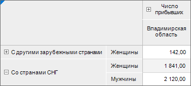
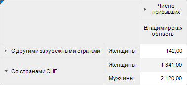

# Отображение пользовательских экспандеров

Отображение пользовательских экспандеров
-

# Отображение пользовательских экспандеров

По умолчанию в таблице отображаются стандартные экспандеры:

	- .
	 Развёрнутый экспандер;

	- .
	 Свёрнутый экспандер.

Настройка отображения пользовательских экспандеров осуществляется в
 среде разработки на языке программирования Fore с помощью свойств [ITabSheet.ExpanderOnPicture](TabSheet.chm::/Interface/ITabSheet/ITabSheet.ExpanderOnPicture.htm)
 и [ITabSheet.ExpanderOffPicture](TabSheet.chm::/Interface/ITabSheet/ITabSheet.ExpanderOffPicture.htm).

Для отображения пользовательских экспандеров:

	- Выберите способ хранения пиктограмм:

		- [в
		 ресурсах](UiNav.chm::/Multilanguage/Resources/Work_Resources.htm#image);

		- в файловой системе.

	- Выполните модуль в зависимости от выбранного способа хранения
	 пиктограмм:

		- для ресурса.
		 Для выполнения примера в репозитории предполагается наличие
		 регламентного отчёта с идентификатором REP_ID и ресурс с идентификатором
		 RES_ID, содержащего два изображения для экспандеров с идентификаторами
		 ID_EXPOn и ID_EXPOff. Добавьте ссылки на системные сборки: Drawing,
		 IO, Metabase, Report, Tab.

	Sub UserProc;

	Var

	    MB: IMetabase;

	    Rep: IPrxReport;

	    SheetT: IPrxTable;

	    Tab: ITabSheet;

	    TImg: ITabImages;

	    ExpOn, ExpOff: Integer;

	    Res: IResourceObject;

	Begin

	    // Получим репозиторий

	    MB := MetabaseClass.Active;

	    // Получим регламентный отчёт

	    Rep := MB.ItemById("REP_ID").Edit As IPrxReport;

	    // Получим таблицу с листа отчёта

	    SheetT := Rep.ActiveSheet As IPrxTable;

	    Tab := SheetT.TabSheet;

	    // Получим изображение пользовательских экспандеров из ресурсов

	    Res := MetabaseClass.Active.ItemById("RES_ID").Bind As IResourceObject;

	    TImg := Tab.Images;

	    // Выполним очистку коллекции изображений

	    TImg.RemoveAll(True);

	    // Получим изображение для развернутого экспандера из ресурса

	    ExpOn := TImg.Add(GxImage.FromStream(Res.Binaries.Value("ID_EXPOn")));

	    // Получим изображение для свернутого экспандера из ресурса

	    ExpOff := TImg.Add(GxImage.FromStream(Res.Binaries.Value("ID_EXPOff")));

	    // Зададим пользовательские экспандеры

	    Tab.ExpanderOnPicture := ExpOn;

	    Tab.ExpanderOffPicture := ExpOff;

	    (Rep As IMetabaseObject).Save;

	End Sub UserProc;

		- для файловой системы.
		 Для выполнения примера в репозитории предполагается наличие регламентного
		 отчёта с идентификатором REP_ID и в файловой
		 системе должны присутствовать два изображения On.png и
		 Off.png. Добавьте ссылки на системные сборки: Drawing, IO, Metabase,
		 Report, Tab.

	Sub UserProc;

	Var

	    MB: IMetabase;

	    Rep: IPrxReport;

	    SheetT: IPrxTable;

	    Tab: ITabSheet;

	    TImg: ITabImages;

	    ExpOn, ExpOff: Integer;

	    Res: IResourceObject;

	Begin

	    // Получим репозиторий

	    MB := MetabaseClass.Active;

	    // Получим регламентный отчёт

	    Rep := MB.ItemById("REP_ID").Edit As IPrxReport;

	    // Получим таблицу с листа отчёта

	    SheetT := Rep.ActiveSheet As IPrxTable;

	    Tab := SheetT.TabSheet;

	    // Получим коллекцию
	 изображений табличной области

	    TImg := Tab.Images;

	    // Выполним очистку коллекции изображений

	    TImg.RemoveAll(True);

	    // Получим изображение для развернутого экспандера из файловой
	 системы

	    ExpOn := TImg.Add(GxImage.FromFile("С:\On.png"));

	    // Получим изображение для свернутого экспандера из файловой
	 системы

	    ExpOff := TImg.Add(GxImage.FromFile("C:\Off.png"));

	    // Зададим пользовательские экспандеры

	    Tab.ExpanderOnPicture := ExpOn;

	    Tab.ExpanderOffPicture := ExpOff;

	    (Rep As IMetabaseObject).Save;

	End Sub UserProc;

После выполнения действий будут отображаться пользовательские экспандеры:

См. также:

[Размещение
 элементов измерения](Layout_Dim.htm)

		Справочная
		 система на версию 10.9
		 от 18/08/2025,
		 © ООО «ФОРСАЙТ»,
