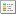
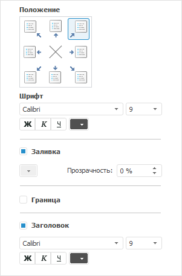
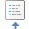
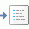
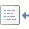

# Легенда метрик

Легенда метрик
-

# Легенда метрик

Легенда [метрик таблицы](../Work_with_dimensions/Table_metrics.htm)
 настраивается на вкладках боковой панели:

	- Легенда «Значение»;

	- Легенда «Цвет фона»;

	- Легенда «Цвет шрифта»;

	- Легенда «Размер шрифта».

Примечание.
 В регламентном отчете легенда добавляется при помощи кнопки с раскрывающимся
 меню  «Легенда» группы «Диаграммы»
 вкладки «Вставка» ленты инструментов.
 Настройка легенды доступна на вкладке боковой панели «Параметры
 легенды» после выделения легенды на рабочей области.

Вкладки имеют идентичное содержание:

Для легенд таблицы доступны следующие настройки:

[Расположение
 легенды](javascript:TextPopup(this))

	На панели «Положение» выберите
	 вариант расположения легенды:

		- . В левом верхнем углу;

		- . По центру верхней границы;

		- . В правом верхнем углу;

		- . По центру правой границы;

		- . В правом нижнем углу;

		- . По центру нижней границы;

		- . В левом нижнем углу;

		- . По центру левой границы;

		- . Легенда не отображается.

[Шрифт текста
 легенды](javascript:TextPopup(this))

	Параметры шрифта, используемого в легенде, задаются в группе «Шрифт»:

		- Шрифт.
		 Выберите один из шрифтов, установленных в операционной системе;

		- Размер
		 шрифта. Установите требуемый размер шрифта. Размер задаётся
		 в пунктах, и его можно выбрать из раскрывающегося списка или ввести
		 вручную. Диапазон допустимых значений: [1, 72];

		- Начертание
		 текста. Нажмите кнопки, задающие начертание шрифта:

			- Ж. Полужирное
			 начертание;

			- К.
			 Курсивное начертание;

			- Ч.
			 Подчеркивание текста.

	При нажатой кнопке будет использоваться
	 соответствующий стиль начертания. Доступно использование нескольких
	 стилей одновременно, например, нажатие кнопок «Ж»
	 и «К»
	 даёт полужирное курсивное начертание;

		- Цвет
		 шрифта. Выберите цвет шрифта в раскрывающейся палитре цветов.

[Заливка легенды](javascript:TextPopup(this))

	Параметры заливки фона легенды задаются в группе «Заливка».

	Установите флажок «Заливка»
	 и в раскрывающейся палитре укажите нужный цвет. В поле «Прозрачность»
	 задайте процент прозрачности фона легенды.

[Граница легенды](javascript:TextPopup(this))

	Оформление границы легенды задается в группе «Граница».
	 Если флажок установлен, то прорисовывается граница легенды. Для настройки
	 параметров границы отображаются дополнительные параметры: раскрывающаяся
	 палитра для выбора цвета границы и редактор значений для задания толщины
	 границы.

[Отображение
 заголовка легенды](javascript:TextPopup(this))

	Для отображения заголовка легенды установите флажок «Заголовок»
	 и задайте параметры шрифта. Параметры шрифта заголовка легенды совпадают
	 с параметрами шрифта, используемого в легенде.

См. также:

[Оформление
 таблицы и ее элементов](Formatting/Formatting_table.htm)

		Справочная
		 система на версию 10.9
		 от 18/08/2025,
		 © ООО «ФОРСАЙТ»,
