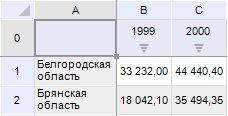
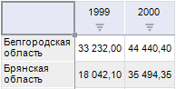

# Отображение разметки таблицы

Отображение разметки таблицы
-

# Отображение разметки таблицы

Под разметкой таблицы понимаются наименования строк и столбцов, которые отображаются
 по умолчанию (для столбцов - A, B, C и т.д., для строк - 1, 2, 3 и т.д.).

Примечание.
 Скрытие разметки недоступно в регламентном отчете.

Для отображения/скрытия разметки нажмите/отожмите кнопку 
 «Разметка» на вкладке ленты «Таблица».

Таблица с разметкой:

Таблица без разметки:

См. также:

[Размещение
 элементов таблицы](Layout/Layout.htm)

		Справочная
		 система на версию 10.9
		 от 18/08/2025,
		 © ООО «ФОРСАЙТ»,
