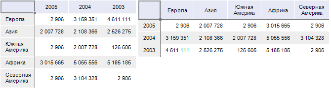

# Поворот таблицы

Поворот таблицы
-

# Поворот таблицы

Функция «Поворот таблицы» позволяет
 менять местами столбцы и строки таблицы.

Примечание.
 Поворот таблицы недоступен в регламентном отчете.

Для поворота таблицы нажмите кнопку 
 «Повернуть таблицу» на вкладке
 ленты «Таблица».

При повороте фиксированные измерения остаются на прежнем месте, а измерения,
 расположенные по строкам и столбцам, меняются местами. При этом порядок
 элементов измерений внутри каждой группы остается неизменным.

Пример таблицы до и после поворота:

См. также:

[Размещение
 элементов таблицы](Layout/Layout.htm)

		Справочная
		 система на версию 10.9
		 от 18/08/2025,
		 © ООО «ФОРСАЙТ»,
