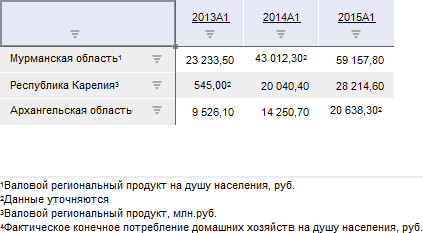

# Отображение сносок в таблице

Отображение сносок в таблице
-

# Отображение сносок в таблице

С помощью языка Fore в таблице
 данных доступны отображение и настройка сносок для данных и для измерений
 в шапке и в боковике.

Сноски для данных формируются с помощью специальной метрики «Сноска»,
 доступной только с помощью Fore.
 Для данной метрики доступна множественная отметка. Сноски для измерений
 в шапке и боковике формируются на основе формулы, составленной из атрибутов
 данного измерения.

Сноски могут быть числовыми, текстовыми или символьными. Для сносок
 может быть отображена расшифровка, расположенная справа, слева, сверху
 или снизу от таблицы данных.

Примечание.
 Сноски экспортируются только в следующие форматы: PDF, EMF, RTF, XLS,
 XLSX. Подробнее об особенностях экспорта сносок вы можете узнать в соответствующем
 разделе, посвященном экспорту.

Пример таблицы данных со сносками:

См. также:

[Настройка внешнего вида таблицы](TableView.htm)

		Справочная
		 система на версию 10.9
		 от 18/08/2025,
		 © ООО «ФОРСАЙТ»,
