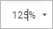
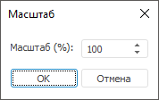

# Масштабирование таблицы

Масштабирование таблицы
-

# Масштабирование таблицы

Для изменения масштаба отображения таблицы выполните одно из действий:

	Веб-приложение Настольное приложение

		В регламентном отчёте, форме ввода:

			- выберите одно из фиксированных значений масштаба с помощью
			 кнопки  «Выбрать»,
			 расположенной рядом с текущим значением масштаба:

		

			- измените текущее значение масштаба на произвольное:

		

		Для изменения масштаба всего отчёта используйте средства браузера.

		В экспресс-отчёте, аналитической панели:

			- нажмите кнопку 
			 «Масштаб» на вкладке
			 «Таблица» ленты инструментов.
			 После чего будет открыто раскрывающееся меню:

		

		Выполните одно из действий:

				- установите переключатель напротив одного из фиксированных
				 значений масштаба;

				- выполните команду «Произвольный».
				 После чего будет открыто окно «Масштаб»
				 для указания произвольного значения масштаба:

		

		В экспресс-отчёте, аналитической панели, регламентном отчёте,
		 форме ввода:

			- нажмите кнопку 
			 «Масштаб» на вкладке
			 «Таблица» ленты инструментов
			 (в экспресс-отчёте и аналитической панели) или на вкладке
			 «Вид» (в регламентном
			 отчёте и форме ввода). После чего будет открыто раскрывающееся
			 меню:

		

		Выполните одно из действий:

				- установите переключатель напротив одного из фиксированных
				 значений масштаба;

				- выполните команду «Произвольный».
				 После чего будет открыто окно «Масштаб»
				 для указания произвольного значения масштаба:

		

			- установите фокус на таблице и, удерживая клавишу CTRL,
			 прокрутите колёсико мыши. При прокручивании колёсика вверх
			 масштаб будет увеличиваться, при прокручивании вниз - уменьшаться.

См. также:

[Оформление
 таблицы и ее элементов](Formatting/Formatting_table.htm)

		Справочная
		 система на версию 10.9
		 от 18/08/2025,
		 © ООО «ФОРСАЙТ»,
