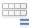
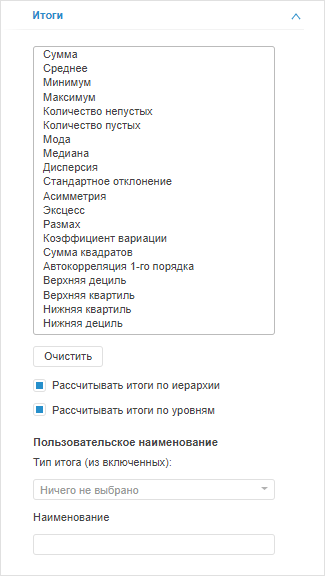
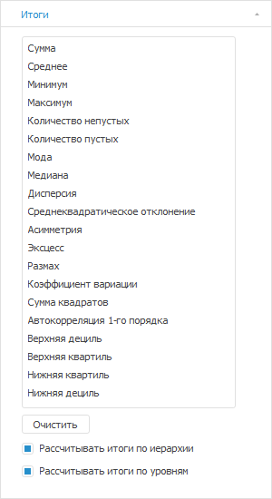
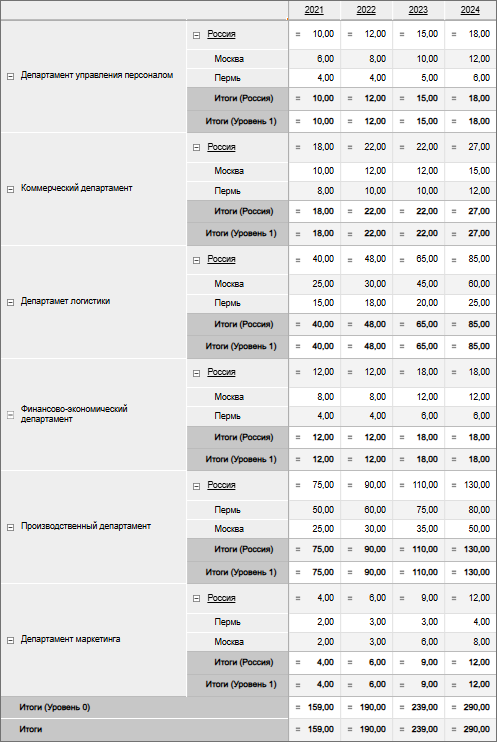
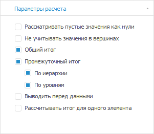
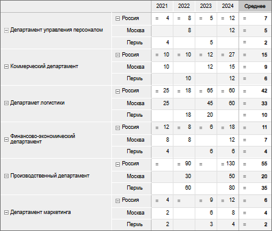
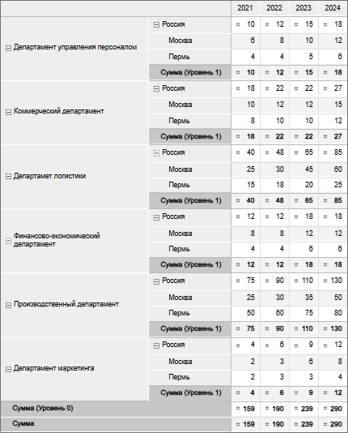
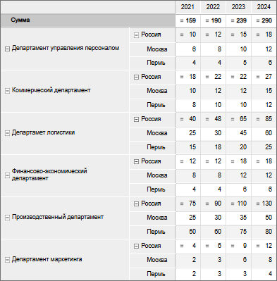
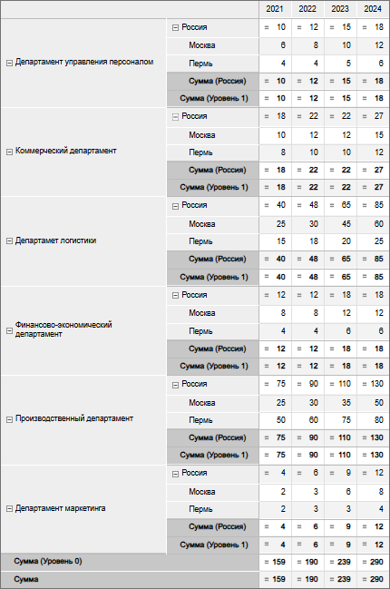
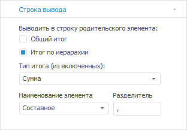

# Расчёт итоговых значений: Настольное приложение

Расчёт итоговых значений: Настольное приложение
-

# Расчёт итоговых значений

	Для таблицы данных можно настроить отображение итоговых значений
	 по строкам и/или столбцам.

	Примечание.
	 При использовании [фильтра](dataentryforms.chm::/desktop/table/table_area_structure.htm#filters)
	 в расширении «[Интерактивные
	 формы ввода данных](dataentryforms.chm::/desktop/starting/starting.htm)» итоговые значения будут
	 скрыты.

## Отображение итоговых значений

	Для отображения итогов «по строкам»/«по столбцам»:

		- выполните команду «Добавить
		 промежуточный итог»/«Добавить
		 итог» в контекстном меню [шапки](../Select_areas.htm#select_heading)/[боковика](../Select_areas.htm#select_sidehead) таблицы
		 и в раскрывающемся меню выберите метод расчёта итогов;

	Примечание.
	 В инструменте «Аналитические панели»
	 выполните команду «Таблица > Добавить
	 промежуточный итог»/«Таблица
	 > Добавить итог» в контекстном меню.

		- выберите необходимые методы расчёта итогов в раскрывающемся
		 меню кнопки  «Итоги по строкам»/
		 «Итоги по столбцам», расположенной
		 на вкладке ленты инструментов:

			- «Главная», «Таблица» или «Конструктор»
			 в экспресс-отчёте или аналитической панели;

			- «Конструктор»
			 в регламентном отчёте;

		- выделите [шапку](../Select_areas.htm#select_heading)/[боковик](../Select_areas.htm#select_sidehead) таблицы
		 и на появившейся вкладке «Итоги»,
		 выберите необходимые методы расчёта итогов. Вид вкладки отличается
		 в настольном приложении и в веб-приложении:

		 Веб-приложение Настольное приложение

			

			

	Для того, чтобы выключить все выбранные
	 методы расчёта и удалить все [пользовательские
	 наименования](#user_naming), нажмите кнопку «Очистить».

	Для отображения итогов по иерархии/уровням
	 установите флажок «[Рассчитывать
	 итоги по иерархии»/«Рассчитывать
	 итоги по уровням](#hiererarchy_level)».

	[Доступные
	 методы расчёта](javascript:TextPopup(this))

		В зависимости от выбранного типа итоговых значений (промежуточный
		 итог, итог или итоги по строкам/столбцам) доступны следующие методы
		 расчёта итогов:

			- Сумма;

			- Среднее. Среднее рассчитается по ячейкам, в которых
			 имеются данные. Если ячейки пустые, то при расчёте среднего
			 эти ячейки не берутся в расчёт. Например, если в 18 ячейках
			 из 20 имеются данные, то расчёт среднего будет произведен,
			 по 18 ячейкам;

		Примечание.
		 Для расчёта среднего, как среднего арифметического, установите
		 флажок «[Рассматривать
		 пустые значения как нули](Calculate_totals.htm#treat_empty_values_as_zeros)».

			- Минимум;

			- Максимум;

			- Количество непустых;

			- Количество пустых;

			- [Мода](Lib.chm::/05_Statistics/UiModelling_mode.htm);

			- [Медиана](Lib.chm::/05_Statistics/UiModelling_Median.htm);

			- [Дисперсия](Lib.chm::/05_Statistics/UIModelling_dispers.htm);

			- [Среднеквадратическое
			 отклонение](Lib.chm::/05_Statistics/UiModelling_ArgSqDev.htm);

			- [Асимметрия](Lib.chm::/05_Statistics/UiModelling_Asymmetry.htm);

			- [Эксцесс](Lib.chm::/05_Statistics/UiModelling_Excess.htm);

			- [Размах](Lib.chm::/05_Statistics/Range.htm);

			- [Коэффициент
			 вариации](Lib.chm::/05_Statistics/UiModelling_CoeffVar.htm);

			- [Сумма
			 квадратов](Lib.chm::/05_Statistics/SquaresSum.htm);

			- Автокорреляция 1-го порядка;

			- [Верхняя
			 дециль](Lib.chm::/05_Statistics/Quantile.htm);

			- [Верхняя
			 квадриль](Lib.chm::/05_Statistics/Quantile.htm);

			- [Нижняя
			 квадриль](Lib.chm::/05_Statistics/Quantile.htm);

			- [Нижняя
			 дециль](Lib.chm::/05_Statistics/Quantile.htm);

			- Общий итог. Общий итог, основанный на [серверной агрегации
			 фактов](UiNavObj.chm::/Cube/Agregation.htm);

			- [Итоги
			 из источника](Calculate_totals_from_the_source.htm). Отображает агрегированные данные из источника.
			 Доступен, если в источнике данных настроена [агрегация измерений
			 фактов куба](UiNavObj.chm::/Cube/Agregation.htm#fact) и не используется [глобальный
			 кеш](UiNav.chm::/02_Navigator/Cache_In_Blob.htm).

	[Задание
	 пользовательского наименования итоговых значений](javascript:TextPopup(this))

		В веб-приложении имеется возможность задания пользовательского
		 наименования итоговых значений таблицы. Для этого выполните следующие
		 действия:

			- Выберите в раскрывающемся списке «Тип
			 итога (из включённых)» один из применённых к таблице
			 типов итога.

			- Укажите новое наименование итоговых значений в поле
			 «Наименование».

		Для возвращения наименования итоговых значений по умолчанию
		 очистите поле «Наименование»
		 вручную или нажмите кнопку «Очистить».

		Примечание.
		 При выборе нового типа итога наименование, указанное для предыдущего
		 типа итога, сохраняется.

		Пример таблицы с наименованиями итогов по умолчанию:

		

		Пример таблицы с пользовательскими наименованиями:

		

	[Примеры
	 итогов по строкам и столбцам](javascript:TextPopup(this))

		Пример итогов по строкам:

		

		Пример итогов по столбцам:

		

	Для настройки расчёта вычислений по отредактированным данным без
	 предварительного сохранения данных в источник используется «[Настройка
	 расчета формул](../Working_with_table_data/FormulaCalculation.htm)».

## Настройка итоговых значений

	Для настройки итоговых значений используйте:

		- вкладку «[Параметры расчета»/«Итоги](Calculate_totals.htm#totals_parameters)»
		 боковой панели;

		- вкладку «[Строка
		 вывода](Calculate_totals.htm#string)» боковой панели;

		- команду «[Метод
		 расчёта итогов](Calculate_totals.htm#element)» контекстного меню элемента.

### Параметры расчета итогов

	Для настройки параметров расчёта итогов используйте вкладки «Параметры расчета»/«Итоги»
	 боковой панели.

	[Для отображения
	 вкладки](javascript:TextPopup(this))

		Первый способ:

			- Выделите в таблице одну или несколько ячеек с итоговыми
			 значениями.

			- Перейдите на вкладку «Параметры
			 расчета», расположенную в группе вкладок «Итоги»
			 боковой панели.

		Второй способ:

			- Выделите в таблице любую ячейку или диапазон с данными.

			- Перейдите на вкладку «Итоги»,
			 расположенную в группе вкладок «Таблица»
			 боковой панели.

	

	Определите на вкладке следующие параметры расчета:

	[Рассматривать
	 пустые значения как нули](javascript:TextPopup(this))

		Если флажок «Рассматривать
		 пустые значения как нули» установлен, то при вычислении
		 итогов пустые значения в ячейках будут рассматриваться как нули.
		 Это важно, например, при вычислении средних значений.

		Примечание.
		 Установка данного флажка не влияет на результат расчёта итогов
		 «Количество пустых» и
		 «Количество непустых»,
		 а также в строке [статуса
		 отчёта](/GetStarted/Interface/Interface_Description.htm#status_line), если рассчитывается «Среднее».

		Пример неустановленного и установленного флажка:

		   

	[Не учитывать
	 значения в вершинах](javascript:TextPopup(this))

		При установленном флажке не будут учитываться значения родительских
		 элементов иерархии. По умолчанию флажок снят.

	[Общий
	 итог / Промежуточный итог](javascript:TextPopup(this))

		Флажок «Общий итог»
		 определяет отображение общих итоговых значений по столбцам/строкам
		 таблицы, рассчитанных по всем элементам с установленной [отметкой](UiSelection.chm::/Selection/Dimension.htm).
		 По умолчанию флажок установлен.

		Флажок «Промежуточный итог»
		 определяет отображение итоговых значений, расположенных по строкам/столбцам,
		 в зависимости от состояния флажков:

			- По иерархии.
			 Итоги рассчитываются по [иерархии
			 измерений](uinavobj.chm::/reference_book/Master_RDS_reference_book/base_settings.htm#hierarchy) боковика/шапки таблицы по каждому
			 элементу с установленной [отметкой](UiSelection.chm::/Selection/Dimension.htm);

			- По уровням.
			 Итоги рассчитываются по [уровням
			 измерений](uinavobj.chm::/reference_book/Master_RDS_reference_book/Level.htm) боковика/шапки таблицы по каждому
			 элементу с установленной [отметкой](UiSelection.chm::/Selection/Dimension.htm).

		Примечание.
		 Если боковик/шапка таблицы состоит из нескольких иерархических
		 измерений, то при расчёте промежуточных итогов каждое следующее
		 левое/верхнее измерение берёт итог высшего уровня правого/нижнего
		 измерения.

		При установке данных флажков в наименованиях итоговых элементов
		 отображаются наименования родительских элементов иерархии и/или
		 наименования уровней соответственно. Флажки «По
		 иерархии» и «По уровням»
		 установлены по умолчанию.

		Совет. Если
		 общий итог совпадает с промежуточным итогом по иерархии/уровням,
		 выключите общий итог для избежания дублирования информации.

		Пример с установленными флажками «Общий
		 итог», «Промежуточный
		 итог» и «По иерархии»:

		

		Пример с установленными флажками «Общий
		 итог», «Промежуточный
		 итог» и «По уровням»:

		

	[Выводить
	 перед данными](javascript:TextPopup(this))

		Если флажок «Выводить перед
		 данными» установлен, то итоги будут отображаться перед
		 ячейками с данными.

		Пример:

		

	[Рассчитывать
	 итог для одного элемента](javascript:TextPopup(this))

		Если флажок «Рассчитывать итог
		 для одного элемента» установлен, то при вычислении итогов
		 по столбцам/строкам дополнительно будут рассчитываться итоги:

			- для элементов по каждому уровню;

			- для элементов, содержащих
			 одну строку/столбец.

		Пример неустановленного флажка:

		

		Пример установленного флажка:

		

### Строка вывода

	Если в таблице отображаются элементы иерархического измерения разных
	 уровней иерархии, то для вывода общего итога или итога по иерархии
	 в строку родительского элемента используйте вкладку «Строка
	 вывода» боковой панели.

	[Для отображения
	 вкладки](javascript:TextPopup(this))

			- Выделите в таблице одну или несколько ячеек с итоговыми
			 значениями.

			- Перейдите на вкладку «Строка
			 вывода», расположенную в группе вкладок «Итоги»
			 боковой панели.

	

	Для настройки параметров отображения итогов в строке родительского
	 элемента установите один или оба флажка. Для итогов по строкам/столбцам
	 настройка раздельная.

	[Тип выводимого
	 итога](javascript:TextPopup(this))

		Выберите один тип итогов, примененных к данной таблице, из раскрывающегося
		 списка.

	[Наименование
	 элемента](javascript:TextPopup(this))

		Выберите тип наименования из списка:

			- Исходное. Выводит
			 наименование исходного элемента;

			- Метод итога.
			 Выводит наименование метода итога;

			- Составное. Выводит
			 наименование исходного элемента и метода итога.

	[Разделитель](javascript:TextPopup(this))

		Задайте в поле ввода разделитель между наименованиями элемента
		 и метода итога. Пункт доступен при выборе типа наименования «Составное».

	[Примеры
	 применения настройки отображения итогов в строке родительского элемента](javascript:TextPopup(this))

		Примеры отображения итогов в строке родительского элемента:

			- при установке флажка «Общий
			 итог», типа итога «Сумма»,
			 наименования элемента «Составное»
			 и разделителя «,»:

		

			- при установке флажка «Итоги
			 по иерархии», типа итога «Сумма»
			 и наименования элемента «Метод
			 итога»:

		

### Итоговые значения для элемента измерения

	В экспресс-отчётах в веб-приложении для настройки метода расчёта
	 итогов элемента измерения, для которого настроен расчёт итогов, выполните
	 команду «Метод расчёта итогов»
	 контекстного меню элемента и выберите метод:

		- Нет. Итог для элемента
		 не будет рассчитываться;

		- Сумма;

		- Среднее;

		- Минимум;

		- Максимум;

		- Мода;

		- Медиана;

		- Дисперсия.

	Выбрать можно только один метод.

	Команда доступна для элементов измерений в шапке таблицы, если рассчитываются
	 итоги по столбцам; для элементов измерений в боковике таблицы, если
	 рассчитываются итоги по строкам.

	При использовании своего метода расчёта для элемента название итоговых
	 значений измениться на «Итог»,
	 если не было настроено [пользовательское
	 наименование](Calculate_totals.htm#user_naming).

	Для возврата метода расчёта измерения для элемента выполните команду
	 «Метод расчёта итогов» >
	 «Сбросить» контекстного меню
	 элемента.

## Особенности расчёта

	Доступно для экспресс-отчётов в веб-приложении.

	Если для таблицы:

		- отмеченные элементы содержат идентификаторы различных единиц
		 измерения;

		- структура измерения, который включает эти элементы, соответствует
		 структуре [справочника
		 показателей](UiNavObj.chm::/Units/Units_Cube.htm#indicators);

		- куб не содержит [справочник единиц
		 измерения](UiNavObj.chm::/Units/Units_Cube.htm#units) и установлен флажок «[Не агрегировать разные единицы измерения](uinavobj.chm::/Cube/CreateCube/Master_Standart/UiMd_Cube_CreateCube_Master_Standart_7.htm#no_agr)»;

	то при расчёте итогов:

		- В группе вкладок «Отметка»
		 напротив измерения, который включает эти элементы, будет отображаться
		 пиктограмма  и всплывающая подсказка.

		- В расчётной ячейке вместо значения будет выведен символ
		 «-». Для изменения символа или текста используйте свойство [IPivot.UnmatchedUnitsText](kepivot.chm::/Interface/IPivot/IPivot.UnmatchedUnitsText.htm).
		 Для отображения символа при расчёте итогов измерение должно находиться
		 в строках или столбцах.

	При включении [отображения
	 пиктограмм для вычисляемых ячеек](../TableView/Formatting/Cells_icons.htm#pic) в расчётной ячейке одновременно
	 будет выведено оба символа. По умолчанию «=-».

## Оформление данных и заголовков
	 итогов

	Для оформления данных и заголовков итогов перейдите на вкладку «Оформление данных»/«Оформление
	 заголовка» в группе вкладок «Итоги»
	 боковой панели.

	[Для отображения
	 вкладки](javascript:TextPopup(this))

			- Выделите в таблице ячейку с итогами.

			- На боковой панели установите переключатель «Итоги».

			- Перейдите на вкладку «Оформление
			 данных»/«Оформление
			 заголовка».

	Доступны следующие настройки оформления:

		- [настройка
		 шрифта](../TableView/Formatting/Font_settings.htm);

		- [настройка
		 заливки](../TableView/Formatting/formattingColor.htm);

		- [настройка
		 границ](../TableView/Formatting/formattingBorders.htm);

	Для оформления данных доступны настройки:

		- [настройка
		 формата](../TableView/Formatting/Data_format.htm);

		- [заполнение
		 пустых и нулевых ячеек](../TableView/Formatting/Empty_cells.htm).

	Примечание.
	 Настройка стилевого оформления может [перекрываться](UiNav.chm::/GUI/applystyle.htm)
	 настройками других элементов.

## Скрытие итогов

	Для скрытия итогов по строкам/столбцам выберите пункт «Сбросить»
	 в раскрывающемся меню кнопки 
	 «Итоги по строкам»/
	 «Итоги по столбцам» на вкладке
	 ленты инструментов:

		- «Главная»,
		 «Таблица» или «Конструктор»
		 в экспресс-отчете и в аналитической панели;

		- «Конструктор»
		 в регламентном отчете.

См. также:

[Работа с таблицей данных](UiAnalyticalArea.chm::/Table.htm)

		Справочная
		 система на версию 10.9
		 от 18/08/2025,
		 © ООО «ФОРСАЙТ»,
