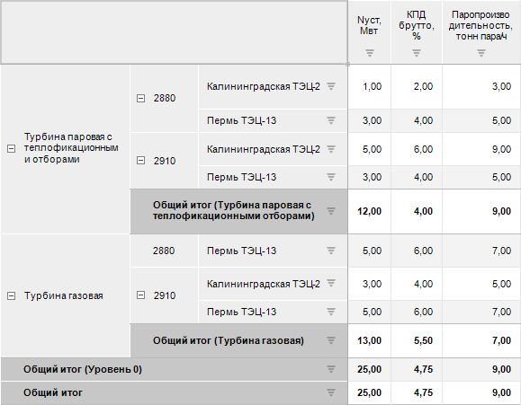

# Расчёт итогов из источника

Расчёт итогов из источника
-

# Расчёт итогов из источника

Для отображения агрегированных данных из источника в таблице используйте
 метод «[Итоги
 из источника](Calculate_totals.htm)» при расчёте итоговых значений. В качестве источника
 данных таблицы должен использоваться [стандартный](UiNavObj.chm::/Cube/CreateCube/Master_Standart/UiMd_Cube_CreateCube_Master_Standart.htm)
 или [автоматический
 куб](UiNavObj.chm::/Cube/CreateCube/Master_Auto/UiMd_Cube_CreateCube_Master_Auto.htm) с настроенной [агрегацией измерений
 фактов куба](UiNavObj.chm::/Cube/Agregation.htm#fact).

Примечание.
 Расчёт итогов из источника недоступен при работе с [глобальным кешем](UiNav.chm::/02_Navigator/Cache_In_Blob.htm).

При настройке [агрегации
 данных](UiNavObj.chm::/Cube/CreateCube/Master_Standart/UiMd_Cube_CreateCube_Master_Standart_7.htm) в стандартном кубе для фактов куба можно использовать
 разные механизмы и методы агрегации одних и тех же измерений/уровней куба.
 Итоги из данного источника будут отображаться в таблице при выполнении
 следующих условий:

	- измерения фактов куба не являются [фиксированными](UiSelection.chm::/selection/dimension.htm#variant_of_location)
	 и расположены по строкам или столбцам таблицы;

	- заданы [механизм
	 и метод агрегации](UiNavObj.chm::/Cube/CreateCube/Master_Standart/UiMd_Cube_CreateCube_Master_Standart_7.htm#agr_dim) для всех измерений/уровней куба,
	 соответствующих факту.

Особенности отображения итогов из источника в таблице:

	- если в [шапке](../Select_areas.htm#select_heading)/[боковике](../Select_areas.htm#select_sidehead) таблицы содержится
	 несколько измерений, то будут отображаться промежуточные итоги и общий
	 итог из источника только по первому измерению;

	- если измерение имеет иерархию, то промежуточные итоги и общий
	 итог будут совпадать со значениями корневых элементов измерения;

	- если дополнительно рассчитаны другие итоговые значения, например,
	 с помощью методов «Сумма»,
	 «Среднее», «Минимум»,
	 то общий итог из источника не будет рассчитываться по данным значениям.

Пример отображения агрегированных данных из источника, промежуточных
 итогов и общего итога:

В таблице используются следующие факты куба, расположенные по столбцам:

	- Nуст,
	 Мвт. Для факта задан [основной
	 механизм агрегации](UiNavObj.chm::/Cube/Work_Cube/Tuning_agr/UiMd_Cube_Work_Cube_Tuning_agr_Basic.htm) и метод «Сумма»
	 для всех измерений/уровней куба;

	- КПД
	 брутто, %. Для факта задан основной механизм агрегации и метод
	 «Фактическое среднее» для
	 всех измерений/уровней куба;

	- Паропроизводительность,
	 тонн пара/ч. Для факта задан основной механизм агрегации и
	 метод «Максимум» для всех
	 измерений/уровней куба.

См. также:

[Расчёт
 итоговых значений](Calculate_totals.htm)

		Справочная
		 система на версию 10.9
		 от 18/08/2025,
		 © ООО «ФОРСАЙТ»,
