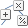
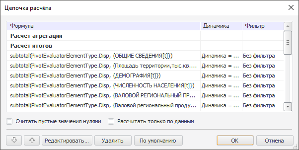

# Вычисляемые элементы

Вычисляемые элементы
-

# Вычисляемые элементы

Вычисляемые элементы используют заданную пользователем формулу для получения
 значения, которое может быть основано на исходных элементах справочника.

Под вычисляемым элементом понимается:

	- [агрегирующий
	 элемент](UiSelection.chm::/Selection/Dimension_edit.htm#add_agregation);

	- расчёт [промежуточных
	 итогов и итогов](UiSelection.chm::/Selection/Dimension_edit.htm#total_subtotal);

	- расчёт MDX-выражения для измерения кубов ADOMD.

Примечание.
 Добавление вычисляемых элементов недоступно при работе с [глобальным кешем](UiNav.chm::/02_Navigator/Cache_In_Blob.htm).

Вычисляемым можно сделать любой элемент измерения. Для этого выделите
 элемент в боковой панели и выполните команду «Редактировать
 формулу» контекстного меню элемента. После выполнения команды будет
 открыто окно «[Редактор выражения](UiNav.Chm::/GUI/ExpressionEditor.htm)».

Для редактирования формулы вычисляемого элемента выделите его в боковой
 панели/таблице или в списке «Итоговое
 измерение» окна «[Редактирование измерения](UiSelection.chm::/Selection/Dimension_edit.htm)»:

	- выполните команду «Элемент
	 > Редактировать формулу»/«Редактировать
	 формулу» в контекстном меню элемента;

	- нажмите кнопку «Редактировать
	 формулу» в окне «[Редактирование
	 измерения](UiSelection.chm::/Selection/Dimension_edit.htm)»;

	- нажмите кнопку «Редактировать
	 формулу», расположенную в группе «Элемент»
	 на вкладке «Иерархия» ленты
	 инструментов.

Для настройки формулы вычисляемого элемента измерения будет открыто
 окно «[Редактор выражения](UiNav.Chm::/GUI/ExpressionEditor.htm)».

Для настройки расчёта вычислений по отредактированным данным без предварительного
 сохранения данных в источник используется [настройка
 расчёта формул](../Working_with_table_data/FormulaCalculation.htm).

Примечание.
 Вычисляемые элементы рассчитываются автоматически по заданным формулам,
 [без возможности
 их редактирования](../Working_with_table_data/Edit_and_save_data.htm) вручную.

## Цепочка расчёта

Для изменения порядка вычисления формул используйте окно «Цепочка
 расчёта».

[Для отображения
 окна «Цепочка расчёта»](javascript:TextPopup(this))

	Нажмите кнопку  «Цепочка расчёта», расположенную
	 на вкладке «Конструктор» ленты
	 инструментов. Кнопка станет доступной при добавлении вычисляемых элементов
	 и/или формул в ячейки.

В окне доступны разделы «Расчёт агрегации»
 и «Расчёт итогов». В пределах
 разделов «Расчёт агрегации» и
 «Расчёт итогов» можно менять порядок
 вычисления формул. Раздел «Расчёт итогов»
 всегда идет ниже раздела «Расчёт
 агрегации». Расчёт вычисляемых элементов можно задавать как
 до этих пунктов, так и между ними. Формулы вычисляемых элементов добавляются
 до раздела «Расчёт агрегации».
 По умолчанию формулы вычисляются в порядке добавления.

Примечание.
 Изменение порядка вычисления формул в разделе «Расчёт
 итогов» может привести к изменению результата итогов.

Если пункт «Расчёт агрегации»
 является не первым, то при использовании типа агрегации «Из
 измерений источника» он станет первым в цепочке расчёта, при этом
 будет сообщено об изменении порядка элементов в цепочке расчёта, первым
 будет производиться расчёт агрегации, а затем расчёт всех остальных элементов,
 основанных на ее результатах. При нажатии на кнопку «ОК»
 будет использован заданный тип агрегации и изменится порядок пунктов в
 цепочке расчёта.

В окне доступны следующие операции с формулами:

	- для изменения порядка вычисления формул используйте кнопки  и
	 ;

	- при вычислении формул пустые значения могут быть рассмотрены
	 как нули. Для этого установите флажок «Считать
	 пустые значения нулями». Это важно, например, при вычислении
	 средних значений;

	- для расчёта формул по элементам, у которых есть данные, установите
	 флажок «Рассчитать только по данным»;

Совет.
 Установка флажка «Рассчитать только по
 данным» ускоряет расчёт формул за счет исключения пустых ячеек
 из расчёта.

	- для настройки формулы нажмите кнопку «Редактировать».
	 Будет открыто окно «[Редактор выражения](UiNav.Chm::/GUI/ExpressionEditor.htm)»;

	- для удаления выбранной формулы нажмите кнопку «Удалить»;

	- для изменения порядка расчёта формул с учётом их зависимости
	 нажмите кнопку «По умолчанию».
	 Если расчёт одного элемента зависит от расчёта другого, при этом
	 расчёт зависимого элемента стоит раньше по цепочке расчёта, то
	 при нажатии на кнопку «По умолчанию»
	 порядок расчёта этих элементов изменится - зависимый элемент будет
	 рассчитываться позже.

См. также:

[Работа с измерениями в таблице данных](Work_with_dimensions.htm)

		Справочная
		 система на версию 10.9
		 от 18/08/2025,
		 © ООО «ФОРСАЙТ»,
