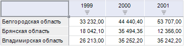
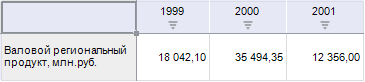

# Фиксация элементов измерения в таблице

Фиксация элементов измерения в таблице
-

# Фиксация элементов измерения в таблице

Фиксация элемента измерения в таблице - это перенос измерения,
 элемент которого был выделен, в группу «Фиксированные»
 и замена его в таблице на элемент одного из фиксированных измерений.

Чтобы зафиксировать элемент измерения из таблицы данных:

	- Выделите в таблице наименование элемента измерения, которое
	 нужно зафиксировать.

	- Выберите пункт «Зафиксировать
	 элемент с заменой на» в контекстном меню. При выборе данного
	 пункта раскрывается меню с названиями фиксированных измерений.

Примечание.
 В инструменте «Аналитические панели»
 выполните команду «Таблица > Зафиксировать
 элемент с заменой на» в контекстном меню наименование элемента
 измерения.

	- Выберите одно из фиксированных измерений из списка. Оно будет
	 перенесено в группу «По строкам»
	 или «По столбцам» (в зависимости
	 от того, как расположено измерение, элемент которого выделен в таблице).
	 В таблице будет отображен первый отмеченный элемент этого измерения.
	 Измерение, которое ранее располагалось по строкам/столбцам будет перенесено
	 в группу «Фиксированные».

Примечание.
 Фиксация элементов измерения в таблице аналитической панели доступна только
 в настольном приложении.

[Пример](javascript:TextPopup(this))

	Исходная таблица:

	

	Зафиксируйте элемент территориального изменения с заменой на одно
	 из фиксированных измерений. В полученной таблице можно отображать
	 данные по выбранному измерению для одного фиксированного региона:

	

См. также:

[Работа с измерениями в таблице данных](Work_with_dimensions.htm)

		Справочная
		 система на версию 10.9
		 от 18/08/2025,
		 © ООО «ФОРСАЙТ»,
