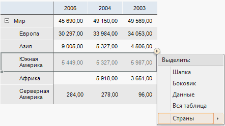
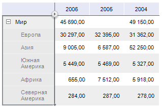
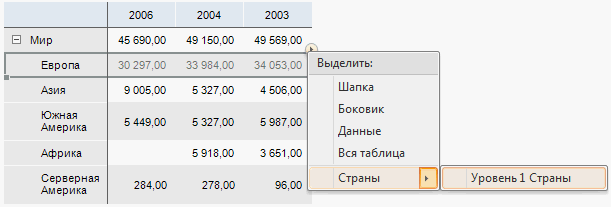
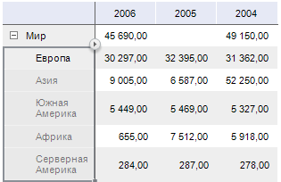

# Выделение элементов измерения в таблице

Выделение элементов измерения в таблице
-

# Выделение измерения в таблице

Для задания настроек измерений выделите измерение или его уровень в
 таблице, аналогично [выделению общих элементов
 таблицы](../Select_areas.htm). Настройки измерения осуществляются при помощи группы вкладок
 боковой панели «Измерение», настройки
 уровня измерения - при помощи группы вкладок боковой панели «Уровень».

Для задания настроек уровням измерений убедитесь, что в справочнике,
 на котором построен куб, являющийся источником данных для таблицы, добавлены
 уровни:

	- Табличный справочник.
	 Задайте уровни справочника на странице «[Уровни](UiNavObj.chm::/reference_book/Master_Table_reference_book/UiMd_reference_book_Master_Table_page4.htm)» мастера;

	- Вычисляемый справочник.
	 Задайте уровни справочника на странице «[Уровни](UiNavObj.chm::/reference_book/Master_Calculation_reference_book/UiMd_reference_book_Master_Calculation_page3.htm)» мастера;

	- Календарный справочник.
	 Задайте уровни справочника на странице «[Структура
	 календаря](UiNavObj.chm::/reference_book/Master_Calendar_reference_book/UiMd_reference_book_Master_Calendar_page2.htm)»
	 мастера;

	- Справочник НСИ. Задайте
	 уровни справочника на вкладке «[Уровни](UiNavObj.chm::/reference_book/Master_RDS_reference_book/Level.htm)».

## Выделение измерения

Для выделения измерения:

	- выделите диапазон, включающий ячейку из шапки или боковика таблицы
	 данных, нажмите на кнопку  и выберите пункт, название
	 которого соответствует названию измерения:

	- в раскрывающемся списке на вкладке ленты «Формат»
	 в группе «Текущий фрагмент»
	 выберите пункт, название которого соответствует названию измерения.

В таблице будут выделены наименования элементов указанного измерения:

На боковой панели будет доступна группа вкладок «Измерение»,
 настройки которой будут применяться для выделенных элементов измерений.

## Выделение уровня измерения

Для выделения уровня измерения:

	- выделите диапазон, включающий ячейку из шапки или боковика таблицы
	 данных, где размещаются элементы иерархического измерения. Нажмите
	 на кнопку , выберите пункт, название которого соответствует
	 названию измерения и в раскрывающемся меню выберите уровень измерения:

	- в раскрывающемся списке на вкладке ленты «Формат»
	 в группе «Текущий фрагмент»
	 выберите пункт, название которого соответствует уровню измерения.

В таблице будут выделены наименования элементов указанного уровня измерения:

На боковой панели будет доступна группа вкладок «Уровень»,
 настройки которой будут применяться для выделенного уровня измерения.

См. также:

[Работа с измерениями в таблице данных](Work_with_dimensions.htm)
 | [Выделение элементов таблицы](../Select_areas.htm)

		Справочная
		 система на версию 10.9
		 от 18/08/2025,
		 © ООО «ФОРСАЙТ»,
