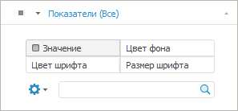
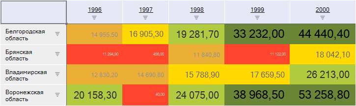

# Настройка метрик для таблицы

Настройка метрик для таблицы
-

# Настройка метрик для таблицы

Данные в таблице можно отображать по четырем метрикам:

	- значение;

	- цвет фона;

	- цвет шрифта;

	- размер шрифта.

Важно. Метрика
 «Цвет фона» может быть перекрыта
 [условным форматированием](../Analysis/Conditional_formatting.htm)
 данных в таблице.

При отображении метрик «Цвет фона»,
 «Цвет шрифта», «Размер
 шрифта» доступна настройка [легенд
 метрик](../TableView/Legend.htm).

Для настройки отображения данных в таблице по нескольким метрикам:

	- В группе вкладок «Отметка»
	 боковой панели выберите [фиксированное
	 измерение](UiSelection.chm::/selection/dimension.htm#variant_of_location), значения элементов которого будут отображаться
	 в ячейках таблицы.

	- В меню вкладки выбранного измерения выберите пункт «Метрики».
	 На вкладке появятся переключатели «Значение»,
	 «Цвет фона», «Цвет
	 шрифта» и «Размер шрифта»:

	- Установите нужный переключатель и отметьте элемент измерения,
	 значение которого будет отображаться по выбранной метрике. У измерения
	 с ролью метрики всегда доступна только единичная отметка.

Примечание.
 Учитывайте следующую особенность шкал, используемых для метрик: граничные
 значения всегда входят в меньший интервал шкалы. Например, есть шкала
 с тремя интервалами: меньше 25, от 25 до 50, больше 50. Значение 25 будет
 входить в интервал «меньше 25», а значение 50 - в интервал «от 25
 до 50».

Пример таблицы с отображением данных по различным метрикам:

См. также:

[Работа с измерениями в таблице данных](Work_with_dimensions.htm)

		Справочная
		 система на версию 10.9
		 от 18/08/2025,
		 © ООО «ФОРСАЙТ»,
