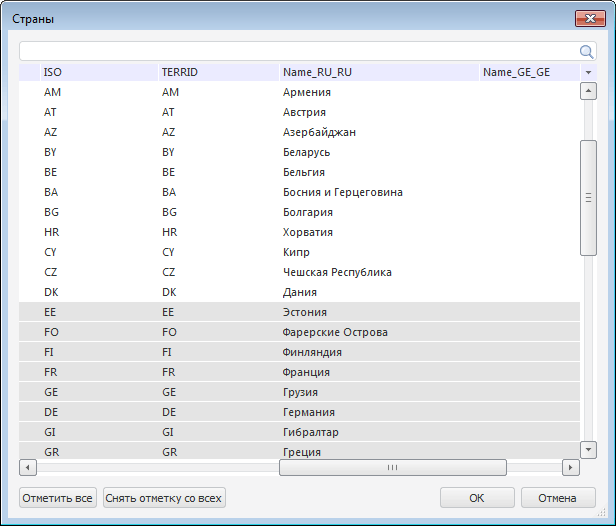
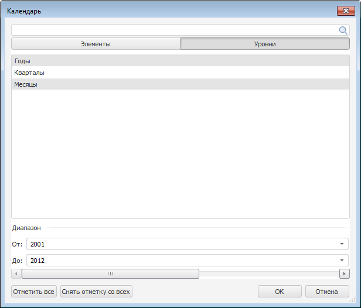

# Изменение отметки из таблицы

Изменение отметки из таблицы
-

# Изменение отметки из таблицы

В таблице доступна отметка элементов измерений для строк и столбцов
 из специального диалога.

Для открытия диалога выполните команду «Изменить
 отметку» в контекстном меню ячейки с заголовком измерения.

Примечание.
 В инструменте «Аналитические панели»
 выполните команду «Таблица > Изменить
 отметку» в контекстном меню ячейки с заголовком измерения.

Откроется диалог с наименованием измерения:

В столбцах таблицы будут находиться все доступные атрибуты измерения.

В диалоге производится [отметка
 элементов измерения](UiSelection.chm::/Selection/Selection_of_the_dimension_elements.htm). Через контекстное меню доступны
 команды для [работы
 с измерением](UiSelection.chm::/Selection/Dimension.htm),
 аналогично работе с боковой панелью.

Для поиска используйте поле, расположенное в верхней части диалога.

При включенном [режиме
 отображения календарного измерения](UiSelection.chm::/Selection/Selection_of_the_CalendarDimension_elements.htm) «По
 элементам и уровням» окно может иметь следующий вид:

См. также:

[Работа
 с данными таблицы](Working_with_table_data.htm)

		Справочная
		 система на версию 10.9
		 от 18/08/2025,
		 © ООО «ФОРСАЙТ»,
