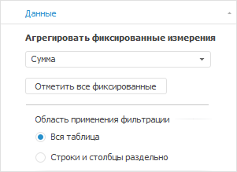
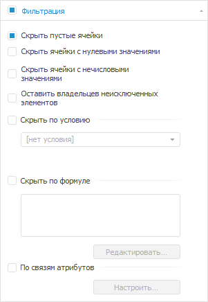
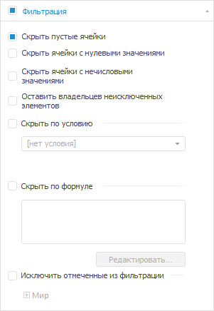
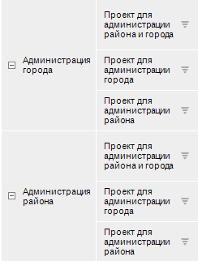
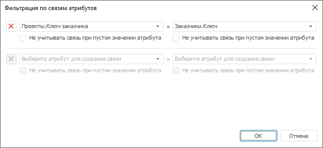
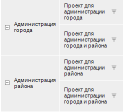
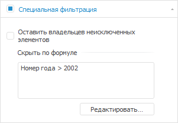
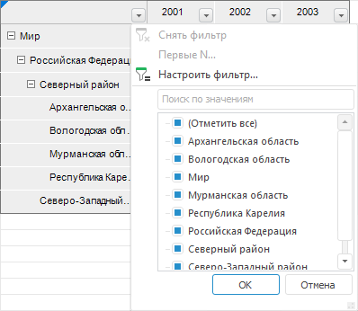
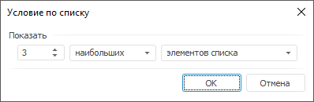
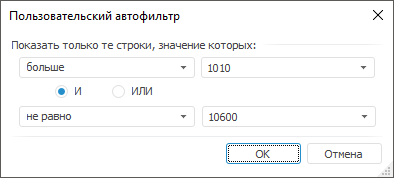

# Фильтрация

Фильтрация
-

# Фильтрация

Фильтрация данных позволяет отобразить в таблице только те данные, которые
 соответствуют заданным условиям. Фильтрация данных доступна для всех визуализаторов.
 В регламентном отчете доступна быстрая настройка автофильтра.

Доступные варианты фильтрации:

	- Фильтрация данных таблицы.
	 Задается через боковую панель или ленту инструментов при [выделенной
	 таблице/боковике/шапке](../Select_areas.htm);

	- Специальная фильтрация измерения.
	 Задается через боковую панель при [выделенном
	 измерении](../Work_with_dimensions/Select_dimensions_elements_in_table.htm);

	- Автофильтр в регламентном отчете.
	 Включается для выделенного диапазона через ленту инструментов, настраивается
	 через меню автофильтра в заголовке диапазона.

При [редактировании данных](Edit_and_save_data.htm) в инструментах
 «Аналитические панели» и «Аналитические запросы (OLAP)» в
 веб-приложении учитывайте следующие особенности при использовании автофильтра:

	- удаление данных применяется только к видимым строкам/столбцам;

	- вставка значения из одной ячейки в диапазон ячеек выполняется
	 только в видимые строки/столбцы;

	- вставка диапазона значений применяется ко всем видимым строкам/столбцам.
	 Вставляемый диапазон значений расширяется с учётом размера области
	 копирования, в том числе на скрытые строки/столбцы;

	- [перемещение диапазона значений в буфер
	 обмена](Insert.htm#cut) применяется ко всем строкам/столбцам независимо от их видимости
	 при фильтрации. [Копирование диапазона значений
	 в буфер обмена](Insert.htm#copy) применяется только к видимым строкам/столбцам.

Поведение будет одинаковым для всего диапазона данных независимо от
 расположения фильтра.

## Область применения фильтрации

Область применения фильтрации задается на вкладке боковой панели «Источник > Данные»:

Допустимые значения:

	- Вся таблица. Настройки
	 фильтрации будут применены ко всей таблице;

	- Строки и столбцы раздельно.
	 Настройки фильтрации применяются отдельно для строк и столбцов, для
	 задания фильтрации необходимо [выбрать
	 шапку/боковик](../Select_areas.htm) таблицы.

Примечание.
 Раздельная фильтрация строк/столбцов будет применена для всех визуализаторов,
 построенных на данной таблице.

## Настройка фильтрации

Для настройки фильтрации используйте:

	- кнопку  «Фильтрация» на вкладке «Конструктор»
	 ленты инструментов (также на вкладке «Главная»
	 или «Данные» для экспресс-отчета);

	- вкладку «Фильтрация»
	 боковой панели.

Примечание.
 Для применения расширенных настроек фильтрации используйте язык программирования
 [Fore](kepivot.chm::/Interface/IPivotFilterSettings/IPivotFilterSettings.htm).

[Для отображения
 вкладки](javascript:TextPopup(this))

		- [Выделите элемент таблицы](../Select_areas.htm),
		 перейдите в группу вкладок «Таблица»
		 боковой панели и выберите вкладку «Фильтрация»;

	Примечание.
	 Если установлен переключатель «Строки
	 и столбцы раздельно» на вкладке боковой панели «Источник
	 > Данные», для отображения вкладки «Фильтрация»
	 выделите шапку/боковик таблицы.

		- Выберите пункт «Настройки
		 фильтрации» в раскрывающемся
		 меню кнопки 
		 «Фильтрация» на вкладке
		 «Конструктор» ленты инструментов
		 (также на вкладке «Главная»
		 или «Данные» для экспресс-отчета).

Набор вариантов фильтрации зависит от выбранной области применения фильтрации.

	 Фильтрация по всей таблице Раздельная фильтрация для строк и столбцов

		

		

Доступны следующие варианты фильтрации:

	- Скрыть пустые ячейки.
	 Будут скрыты строки/столбцы, не содержащие никакой информации;

	- Скрыть ячейки с нулевыми значениями.
	 Будут скрыты строки/столбцы, содержащие нулевые значения;

	- Скрыть ячейки с нечисловыми
	 значениями. Будут скрыты строки/столбцы, содержащие только
	 нечисловые значения;

	- Оставить владельцев неисключенных
	 элементов. Родительские элементы неисключенных фильтрацией
	 строк/столбцов не будут скрыты;

	- Скрыть по условию. Будут
	 скрыты строки/столбцы, все данные ячеек которых соответствуют заданному
	 в раскрывающемся списке условию. Большинство условий использует одно
	 или два числа для сравнения с результатом ячейки:

		- равные А;

		- не равные А;

		- большие А;

		- меньшие А;

		- большие или равные А;

		- меньшие или равные А;

		- между А и В включительно;

		- меньшие А или большие В;

Для задания сложной формулы используйте вариант
 «выражение». При использовании
 данного пункта доступна подстановка «value», соответствующая значению
 ячейки. При использовании выражения доступны стандартные арифметические
 операции, объединение выражения скобками. В регламентных отчетах доступно
 использование функций прикрепленных [модулей](UiReport.chm::/desktop/Reports/Event/UiReport_Reports_Event_Module.htm);

	- Скрыть по формуле. Будут
	 скрыты строки/столбцы, соответствующие формуле, заданной через «[Редактор
	 выражения](UiNav.Chm::/GUI/ExpressionEditor.htm)»;

	- Исключить отмеченные из фильтрации.
	 Будут скрыты выбранные элементы измерения. Настройка доступна при
	 раздельной фильтрации строк и столбцов.

Примечание.
 При наличии нескольких измерений по строкам/столбцам будут применены настройки
 последнего включенного измерения.

	- По связям атрибутов.
	 Будут отображены строки/столбцы элементов измерений с соответствующими
	 атрибутами. Настройка доступна при фильтрации для всей таблицы.

[Пример
 фильтрации по связям атрибутов](javascript:TextPopup(this))

	Фильтрация справочников по связанным
	 атрибутам облегчает процесс подготовки отчетов, снимает необходимость
	 настройки параметризации.

	Пример настройки фильтрации по связям
	 атрибутов:

			- Для выполнения фильтрации по связям атрибутов необходимо,
			 чтобы измерения, отображающиеся в шапке/боковике таблицы,
			 содержали [связанные
			 атрибуты](UiNavObj.chm::/reference_book/Master_RDS_reference_book/Link.htm).

	Примечание.
	 Для выполнения фильтрации по связям атрибутов подходят только справочники
	 НСИ.

	Пример структуры справочников, для которых
	 создана связь атрибутов:

	Справочник «Заказчики»:

				- ключ «1», наименование «Администрация
				 города»;

				- ключ «2», наименование «Администрация
				 района».

	Справочник «Проекты»:

				- ключ «10», наименование «Проект
				 для администрации города», ключ заказчика «1»;

				- ключ «20», наименование «Проект
				 для администрации района», ключ заказчика «2»;

				- ключ «30», наименование «Проект
				 для администрации города и района», ключ заказчика
				 «1,2».

	В данном примере атрибут «Ключ
	 заказчика» справочника «Проекты»
	 связан с атрибутом «Ключ»
	 справочника «Заказчики». Боковик
	 таблицы, построенной на данных справочниках, при условии, что справочники
	 расположены по строкам, будет выглядеть следующим образом:

	

			- Для
			 выполнения фильтрации по связям атрибутов установите флажок
			 «По связям атрибутов»:

				- в раскрывающемся меню
				 кнопки  «Фильтрация» на вкладке
				 ленты «Главная»,
				 «Данные» или «Конструктор» (в экспресс-отчете)
				 или «Конструктор»
				 (для регламентного отчета или выделенного блока аналитической
				 панели).

				- на вкладке «Фильтрация»
				 боковой панели

	Будет открыто окно «Фильтрация
	 по связям атрибутов».

			- В открывшемся окне настройте
			 связи для атрибутов:

	

	Для добавления новой связи выберите атрибуты
	 в появившихся раскрывающихся списках.

	Чтобы при построении боковика/шапки таблицы
	 не учитывались связи по атрибутам с пустыми значениями, установите
	 флажок «Не учитывать связь при пустом
	 значении атрибута».

	После фильтрации по указанным связям
	 атрибутов боковик таблицы будет выглядеть следующим образом:

	

	Для отмены фильтрации, нажмите кнопку
	 
	 напротив связи в окне «Фильтрация
	 по связям атрибутов».

### Отключение фильтрации

Для отключения фильтрации:

	- отожмите верхнюю часть кнопки  «Фильтрация»
	 на вкладке ленты «Данные»
	 или «Конструктор» (в экспресс-отчете)
	 или «Конструктор» (для выделенного
	 блока аналитической панели);

	- снимите флажок с вкладки «Фильтрация»
	 на боковой панели.

## Специальная фильтрация измерения

Отдельно для измерения задается фильтрация по формуле, позволяющая исключить
 элементы, удовлетворяющие формуле, только в выбранном измерении.

Для настройки специальной фильтрации:

	- [Выделите
	 измерение](../Work_with_dimensions/Select_dimensions_elements_in_table.htm).

	- Установите флажок в заголовке вкладки «Специальная
	 фильтрация» на группе вкладок «Измерение»
	 боковой панели.

	- Нажмите кнопку «Редактировать»
	 для открытия «[Редактора выражений](UiNav.Chm::/GUI/ExpressionEditor.htm)».

	- Задайте формулу.

Доступен дополнительный вариант фильтрации:

	- Оставить владельцев неисключенных
	 элементов. Родительские элементы неисключенных фильтрацией
	 элементов не будут отфильтрованы.

## Настройка автофильтра в регламентном отчете

Быстрая фильтрация данных в столбцах таблицы осуществляется при помощи
 кнопок 
 в заголовках столбцов. На одном листе доступен только один автофильтр.

[Для отображения
 кнопки ](javascript:TextPopup(this))

		- Для отображения кнопки автофильтра  для
		 всех столбцов таблицы выделите любые ячейки с данными. При выделении
		 произвольного диапазона автофильтр будет применен только к этому
		 диапазону.

		- Нажмите кнопку
		 «Фильтрация» на вкладке
		 ленты «Данные» или  «Сортировка
		 и фильтрация» на вкладке «Главная».

		- В раскрывающемся меню кнопки выберите пункт «Фильтрация».

	Примечание.
	 В веб-приложении кнопка автофильтра отображается, если для текущего
	 отчета в настольном приложении настроена фильтрация.

В таблице будут отображаться все элементы отмеченные в списке, сформированном
 из всех значений фильтруемых строк.

Операции автофильтра:

	- Снять фильтр. Операция
	 предназначена для отображения всех строк;

	- Первые
	 N. Операция предназначена для вывода указанного количества
	 элементов списка. Количество элементов задается либо явно, либо в
	 процентах от общего количества фильтруемых элементов:

В данном окне можно установить следующие
 параметры:

		- Количество строк.
		 Поле ввода, с помощью которого можно определить количество отображаемых
		 строк;

		- Признак. Определяет
		 какие элементы будут отображаться - наибольшие или наименьшие;

		- Условие выбора.
		 Определяет каким образом задается количество элементов - явно
		 или в процентах от количества элементов;

Примечание.
 Данный фильтр будет недоступен, если в фильтруемых строках отсутствуют
 числовые значения.

	- Настроить
	 фильтр. Операция, предназначенная для определения условий фильтрации
	 в окне «Пользовательский автофильтр»:

В данном окне можно установить следующие
 параметры:

		- Условие выбора.
		 Раскрывающийся список, определяющий условие для отображения элементов
		 (равно, не равно...);

		- Значение. Раскрывающийся
		 список, определяющий значение условия для отображения элементов.
		 Данный список элементов содержит все значения диапазона автофильтра,
		 отсортированные без учета регистра. Регистр учитывается только
		 при совпадении значений;

		- Условия фильтрации.
		 Переключатель, определяющий порядок использования двух условий
		 одновременно.

Предусмотрено два варианта использования
 сочетаний условий:

		- При установке переключателя «И»
		 будут отображаться строки, удовлетворяющие обоим условиям;

		- При установке переключателя «ИЛИ»
		 будут отображаться строки, удовлетворяющие хотя бы одному из двух
		 условий.

См. также:

[Работа
 с данными таблицы](Working_with_table_data.htm)

		Справочная
		 система на версию 10.9
		 от 18/08/2025,
		 © ООО «ФОРСАЙТ»,
