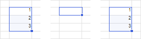
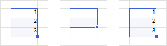

# Копирование и вставка данных из буфера обмена

Копирование и вставка данных из буфера обмена
-

# Копирование и вставка данных из буфера обмена

	В инструментах «[Аналитические запросы (OLAP)](UIExpress.chm::/purpose/UiExpress_Purpose.htm)», «[Аналитические
	 панели](UIAdhoc.chm::/UiAdhoc_Purpose.htm)», «[Отчёты](UIReport.chm::/UiReport_purpose.htm)»,
	 «[Анализ временных рядов](UiDw.chm::/UiDw_Title.htm)» и расширении «[Интерактивные
	 формы ввода данных](DataEntryForms.chm::/DataEntryForms_Purpose.htm)» при работе с таблицей
	 через буфер обмена доступны копирование, вырезание и вставка данных.

## Копирование данных в буфер обмена

	Для копирования данных из выделенной ячейки или области:

		- в регламентных отчётах и формах ввода:

			- нажмите кнопку  «Копировать»
			 в группе «Буфер обмена»
			 на вкладке «Главная»
			 ленты инструментов в настольном приложении;

			- выполните команду «Правка
			 > Копировать» главного меню в веб-приложении;

			- выполните команду контекстного меню «Копировать»
			 выделенного диапазона ячеек;

			- нажмите сочетание клавиш CTRL+С или CTRL+INSERT;

		- в аналитических панелях:

			- нажмите кнопку  «Копировать»
			 в группе «Буфер обмена»
			 на вкладке «Главная»
			 ленты инструментов;

			- выполните команду контекстного меню 
			 «Копировать» выделенного
			 диапазона ячеек;

			- нажмите сочетание клавиш CTRL+С или CTRL+INSERT;

	Примечание.
	 При копировании данных из таблицы в аналитических панелях копируется
	 весь визуализатор.

		- в экспресс-отчётах и рабочих книгах:

			- выполните команду контекстного меню 
			 «Копировать» выделенного
			 диапазона ячеек;

			- нажмите сочетание клавиш CTRL+С или CTRL+INSERT.

	При использовании [автофильтра](Filtering.htm) диапазона
	 данных на листе отчёта или табличного визуализатора копирование диапазона
	 значений в буфер обмена применяется только к видимым строкам/столбцам.

## Перемещение данных в буфер обмена

	Для вырезания данных из выделенной ячейки или области для их последующего
	 перемещения в другую ячейку или область:

		- в регламентных отчётах и формах ввода:

			- нажмите кнопку  «Вырезать»
			 в группе «Буфер обмена»
			 на вкладке «Главная»
			 ленты инструментов в настольном приложении;

			- выполните команду «Правка
			 > Вырезать» главного меню в веб-приложении;

			- выполните команду контекстного меню «Вырезать»
			 выделенного диапазона ячеек;

			- нажмите сочетание клавиш CTRL+X или SHIFT+DELETE;

		- в аналитических панелях:

			- нажмите кнопку  «Вырезать»
			 в группе «Буфер обмена»
			 на вкладке «Главная»
			 ленты инструментов;

			- выполните команду контекстного меню 
			 «Вырезать» выделенного
			 диапазона ячеек;

			- нажмите сочетание клавиш CTRL+X или SHIFT+DELETE;

	Примечание.
	 При вырезании данных из таблицы в аналитических панелях вырезается
	 весь визуализатор.

		- в экспресс-отчётах и рабочих книгах:

			- выполните команду контекстного меню 
			 «Вырезать» выделенного
			 диапазона ячеек;

			- нажмите сочетание клавиш CTRL+X или SHIFT+DELETE.

### Особенности перемещения данных

	Вставка вырезанных данных выполняется с сохранением всех исходных
	 настроек оформления ячеек и примечаний при их наличии.

	При вырезании данных:

		- в отчёте, открытом в режиме просмотра, очищается только
		 содержимое ячеек;

		- в отчёте, открытом в режиме редактирования:

			- для ячеек таблицы очищается только содержимое ячеек;

			- для остальных ячеек листа отчёта очищаются содержимое
			 ячеек, форматы данных в ячейках и примечания к ячейкам.

	При использовании [автофильтра](Filtering.htm) диапазона
	 данных на листе отчёта или табличного визуализатора перемещение диапазона
	 значений в буфер обмена применяется ко всем строкам/столбцам независимо
	 от их видимости при фильтрации. Поведение будет одинаковым для всего
	 диапазона данных независимо от расположения фильтра.

## Вставка данных из буфера обмена

	Для вставки данных в выделенную ячейку или область:

		- в регламентных отчётах и формах ввода:

			- нажмите кнопку  «Вставить»
			 в группе «Буфер обмена»
			 на вкладке «Главная»
			 ленты инструментов в настольном приложении;

			- выполните команду «Правка
			 > Вставить» главного меню в веб-приложении;

			- выполните команду контекстного меню «Вставить»
			 выделенного диапазона ячеек;

			- нажмите сочетание клавиш CTRL+V или SHIFT+INSERT;

	[Особенности
	 вставки данных в форму ввода](javascript:TextPopup(this))

				- если вставляемый диапазон выходит за пределы табличной
				 области, то вставка осуществится в пределах табличной
				 области;

				- если для вставки диапазона ячеек выделен диапазон
				 меньшего размера, то размеры диапазона, куда вставляются
				 данные, будут расширены вправо и вниз до размера вставляемого
				 диапазона;

				- если для вставки диапазона ячеек выделен диапазон
				 большего размера, то будет заполнен только диапазон соответствующий
				 размерам вставляемого диапазона;

				- если для вставки ячейки выделен диапазон, то диапазон
				 будет полностью заполнен данными из ячейки.

		- в аналитических панелях:

			- нажмите кнопку  «Вставить»
			 в группе «Буфер обмена»
			 на вкладке «Главная»
			 ленты инструментов;

			- выполните команду контекстного меню 
			 «Вставить» выделенного
			 диапазона ячеек;

			- нажмите сочетание клавиш CTRL+V или SHIFT+INSERT;

	Примечание.
	 При копировании и вставке данных из таблицы в аналитических панелях
	 вставляется весь визуализатор.

		- в экспресс-отчётах и рабочих книгах:

			- выполните команду контекстного меню 
			 «Вставить» выделенного
			 диапазона ячеек;

			- нажмите сочетание клавиш CTRL+V или SHIFT+INSERT.

	[Копирование
	 и вставка данных из внешних приложений](javascript:TextPopup(this))

		При вставке данных, скопированных в буфер обмена из внешних
		 приложений, оформление может отличаться от исходного. Правила
		 оформления при вставке скопированных данных описаны в подразделе
		 «[Параметры форматирования при вставке
		 из буфера обмена](#format_params)».

		Поддерживается копирование таблиц Microsoft Excel. При копировании
		 таблиц не копируются следующие настройки:

			- ориентация текста;

			- штриховка;

			- рисунки, диаграммы;

			- объекты WordArt и SmartArt;

			- автофигуры;

			- текстовые блоки;

			- гиперссылки;

			- формулы и функции, содержащиеся в ячейках. Копируется
			 только результат вычисления.

		Вставка рисунков, диаграмм, автофигур, текстовых блоков, а также
		 объектов WordArt и SmartArt, скопированных из Microsoft Excel,
		 выполняется в виде рисунков.

### Особенности вставки данных

	Если используется [автофильтра](Filtering.htm) диапазона
	 данных в регламентных отчётах, экспресс-отчётах и формах ввода:

		- вставка значения из одной ячейки в диапазон ячеек применяется
		 только к видимым строкам/столбцам;

		- вставка диапазона значений применяется ко всем видимым строкам/столбцам.
		 Вставляемый диапазон значений расширяется с учётом размера области
		 копирования, в том числе на скрытые строки/столбцы.

	Поведение будет одинаковым для всего диапазона
	 данных независимо от расположения фильтра.

	В зависимости от выделенного диапазона ячеек для вставки данных
	 в регламентных отчётах, экспресс-отчётах и формах ввода можно выделить
	 следующие особенности:

		- Для вставки данных выделяется
		 только одна ячейка. Ячейка для вставки будет расширена
		 вправо и вниз до диапазона, равного размеру скопированной области.
		 На примере изображены копируемые данные (слева), выделенная ячейка
		 (по центру), вставленные данные (справа):

	

		- Для вставки данных выделяется
		 несколько ячеек. Если копируемая область по размерам меньше,
		 чем область, выделенная для вставки, то произойдет заполнение
		 области для вставки копируемой областью. На примере ниже изображены
		 копируемые данные (слева), выделенная область (по центру), вставленные
		 данные (справа). Копируемая область размещается в области для
		 вставки несколько раз целиком, но могут остаться незаполненные
		 ячейки так как их не достаточно для вставки копируемой области
		 целиком:

	

	Если копируемая область по размерам больше,
	 чем область, выделенная для вставки, то копируемая область займет
	 всю область для вставки и соседние ячейки, необходимые для полного
	 размещения копируемой области.

	

### Параметры форматирования при вставке
	 из буфера обмена

	Инструменты «[Аналитические запросы (OLAP)](UIExpress.chm::/purpose/UiExpress_Purpose.htm)», «[Отчёты](UIReport.chm::/UiReport_purpose.htm)»
	 и «[Анализ временных рядов](UiDw.chm::/UiDw_Title.htm)», а также расширение «[Интерактивные
	 формы ввода данных](DataEntryForms.chm::/DataEntryForms_Purpose.htm)» поддерживают вставку
	 данных при копировании из следующих продуктов:

		- Microsoft Office;

		- LibreOffice;

		- МойОфис.

	При вставке содержимого из буфера обмена на лист отчёта:

		- в веб-приложении происходит автоматическое сохранение исходного
		 форматирования вставленных данных;

		- в настольном приложении в правом нижнем углу от вставленных
		 ячеек появляется кнопка 
		 «Параметры вставки», информирующая
		 о наличии собственного оформления у вставленных данных. При нажатии
		 кнопки  «Параметры
		 вставки» отображаются варианты вставки:

			- Сохранить исходное
			 форматирование. Данные будут вставлены с использованием
			 исходного форматирования;

			- Вставить без исходного
			 форматирования. Данные будут вставлены с использованием
			 формата ячеек, в которые осуществляется вставка.

	[Прекращение
	 отображения кнопки с параметрами вставки](javascript:TextPopup(this))

		Кнопка с параметрами вставки временно
		 перестаёт отображаться:

				- при перемещении фокуса на другие элементы (например,
				 шрифт, строка формул и т.д.);

				- при открытии окна;

				- при вызове контекстного меню;

				- при переходе в режим редактирования одной из вставленных
				 ячеек и при условии, что ничего не изменялось и/или выход
				 из режима редактирования был осуществлён с помощью клавиши
				 ESC.

		Кнопка с параметрами вставки перестаёт
		 отображаться полностью:

				- при изменении содержимого буфера обмена (например,
				 скопированы данные другой ячейки);

				- при сохранении отчёта;

				- при переходе в режим редактирования любой ячейки
				 вне области вставки и выхода из режима редактирования,
				 даже если ничего не изменялось;

				- при изменении состояния листа (например, вставка
				 диаграммы или изменение масштаба листа);

				- при нажатии после вставки данных клавиши ESC.

	Примечание.
	 При вставке данных, скопированных из продукта «МойОфис», исходное
	 форматирование не сохраняется.

См. также:

[Работа
 с данными таблицы](Working_with_table_data.htm)

		Справочная
		 система на версию 10.9
		 от 18/08/2025,
		 © ООО «ФОРСАЙТ»,
