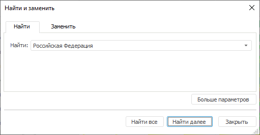
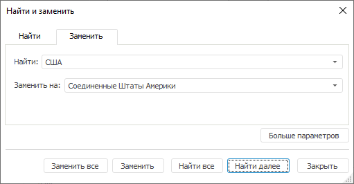

# Поиск и замена

Поиск и замена
-

# Поиск и замена данных

Поиск и замен данных выполняется с помощью диалога «Найти
 и заменить». Если выделена одна ячейка, то поиск и замена данных
 распространяется на всю таблицу. Если выделен диапазон, то поиск и замена
 распространяется только на выделенный диапазон ячеек.

[Для открытия
 диалога «Найти и заменить»](javascript:TextPopup(this))

		- В настольном приложении:

			- в регламентном отчете.
			 Выполните команду «Найти»
			 в раскрывающемся меню кнопки  «Найти
			 и заменить» на вкладке «Главная»
			 ленты инструментов;

			- в экспресс-отчете и
			 аналитической панели. Выполните команду «Найти»
			 в раскрывающемся меню кнопки  «Найти
			 и заменить» на вкладке «Таблица»
			 ленты инструментов;

			- в рабочей книге.
			 Нажмите кнопку 
			 «Найти» на вкладке
			 «Таблица» ленты инструментов;

			- нажмите сочетание клавиш CTRL+F для поиска
			 данных;

			- нажмите сочетание клавиш CTRL+H для замены
			 данных;

		- В веб-приложении:

			- в регламентном отчете
			 и аналитической панели. Нажмите кнопку  «Найти»
			 на вкладке «Главная»
			 ленты инструментов;

			- в экспресс-отчете.
			 Нажмите кнопку 
			 «Найти» на вкладке
			 «Таблица: Конструктор»
			 ленты инструментов;

			- в рабочей книге.
			 Нажмите кнопку 
			 «Найти» на вкладке
			 «Таблица» ленты инструментов.

	Примечание.
	 Замена данных доступна только в настольном приложении.

## Поиск данных

Для поиска данных:

	- Откройте диалог «Найти и заменить».
	 Он откроется на вкладке «Найти»:

	- В поле «Найти»
	 введите искомое значение, формулу или текст.

	- Если необходимо, задайте дополнительные
	 параметры поиска. Для этого нажмите кнопку «Больше
	 параметров». На вкладке «Найти»
	 появятся дополнительные настройки поиска:

Примечание.
 По умолчанию поиск производится по значению в ячейках таблицы, по строкам
 без учета регистра, формата искомых ячеек и других параметров. В регламентных
 отчётах и формах ввода по умолчанию дополнительно поиск производится на
 листе.

[Оформление
 ячеек с искомыми значениями](javascript:TextPopup(this))

	Примечание.
	 Настройка оформления доступна только в настольном приложении.

	Для выбора формата искомого значения
	 нажмите кнопку «Формат». Будет
	 отображено меню, содержащее следующие команды:

			- Задать формат.
			 Открывает окно «[Формат ячейки](uireport.chm::/desktop/Table/Attribute/UiReport_Table_Attribute.htm)»,
			 в котором задайте формат искомого значения. Заданный формат
			 отображается в поле «Образец».
			 Если формат не задан, в поле отображается текст «Формат
			 не задан»;

			- Выбрать формат из ячейки.
			 Скрывает диалог «Найти и
			 заменить». После выделения ячейки отчета диалог отображается
			 снова, а в поле «Образец»
			 отображается формат выбранной ячейки;

			- Очистить формат поиска.
			 Сбрасывает выбранный формат. В поле «Образец»
			 отображается текст «Формат
			 не задан».

[Учитывать
 регистр](javascript:TextPopup(this))

	Для учёта регистра символов в искомом
	 тексте установите флажок «Учитывать
	 регистр».

[Ячейка
 целиком](javascript:TextPopup(this))

	Для поиска только тех ячеек, которые
	 полностью содержат значение, введенное для поиска, установите флажок
	 «Ячейки целиком»

[Область
 поиска](javascript:TextPopup(this))

	Примечание.
	 Выбор области поиска доступен только в настольном приложении в регламентных
	 отчётах и формах ввода.

	Для выбора области поиска используйте
	 раскрывающийся список «Область поиска»,
	 содержащий следующие значения:

			- в отчете;

			- на листе.

[Порядок
 поиска](javascript:TextPopup(this))

	Для выбора зоны поиска используйте раскрывающийся
	 список «Порядок поиска», содержащий
	 следующие значения:

			- по строкам;

			- по столбцам.

[Предмет
 поиска](javascript:TextPopup(this))

	Для выбора предмета поиска используйте
	 флажки:

			- Значение. Поиск
			 выполняется по значениям в ячейках;

			- Текст. Поиск
			 выполняется по тексту, отображаемому в ячейках. Отображаемый
			 текст может отличаться от значения ячейки из-за [настроек
			 формата данных](../TableView/Formatting/Data_format.htm). Например, в ячейке может содержаться значение
			 «2,5879», а отображаться текст «2,59»;

			- Формула. Поиск
			 выполняется по формулам, по которым рассчитываются значения
			 в ячейках;

			- Метаданные.
			 Поиск выполняется по метаданным ячеек таблицы. Для вычисляемых
			 элементов поиск выполняется по их формуле.

			Метаданные состоят из наименования источника данных и наименований
			 элементов измерения, соответствующих данной ячейке. В регламентном
			 отчёте метаданные выделенной ячейки отображаются в конце [строки
			 формул](uireport.chm::/desktop/organizational_management/UiReport_Organizational_FormulaLine.htm).

	Примечание.
	 Флажки «Формула» и «Метаданные» доступны только
	 в настольном приложении.

	- Нажмите на кнопку «Найти/Найти далее» для последовательного
	 перехода по найденным ячейкам таблицы или кнопку «Найти
	 все» для вывода всех результатов поиска:

Примечание.
 Команда «Найти все» доступна только
 в настольном приложении.

## Поиск и замена

Примечание.
 Возможность замены данных в таблице доступна только в настольном приложении.

Для замены данных:

	- Откройте диалог «Найти и заменить»
	 и перейдите на вкладку «Заменить».

	- В поле «Найти»
	 введите значение, формулу или текст для поиска в таблице.

	- В поле «Заменить»
	 введите значение, формулу или текст, на которые нужно заменить искомое
	 значение в таблице.

	- Если необходимо, задайте [дополнительные
	 параметры поиска](Search.htm#additional_search_parameters).

	- Нажмите на кнопку «Заменить»
	 для последовательной замены данных в ячейках таблицы или кнопку «Заменить все» для замены всех найденных
	 значений.

Для остановки замены нажмите клавишу ESC.

См. также:

[Работа
 с данными таблицы](Working_with_table_data.htm)

		Справочная
		 система на версию 10.9
		 от 18/08/2025,
		 © ООО «ФОРСАЙТ»,
