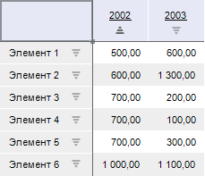
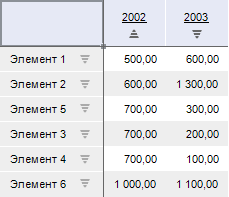
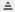
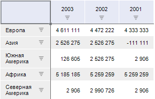
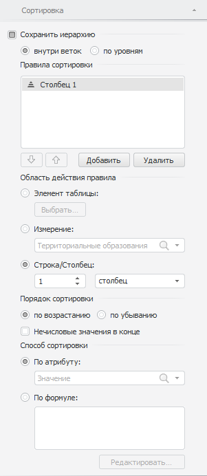

# Сортировка

Сортировка
-

# Сортировка

Данные в таблице можно отсортировать по столбцам и/или по строкам.

Установка сортировки для выбранного столбца/строки осуществляется с
 помощью значков сортировки, расположенных в заголовках строк/столбцов,
 при помощи боковой панели или кнопок.

## Множественная сортировка

Множественная сортировка позволяет отсортировать строки и столбцы одновременно,
 или отсортировать данные, имеющие одинаковую позицию при первоначальной
 сортировке.

### Настройка множественной сортировки

Для настройки множественной сортировки:

	- задайте несколько правил сортировки на вкладке боковой панели
	 «Сортировка»;

	- установите сортировку для столбца/строки, зажмите клавишу SHIFT
	 и нажмите на значок сортировки еще одного столбца/строки.

[Пример множественной
 сортировки](javascript:TextPopup(this))

	Настроенная сортировка для первого столбца в порядке возрастания:

	

	Настроенная множественная сортировка: для первого столбца в порядке
	 возрастания, для второго столбца в порядке убывания:

	

	В результате настроенной множественной сортировки элементы, которые
	 имели одинаковые значения (700) были отсортированы по значениям второго
	 столбца.

## Значки сортировки

При последовательном нажатии на любой из значков его вид изменяется,
 и, соответственно, меняется вид сортировки:

.
 Сортировка по убыванию (в случае с текстовыми значениями - от Я до
 А);

.
 Сортировка по возрастанию (в случае с текстовыми значениями - от А до
 Я);

.
 Сортировка отключена.

Примечание.
 Цвет значка сортировки зависит от [стиля таблицы](../TableView/Formatting/Table_styles.htm)
 или [заливки](UiNav.chm::/GUI/Format/UiReport_Table_Attribute_View.htm)
 ячейки в отчёте: для тёмных цветов заливки используется светлый значок,
 для светлых - тёмный.

[Для отображения/скрытия
 значков сортировки](javascript:TextPopup(this))

		- Для всей таблицы.
		 Установите/снимите флажок «Значки
		 сортировки» на вкладке боковой панели «[Размещение](../TableView/Layout/Layout.htm)»,
		 при выделенной [ячейке/всей таблице](../Select_areas.htm).

		- Для строк таблицы.
		 Установите/снимите флажок «Отображать
		 значки сортировки строк» на вкладке боковой панели «[Размещение](../TableView/Layout/Layout_Dim.htm)»,
		 при выделенном [боковике](../Select_areas.htm).

		- Для столбцов таблицы. Установите/снимите
		 флажок «Отображать значки сортировки
		 столбцов» на вкладке боковой панели «[Размещение](../TableView/Layout/Layout_Dim.htm)»,
		 при выделенной [шапке](../Select_areas.htm).

Примечание.
 Значки сортировки будут скрыты при объединении измерений. Сортировка,
 настроенная на боковой панели, не будет применяться до разделения измерений.

Пример таблицы со значками сортировки для строк и столбцов:

## Настройка сортировки с помощью боковой панели

Для настройки сортировки используйте вкладку «Сортировка»
 в группе вкладок «Таблица»
 боковой панели. Вкладка доступна, если выделена [ячейка/вся
 таблица](../Select_areas.htm).

	- Сохранить иерархию.
	 При снятом флажке элементы будут отсортированы без учета иерархии.
	 При установленном флажке выберите метод сохранения иерархии:

		- Внутри веток. Элементы
		 полностью сохраняют иерархию, правила сортировки будут применены
		 индивидуально в каждой ветке;

		- По уровням. Элементы
		 будут разделены на уровни, правила сортировки будут применены
		 внутри уровней.

	- Правила сортировки.
	 Все правила сортировки отображаются в списке и применяются в порядке
	 очередности. Для добавления/удаления правила сортировки нажмите кнопки
	 «Добавить»/«Удалить»
	 соответственно. Для изменения очередности применения правил используйте
	 кнопки  / .
	 Для редактирования правила сортировки выделите правило и задайте параметры
	 правила сортировки:

		- Область
		 действия правила:

			- Элемент таблицы.
			 Сортировка по выбранному элементу таблицы;

			- Измерение. Сортировка
			 по выбранному измерению;

			- Строка/Столбец.
			 Сортировка по выбранному столбцу/строке;

		- Порядок
		 сортировки:

			- По возрастанию
			 / По убыванию. Определяет
			 порядок сортировки;

			- Нечисловые значения
			 в конце. При установленном флажке нечисловые значения
			 будут расположены после числовых значений;

		- Способ
		 сортировки. Определяет атрибут, по которому будет производиться
		 сортировка:

			- По атрибуту.
			 По умолчанию сортировка производится по атрибуту «Значение».
			 Если в качестве области действия правила сортировки выбрано
			 «Измерение» - в раскрывающемся
			 списке задается атрибут измерения, по которому будет произведена
			 сортировка;

			- По формуле.
			 Сортировка производится по заданной формуле. При нажатии на
			 кнопку «Редактировать»
			 будет открыт [редактор
			 выражений](UiNav.chm::/GUI/ExpressionEditor.htm).

См. также:

[Работа
 с данными таблицы](Working_with_table_data.htm)

		Справочная
		 система на версию 10.9
		 от 18/08/2025,
		 © ООО «ФОРСАЙТ»,
