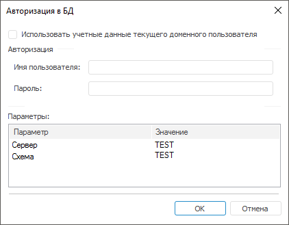

# Авторизация: Планировщик задач

Авторизация: Планировщик задач
-

# Авторизация

В [конфигурационном
 файле](configure_file_manual_extend.htm#credentials) планировщика задач может быть явным образом задан способ авторизации
 в репозитории. Существует несколько способов авторизации:

	- явное указание имени пользователя и пароля в конфигурационном
	 файле;

	- запрос имени пользователя и пароля в диалоге.

При запросе имени пользователя и пароля отображается следующий диалог:

В диалоге доступны следующие настройки:

	- Использовать учетные данные
	 текущего доменного пользователя. При установке флажка вход
	 в репозиторий будет осуществлён от имени доменного пользователя, который
	 запустил планировщик задач. Если флажок снят, то используется парольная
	 авторизация;

Примечание.
 Флажок доступен, если в конфигурационном файле указано значение параметра:
 <Credentials Authentication="0"/>.

	- Авторизация. Группа
	 параметров авторизация предназначена для указания пользователя
	 и пароля для парольной авторизации;

	- Параметры. В таблице
	 отображаются данные репозитория, к которому выполняется подключение.

Примечание.
 Диалог «Авторизация в БД» может
 быть открыт несколько раз, если в конфигурационном файле указано несколько
 репозиториев.

Если в [конфигурационном файле](UiAppSrv_Work_AppSrvXml.htm)
 планировщика задач определена необходимость запроса имени пользователя
 и пароля при авторизации на сервере исходящей почты, то будет открыт диалог
 авторизации.

См. также:

[Запуск
 задач на выполнение](UiAppSrv_Work_Run.htm)

		Справочная
		 система на версию 10.9
		 от 18/08/2025,
		 © ООО «ФОРСАЙТ»,
