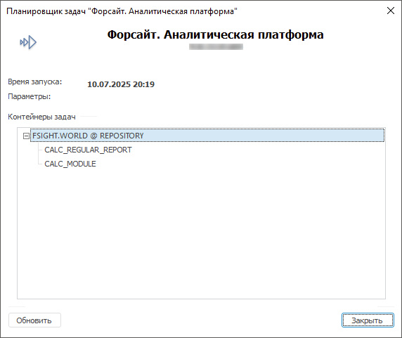

# Запуск задач на выполнение

Запуск задач на выполнение
-

# Запуск задач на выполнение

После [создания
 задач](../2_Work_interface/Operations_with_tasks.htm) выполните запуск задач на выполнение. Запуск задач может быть
 выполнен на локальном компьютере в [контейнере
 запланированных задач](../Getting_Started.htm) или с помощью планировщика задач, позволяющего
 выполнять по расписанию ресурсоёмкие задачи на [сервере приложений](Setup.chm::/UiWebSetup/AppServer.htm).

Важно. Планировщик
 на сервере приложений и [BI-сервер](Setup.chm::/UiWebSetup/UiWebSetup_TitlePage.htm)
 рекомендуется запускать на разных серверах.

Задачи могут выполняться:

	- по установленному [расписанию](../3_Work_Tasks/UiAppSrv_Work_Tasks_CreateTask_TimeTable.htm);

	- по [условию](../3_Work_Tasks/Conditions.htm):
	 при расчёте указанной функции или правила валидации с определенным
	 результатом;

	- при наступлении определенного [системного](../3_Work_Tasks/UiAppSrv_Work_Tasks_CreateTask_TimeTable.htm#systemevent) или [пользовательского
	 события](../3_Work_Tasks/UiAppSrv_Work_Tasks_CreateTask_TimeTable.htm#customevent).

Для запуска задач на выполнение выполните шаги:

	- [Создайте конфигурационный
	 файл](UiAppSrv_Work_AppSrvXml.htm). Конфигурационный файл формируется автоматически из контейнера
	 запланированных задач. По умолчанию конфигурационный файл называется
	 Scheduler.xml и сохраняется в папку установки «Форсайт. Аналитическая платформа».

	Веб-приложение Настольное приложение

		

		

	- Запуск планировщика в виде службы или с заданными параметрами:

		- [Создание
		 службы](UiAppSrv_Work_AppSrv_Service.htm). Создание службы позволяет автоматически запускать
		 планировщик задач при загрузке ОС. В зависимости от ОС, на которой
		 происходит запуск, создание службы отличается. При работе в ОС
		 Windows данную функцию выполняет служба ОС Windows, а при работе
		 в ОС Linux реализация происходит с использованием init-скрипта
		 для системы инициализации;

		- [Запуск
		 планировщика задач](../3_Work_Tasks/UiAppSrv_Run_Parametrs.htm). Для запуска планировщика задач
		 запустите файл Scheduler.exe в папке с установленным «Форсайт. Аналитическая платформа».
		 Будет запущен новый экземпляр планировщика задач, настроенный
		 на конфигурационный файл [Scheduler.xml](UiAppSrv_Work_AppSrvXml.htm).
		 Запуск может быть выполнен с заданными параметрами.

Планировщик задач через заданный интервал
 времени опрашивает контейнер задач и, если подошло время, выполняет задачи.
 По умолчанию планировщик задач проверяет наличие задач каждые 5 минут.
 В случае если время выполнения задач контейнера совпадает, их выполнение
 происходит параллельно друг другу.

	- [Авторизация](UiAppSrv_Work_AppSrv.htm). Если в [конфигурационном
	 файле](configure_file_manual_extend.htm#credentials) планировщика задач задано значение параметра <Credentials
	 Authentication="0"/>, то при запуске планировщика
	 задач будет открыт диалог «Авторизация
	 в БД» для определения типа авторизации:

	- [Просмотр](UiAppSrv_Work_AppSrv_Parameters.htm) и
	 [обновление настроек](../3_Work_Tasks/Update_config_AppSrv.htm)
	 планировщика. Просмотр и обновление настроек планировщика задач происходит
	 в основном окне планировщика задач:

	- [Просмотр состояния
	 задач](../3_Work_Tasks/view_task_state.htm):

	- [Остановка запущенных
	 задач и закрытие планировщика](../3_Work_Tasks/Stop_Runnig_Tasks.htm):

Для закрытия планировщика:

		- нажмите кнопку «Закрыть»
		 в окне планировщика задач;

		- выполните команду «Закрыть»
		 в контекстном меню для значка .

При нажатии кнопки «Закрыть»
 в окне планировщика задач произойдет закрытие только окна планировщика,
 сам планировщик продолжит работу и будет доступен в области уведомлений.
 Чтобы полностью закрыть планировщик задач, выполните команду «Закрыть»
 в контекстном меню для значка .

После создания задачи будут доступны операции:

	- [просмотр
	 результатов отправления задачи](../3_Work_Tasks/view_task_state.htm#notification);

	- [обновление
	 состояния задач](../3_Work_Tasks/view_task_state.htm#renewtask);

	- [повторный
	 запуск задачи](../3_Work_Tasks/view_task_state.htm#resettask);

	- [запуск
	 задач вручную](../3_Work_Tasks/view_task_state.htm#manual_task);

	- [сохранение
	 результатов задачи](../3_Work_Tasks/view_task_state.htm#save_task).

Примечание.
 При работе с большим количеством задач в планировщике задач предусмотрены
 [особенности распределения потоков
 задач](UiAppSrv_Work_AppSrvXml_Flow.htm).

См. также:

[Создание
 службы для запуска планировщика задач](UiAppSrv_Work_AppSrv_Service.htm) | [Создание
 конфигурационного файла](UiAppSrv_Work_AppSrvXml.htm)

		Справочная
		 система на версию 10.9
		 от 18/08/2025,
		 © ООО «ФОРСАЙТ»,
