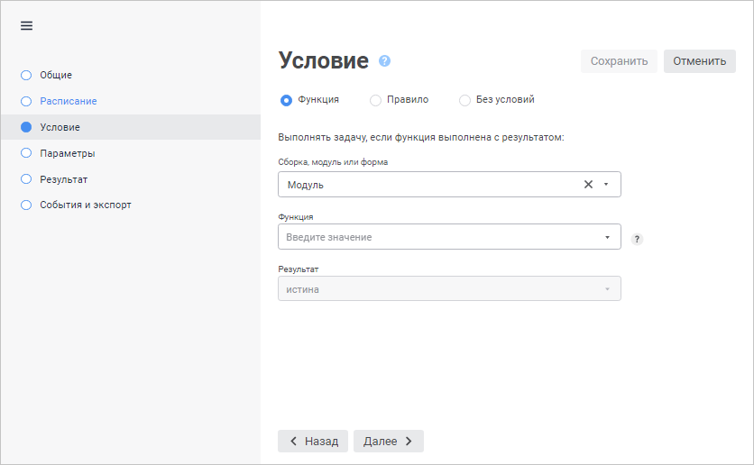
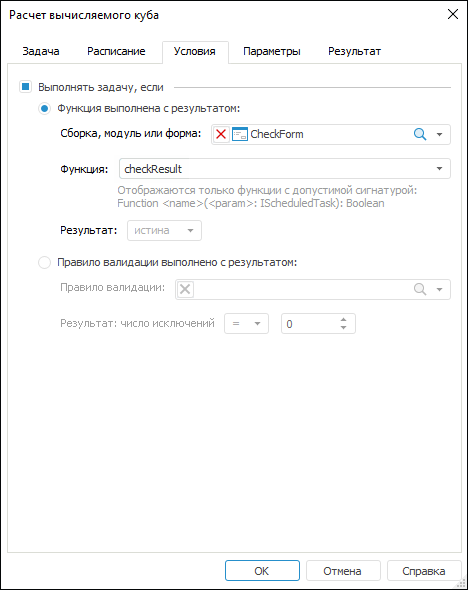

# Задание условия выполнения задачи

Задание условия выполнения задачи
-

# Задание условия выполнения задачи

Для каждой задачи есть возможность установить условие её выполнения:
 функцию или правило валидации. Если функция или правило валидации будут
 рассчитаны с определенным результатом, то задача будет выполняться. Задать
 условия выполнения задачи можно на странице/вкладке «Условие»
 в [мастере
 настройки задачи](../2_Work_interface/Operations_with_tasks.htm#master).

[Для открытия мастера настройки задачи](javascript:TextPopup(this))

		- в веб-приложении:

			- нажмите кнопку  «Редактировать», расположенную
			 напротив задачи;

			- дважды щёлкните по задаче;

		- в настольном приложении:

			- выполните команду «Задача
			 > Редактировать» главного меню;

			- выполните команду «Редактировать»
			 в контекстном меню задачи;

			- нажмите кнопку  на панели
			 инструментов;

			- нажмите клавишу F4;

			- дважды щёлкните по задаче.

	Также мастер настройки задачи открывается при её [создании](../2_Work_interface/Operations_with_tasks.htm).

	Веб-приложение Настольное приложение

		

		

В веб-приложении вид страницы зависит от выбранного типа условия.

Задайте параметры:

	- Функция/Функция выполнена с
	 результатом. Установите переключатель для выполнения задачи
	 с учётом результата выполнения функции (истина или ложь) из указанной
	 сборки, формы или модуля репозитория:

		- Сборка, модуль или форма.
		 Выберите в раскрывающемся списке сборку, модуль или форму с необходимой
		 функцией. Для поиска объекта в списке начните вводить наименование
		 объекта в строке поиска в веб-приложении или нажмите кнопку  «Поиск»
		 и введите наименование объекта в настольном приложении. Для удаления
		 объекта из поля нажмите кнопку «Удалить»;

		- Функция. Выберите
		 в раскрывающемся списке функцию, результат выполнения которой
		 необходим для выполнения условия;

		- Результат. Выберите
		 в раскрывающемся списке результат выполнения условия «Истина»
		 или «Ложь»;

Примечание.
 В поле «Функция» будут отображаться
 только функции с определенной сигнатурой: Function
 <name> (<param>: IScheduledTask): Boolean.

	- Правило/Правило валидации выполнено
	 с реультатом. Установите переключатель для выполнения задачи
	 с учётом правила валидации и числа исключений из этого правила:

		- [Правило
		 валидации](UiAnalyticalArea.chm::/Analysis/Data_validation.htm). Выберите в раскрывающемся
		 списке правило валидации из репозитория. Для поиска объекта в
		 списке начните вводить наименование объекта в строке поиска в
		 веб-приложении или нажмите кнопку  «Поиск»
		 и введите наименование объекта в настольном приложении. Для удаления
		 объекта из поля нажмите кнопку «Удалить»;

Примечание.
 В качестве условия выполнения задачи могут использоваться правила валидации,
 содержащиеся только в базе данных временных рядов.

		- Результат: число исключений.
		 Укажите результат, с которым должно выполняться правило валидации
		 для выполнения условия. В первом поле выберите в раскрывающемся
		 списке оператор сравнения, а во втором поле введите числовое значение;

	- Без условий. По умолчанию.
	 Задача выполняется без условий. В настольном приложении использование
	 условия определяется флажком «Выполнять
	 задачу, если».

См. также:

[Создание
 запланированных задач](Work_Task.htm)

		Справочная
		 система на версию 10.9
		 от 18/08/2025,
		 © ООО «ФОРСАЙТ»,
