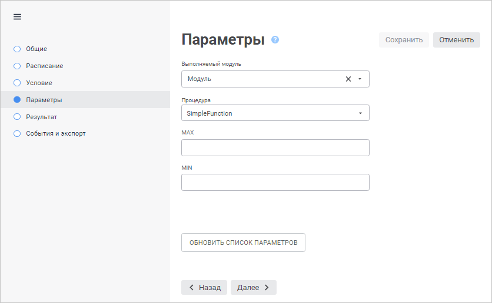
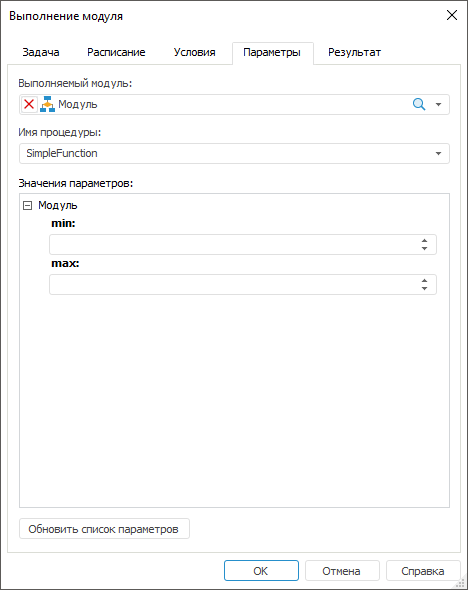

# Настройка выполнения модуля

Настройка выполнения модуля
-

# Настройка выполнения модуля

При настройке задачи выполнения модуля на странице/вкладке «[Параметры](UiAppSrv_Work_Tasks_CreateTask_Parameters.htm)»
 в [мастере
 настройки задачи](../2_Work_interface/Operations_with_tasks.htm#master) добавляются дополнительные параметры.

[Для открытия мастера настройки задачи](javascript:TextPopup(this))

		- в веб-приложении:

			- нажмите кнопку  «Редактировать», расположенную
			 напротив задачи;

			- дважды щёлкните по задаче;

		- в настольном приложении:

			- выполните команду «Задача
			 > Редактировать» главного меню;

			- выполните команду «Редактировать»
			 в контекстном меню задачи;

			- нажмите кнопку  на панели
			 инструментов;

			- нажмите клавишу F4;

			- дважды щёлкните по задаче.

	Также мастер настройки задачи открывается при её [создании](../2_Work_interface/Operations_with_tasks.htm).

	Веб-приложение Настольное приложение

		

		

Задайте параметры:

	- Выполняемый модуль.
	 Выберите в раскрывающемся списке модуль;

Примечание.
 В задачах выполнения модуля запрещено создание визуальных форм и компонентов.

	- Процедура/Имя процедуры.
	 Выберите в раскрывающемся списке процедуру или функцию, которая будет
	 выполнена при запуске задачи. В списке содержатся все процедуры и
	 функции, которые реализованы в глобальном пространстве имён (Global
	 Scope) модуля;

	- Значения параметров.
	 Задайте значения параметрам, которые будут передаваться в процедуру
	 или функцию при выполнении задачи. Набор полей зависит от сигнатуры
	 процедуры/функции. Вид полей ввода параметров зависит от типов параметров.

Примечание.
 Отображаются только те параметры, которые имеют простой тип данных (String,
 Integer и другие).

Если задача была создана до изменения сигнатуры процедуры/функции, то
 для обновления списка параметров при настройке задачи нажмите кнопку «Обновить список параметров».

См. также:

[Настройка
 объекта задачи](UiAppSrv_Work_Tasks_CreateTask_Parameters.htm) | [Создание запланированных
 задач](Work_Task.htm)

		Справочная
		 система на версию 10.9
		 от 18/08/2025,
		 © ООО «ФОРСАЙТ»,
