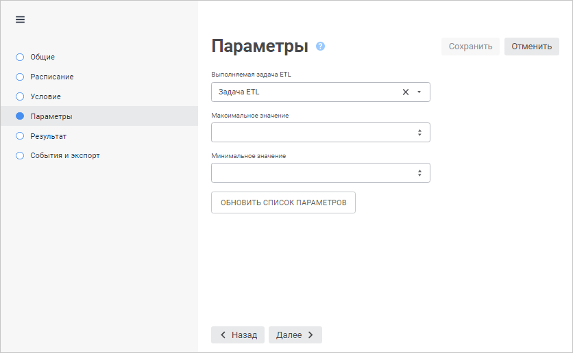
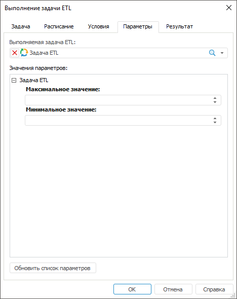

# Настройка объекта задачи

Настройка объекта задачи
-

# Настройка объекта задачи

Для настройки объекта задачи и задания значений его параметров, используйте
 вкладку/страницу «Параметры» в
 [мастере
 настройки задачи](../2_Work_interface/Operations_with_tasks.htm#master). Параметры объекта задаются при создании или редактировании
 объекта. Например, в отчёте параметры предназначены для динамического
 управления отображаемыми данными.

[Для открытия мастера настройки задачи](javascript:TextPopup(this))

		- в веб-приложении:

			- нажмите кнопку  «Редактировать», расположенную
			 напротив задачи;

			- дважды щёлкните по задаче;

		- в настольном приложении:

			- выполните команду «Задача
			 > Редактировать» главного меню;

			- выполните команду «Редактировать»
			 в контекстном меню задачи;

			- нажмите кнопку  на панели
			 инструментов;

			- нажмите клавишу F4;

			- дважды щёлкните по задаче.

	Также мастер настройки задачи открывается при её [создании](../2_Work_interface/Operations_with_tasks.htm).

	Веб-приложение Настольное приложение

		

		

Задайте параметры:

	- Объект задачи. Выберите
	 в раскрывающемся списке объект репозитория. Для выбора доступны только
	 объекты, соответствующие типу задачи. Для задачи обновления кеша будут
	 доступны различные виды кубов, справочников и базы данных временных
	 рядов;

	- Значения параметров.
	 Задайте значения параметрам, которые будут использоваться при выполнении
	 задачи. Набор полей зависит от параметров выбранного объекта задачи.
	 Вид полей ввода параметров зависит от типов параметров.

Если задача была создана до изменения параметров объекта, то для обновления
 списка параметров при настройке задачи нажмите кнопку «Обновить
 список параметров».

Специфические настройки имеют следующие задачи:

	- [выполнение модуля](NET_assembly_execution.htm);

	- [обновление кеша объекта](Update_the_cache_object.htm).
	 Доступно только в настольном приложении;

	- [обновление поискового
	 индекса](Updating_the_search_index_task.htm). Доступно только в настольном приложении.

См. также:

[Создание
 запланированных задач](Work_Task.htm)

		Справочная
		 система на версию 10.9
		 от 18/08/2025,
		 © ООО «ФОРСАЙТ»,
