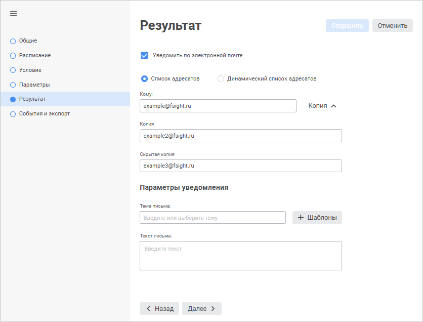
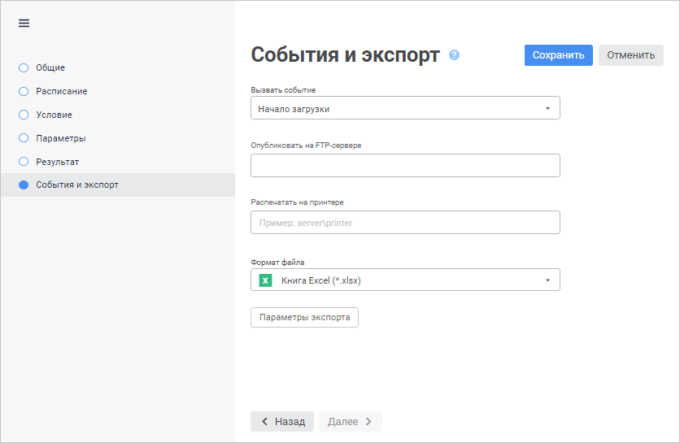

# Настройка обработки результата выполнения задачи

Настройка обработки результата выполнения задачи
-

# Настройка обработки результата
	 выполнения задачи

	Для настройки вариантов обработки результата выполнения задачи используйте
	 страницу/вкладку «Результат»
	 в [мастере
	 настройки задачи](../2_Work_interface/Operations_with_tasks.htm#master).

[Для открытия мастера настройки задачи](javascript:TextPopup(this))

		- в веб-приложении:

			- нажмите кнопку  «Редактировать», расположенную
			 напротив задачи;

			- дважды щёлкните по задаче;

		- в настольном приложении:

			- выполните команду «Задача
			 > Редактировать» главного меню;

			- выполните команду «Редактировать»
			 в контекстном меню задачи;

			- нажмите кнопку  на панели
			 инструментов;

			- нажмите клавишу F4;

			- дважды щёлкните по задаче.

	Также мастер настройки задачи открывается при её [создании](../2_Work_interface/Operations_with_tasks.htm).

		Веб-приложение Настольное приложение

			

			

	Для всех задач доступны варианты обработки результата:

		- отправка уведомления по электронной почте;

		- вызов пользовательского события.

	Для задачи вычисления регламентного отчёта доступны дополнительные
	 варианты обработки результата:

		- публикация на FTP-сервере;

		- печать на принтере;

		- формат файла.

Примечание. Для
 отчёта, отправляемого по электронной почте и/или публикуемого на FTP-сервере,
 доступны следующие форматы: XLSX, XLS, PDF, PNG в веб-приложении; XLSX,
 XLS, PDF, RTF, HTM, ODS, EMF, PPREPORT в настольном приложении.

## Уведомить по электронной почте

	Отправка уведомлений по электронной почте доступна только для задач,
	 выполняемых по [расписанию](UiAppSrv_Work_Tasks_CreateTask_TimeTable.htm).
	 При запуске задач [вручную](view_task_state.htm#manual_task)
	 сообщения не отправляются.

	Для настройки автоматической отправки уведомления о выполнении задачи
	 на электронную почту установите флажок «Уведомить
	 по электронной почте» и выберите вариант добавления адресатов
	 с помощью переключателей:

		- Список адресатов.
		 Для выбора списка адресов электронной почты, пользователей или
		 групп пользователей, которым будет доставлен отчёт о выполнении
		 задачи, выполните действия:

			- в веб-приложении задайте параметры:

				- Кому. Введите
				 адрес одного или нескольких основных получателей сообщения
				 через разделитель «;». Обязательный параметр для заполнения;

				- Копия. Введите
				 адрес одного или нескольких получателей для ознакомления
				 с сообщением через разделитель «;». Необязательный параметр
				 для заполнения;

				- Скрытая копия.
				 Введите адрес одного или нескольких получателей для ознакомления
				 с сообщением через разделитель «;». Адрес будет скрыт
				 от других получателей сообщения. Необязательный параметр
				 для заполнения;

	Примечание.
	 Нажмите кнопку «Копия» для
	 отображения параметров «Копия»
	 и «Скрытая копия». По умолчанию
	 параметры скрыты.

			- в настольном приложении:

				- задайте список адресов электронной почты, на которые
				 будет отправлено уведомление. После каждого адреса поставьте
				 точку с запятой;

				- нажмите кнопку «Выбрать»
				 для поиска субъектов безопасности. Будет открыто окно
				 «[Выбор пользователей и групп](Admin.chm::/03_Admin/Admin_UsersGroups.htm)»;

		- Динамический
		 список адресатов. Для формирования списка адресатов по
		 условию выполните действия:

			- в поле «Модуль»
			 укажите объект, содержащий реализацию функции для обработки
			 списка адресатов;

			- в раскрывающемся списке «Функция»
			 выберите функцию, предназначенную для обработки списка адресатов.

	Примечание.
	 В списке отображаются только функции с сигнатурой: Function
	 <name>(<param>: IScheduledTask): IArrayList.

	Для настройки параметров электронной почты:

		- в веб-приложении задайте параметры:

			- Тема
			 письма. Введите краткое описание, которое характеризует
			 выполнение задачи, в качестве темы письма. При необходимости
			 выберите подстановку, которая будет отображаться в теме письма,
			 с помощью кнопки 
			 «Шаблоны»:

				- &[TASK_RESULT] - результат выполнения;

				- &[TASK_NAME] - наименование задачи;

				- &[TASK_ID] - идентификатор задачи;

				- &[TASK_START] - время запуска;

				- &[TASK_FINISH] - время завершения;

			- Текст
			 письма. Введите описание уведомления в результате выполнения
			 задачи;

		- в настольном приложении используйте окно «[Параметры
		 электронной почты](UiAppSrv_Work_Tasks_CreateTask_Rezult_Params.htm)». Для открытия окна нажмите кнопку
		 «Настройки уведомления».

	После выполнения задачи по указанным адресам будет отправлено соответствующее
	 уведомление с заданными параметрами электронной почты. Состояние отправки
	 уведомления будет отображено в рабочей области контейнера в столбце
	 «[Уведомление](view_task_state.htm#notification)».

	Важно.
	 При настройке отправки сообщений по электронной почте в [конфигурационном
	 файле](../1_Work_AppSrv/configure_file_manual_extend.htm#host) опишите раздел <HOST>, в противном случае сообщения
	 не будут отправлены.

### Пример модуля для настройки динамического списка адресатов

	Для выполнения примера добавьте ссылки на системные сборки: Collection,
	 Metabase.

		Public Function GetRecepients(Task: IScheduledTask):IArrayList;

		Var

		    List: IArrayList;

		    Mb: IMetabase;

		    MS: IMetabaseSecurity;

		    SSS: ISecuritySubjects;

		    SS: ISecuritySubject;

		Begin

		    Mb := Metabaseclass.Active;

		    MS := MB.Security;

		    SSS := MS.AllUsers;

		    // Пользователь платформы:

		    SS := SSS.Item(9);

		    Select Case (Task.State As Integer)

		        // Задача выполнена удачно:

		        Case 3:

		            List := New ArrayList.Create;

		            List.Add("user1@example.com");

		            List.Add(MS.ResolveSid(SS.Sid));

		        // Задача выполнена с ошибкой:

		        Case 4:

		            List := New ArrayList.Create;

		            List.Add("user2@example.com");

		            List.Add(MS.ResolveSid(SS.Sid));

		    End Select;

		    Return List;

		End Function GetRecepients;

	Созданный модуль укажите в поле «Модуль»
	 на вкладке «Результат» в диалоге
	 настройки параметров задачи. В поле «Функция»
	 укажите «GetRecepients».

	В результате выполнения примера электронный адрес для отправки уведомления
	 о выполнении задачи будет определен в зависимости от текущего состояния
	 выполняемой задачи.

## Вызвать событие

	Для настройки вызова пользовательского события после завершения
	 вычисления задачи выполните действия, указанные ниже.

		Веб-приложение Настольное приложение

				- Перейдите на страницу «События
				 и экспорт»:

			

				- Выберите в раскрывающемся списке «Вызвать
				 событие» событие, определённое на вкладке «[Пользовательские
				 метаданные > События](UiDevEnv.chm::/04_NavigatorSetting/Classes_Object/Classes_Events.htm)» в настройках параметров
				 репозитория.

				- Установите флажок «Вызвать
				 событие» на вкладке «Результат».

				- Выберите в раскрывающемся списке событие, определённое
				 на вкладке «[Пользовательские
				 метаданные > События](UiDevEnv.chm::/04_NavigatorSetting/Classes_Object/Classes_Events.htm)» в настройках параметров
				 репозитория.

	После выполнения задачи будет генерироваться заданное пользовательское
	 событие. Данное событие будут обрабатывать те задачи, для которых
	 настроено выполнение [по
	 наступлению настраиваемого события](UiAppSrv_Work_Tasks_CreateTask_TimeTable.htm#customevent).

## Дополнительные параметры обработки результата
	 для регламентного отчёта

	Для задачи «Вычисление регламентного
	 отчёта» доступны дополнительные параметры обработки результата:

		- в веб-приложении на странице «[События и экспорт](#event)»;

		- в настольном приложении на вкладке «Результат».

### Опубликовать на FTP-сервере

	Результат выполнения задачи можно поместить на FTP-сервер. Для этого:

		- Установите флажок «Опубликовать
		 на FTP-сервере». Актуально только для настольного приложения.

		- В поле ввода задайте адрес сервера.

		- [Задайте
		 формат файла и параметры экспорта](UiAppSrv_Work_Tasks_CreateTask_Rezult.htm#format).

	После выполнения задачи на указанном сервере будет сохранен результат
	 вычисления отчёта.

	Важно.
	 При настройке сохранения файла на FTP-сервер необходимо в [конфигурационном
	 файле](../1_Work_AppSrv/configure_file_manual_extend.htm#host) описать раздел Ftp, в противном случае файл отчёта не будет
	 сохранён на сервер.

### Распечатать на принтере

	Для печати результата выполнения задачи:

		- Установите флажок «Распечатать
		 на принтере». Актуально только для настольного приложения.

		- Задайте принтер в следующем формате:
		 server\printer.

### Формат файла и параметры экспорта

	Для отчёта, прикладываемого к письму и/или публикуемого на на FTP-сервере,
	 можно задать формат файла и параметры экспорта в него:

		- Выберите формат отчёта в раскрывающемся списке «Формат
		 файла»:

			- файл в формате PPREPORT (*.ppreport). Доступно только
			 в настольном приложении;

			- файл в формате EMF (*.emf). Доступно только в настольном
			 приложении;

			- электронная таблица OpenDocument (*.ods). Доступно только
			 в настольном приложении;

			- веб-страница, архив в одном файле (*.htm). Доступно
			 только в настольном приложении;

			- документ в формате RTF (*.rtf). Доступно только в настольном
			 приложении;

			- изображение (*.png). Доступно только в веб-приложении;

			- документ PDF (*.pdf);

			- книга Excel 97-2003 (*.xls);

			- книга Excel (*.xlsx).

		- Для настройки параметров экспорта отчёта в выбранный формат
		 нажмите кнопку «Параметры экспорта».
		 Будет открыто окно «[Параметры
		 экспорта](uireport.chm::/desktop/Reports/OperationReport/UiReport_Reports_Operation_Export.htm#export_to_excel)». Вид диалога зависит
		 от выбранного формата экспорта отчёта.

	После выполнения задачи результат вычисления отчёта будет экспортирован
	 в заданный формат.

См. также:

[Создание
 запланированных задач](Work_Task.htm)

		Справочная
		 система на версию 10.9
		 от 18/08/2025,
		 © ООО «ФОРСАЙТ»,
