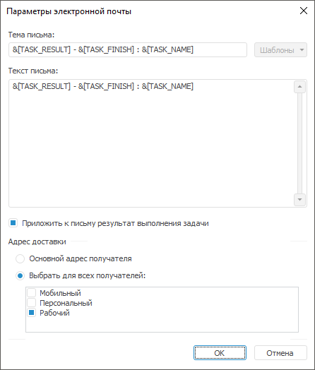

# Настройка параметров электронной почты: Настольное приложение

Настройка параметров электронной почты: Настольное приложение
-

# Настройка параметров электронной почты

Для настройки параметров электронной почты нажмите кнопку «Настройки
 уведомления» на вкладке «[Результат](UiAppSrv_Work_Tasks_CreateTask_Rezult.htm)»
 в [мастере
 настройки задачи](../2_Work_interface/Operations_with_tasks.htm#master). После выполнения действия будет открыто окно «Параметры электронной почты»:

Примечание.
 Настройка параметров электронной почты с помощью окна «Параметры
 электронной почты» доступна только в настольном приложении.

Задайте параметры:

	- Тема письма. Введите
	 краткое описание, которое характеризует выполнение задачи, в качестве
	 темы письма. При необходимости выберите подстановку, которая будет
	 отображаться в теме письма, с помощью кнопки «Шаблоны»:

	-

		- &[TASK_RESULT] - результат
		 выполнения;

		- &[TASK_NAME] - наименование
		 задачи;

		- &[TASK_ID] - идентификатор
		 задачи;

		- &[TASK_START] - время запуска;

		- &[TASK_FINISH] - время завершения;

	- Текст письма. Введите
	 описание уведомления в результате выполнения задачи;

	- Приложить к письму результат
	 выполнения задачи. Флажок отображается только для задачи «Вычисление регламентного отчета».
	 При установленном флажке к письму будет приложен результат выполнения
	 задачи в выбранном формате;

Примечание. Для
 отчета, отправляемого по электронной почте, доступны следующие форматы:
 XLSX, XLS, PDF, RTF, HTM, ODS, EMF, PPREPORT.

	- Адрес доставки. Группа
	 настроек, определяющих по каким адресам будет отправлен отчет.

	Данные настройки актуальны, если в окне результатов в списке уведомления
	 указаны пользователи репозитория. Для выбранных пользователей в профиле
	 должны быть указаны адреса электронной почты. В группе доступны варианты:

	-

		- [Основной
		 адрес получателя](UiNav.chm::/02_Navigator/UiNav_PersonalData.htm#select_default_address). Результат будет выслан
		 на электронную почту, заданную для пользователей по умолчанию;

		- [Выбрать
		 для всех получателей](UiNav.chm::/02_Navigator/UiNav_PersonalData.htm). Результат будет
		 выслан на электронную почту, отмеченную флажками «Мобильный»,
		 «Персональный» или «Рабочий».

См. также:

[Настройка
 обработки результата выполнения задачи](UiAppSrv_Work_Tasks_CreateTask_Rezult.htm)

		Справочная
		 система на версию 10.9
		 от 18/08/2025,
		 © ООО «ФОРСАЙТ»,
