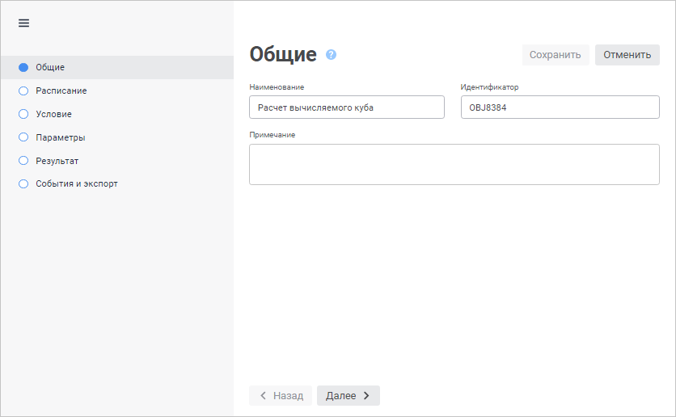
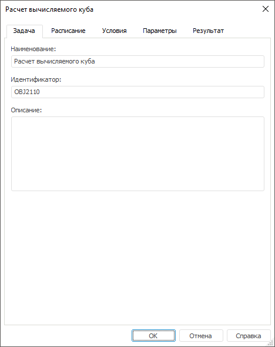

# Определение наименования и идентификатора задачи: Контейнер запланированных задач

Определение наименования и идентификатора задачи: Контейнер запланированных задач
-

# Определение наименования и идентификатора задачи

Для настройки общих параметров задачи в [мастере
 настройки задачи](../2_Work_interface/Operations_with_tasks.htm#master):

	- в веб-приложении используйте страницу «Общие»;

	- в настольном приложении используйте вкладку «Задача».

[Для открытия мастера настройки задачи](javascript:TextPopup(this))

		- в веб-приложении:

			- нажмите кнопку  «Редактировать», расположенную
			 напротив задачи;

			- дважды щёлкните по задаче;

		- в настольном приложении:

			- выполните команду «Задача
			 > Редактировать» главного меню;

			- выполните команду «Редактировать»
			 в контекстном меню задачи;

			- нажмите кнопку  на панели
			 инструментов;

			- нажмите клавишу F4;

			- дважды щёлкните по задаче.

	Также мастер настройки задачи открывается при её [создании](../2_Work_interface/Operations_with_tasks.htm).

	Веб-приложение Настольное приложение

		

		

Задайте параметры:

	- Наименование. Наименование
	 задачи: строка символов, несущая смысловую нагрузку;

	- Идентификатор. Уникальный
	 идентификатор задачи в рамках контейнера запланированных задач. Допускается
	 использование букв латинского алфавита, цифр и знаков «_»;

	- Примечание/Описание.
	 Текстовое описание или комментарий к задаче. Необязательный параметр.

См. также:

[Создание
 запланированных задач](Work_Task.htm)

		Справочная
		 система на версию 10.9
		 от 18/08/2025,
		 © ООО «ФОРСАЙТ»,
