# Задание периодичности выполнения задачи

Задание периодичности выполнения задачи
-

# Задание периодичности выполнения задачи

	Для задачи можно настроить различные периоды выполнения: однократное,
	 ежедневное, еженедельное, ежемесячное, а также по наступлению системного
	 или пользовательского события.

	Настройки периодичности выполнения задачи задаются на вкладке/странице
	 «Расписание» в [мастере
	 настройки задачи](../2_Work_interface/Operations_with_tasks.htm#master).

	Примечание.
	 Для выполнения задач [запустите
	 планировщик задач](../1_Work_AppSrv/UiAppSrv_Work_Run.htm) на BI-сервере или на любом другом аналогично
	 настроенном сервере.

[Для открытия мастера настройки задачи](javascript:TextPopup(this))

		- в веб-приложении:

			- нажмите кнопку  «Редактировать», расположенную
			 напротив задачи;

			- дважды щёлкните по задаче;

		- в настольном приложении:

			- выполните команду «Задача
			 > Редактировать» главного меню;

			- выполните команду «Редактировать»
			 в контекстном меню задачи;

			- нажмите кнопку  на панели
			 инструментов;

			- нажмите клавишу F4;

			- дважды щёлкните по задаче.

	Также мастер настройки задачи открывается при её [создании](../2_Work_interface/Operations_with_tasks.htm).

		Веб-приложение

		 Настольное
		 приложение

			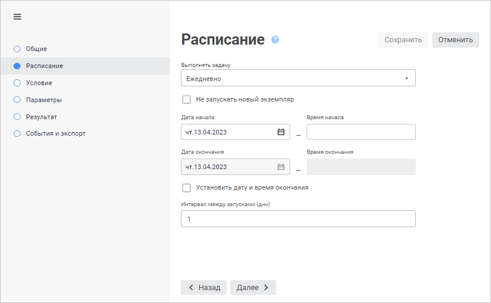

			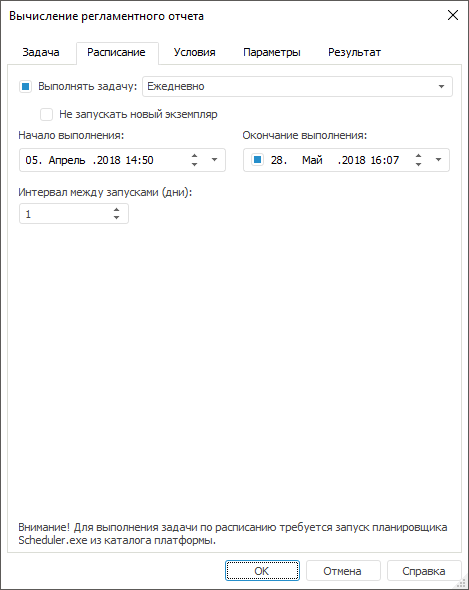

	Вид страницы/вкладки зависит от выбранной периодичности выполнения
	 задачи.

	Для настройки расписания:

		- в веб-приложении выберите вариант периодичности в раскрывающемся
		 списке «Выполнять задачу»;

		- в настольном приложении установите флажок «Выполнять
		 задачу» и выберите вариант периодичности в раскрывающемся
		 списке.

	Для деактивации задачи:

		- в веб-приложении выберите вариант периодичности «Не
		 задано» в раскрывающемся списке «Выполнять
		 задачу»;

		- в настольном приложении снимите флажок «Выполнять
		 задачу».

	Деактивированная задача имеет статус «Не
	 активна» и не будет выполнятся.

	Примечание.
	 Фактическое время запуска на выполнение задачи зависит от [интервала](../1_Work_AppSrv/configure_file_manual_extend.htm#taskcontainer)
	 проверки контейнера задач.

## Ежедневно

	Набор параметров при выборе варианта «Ежедневно».

		Веб-приложение Настольное приложение

			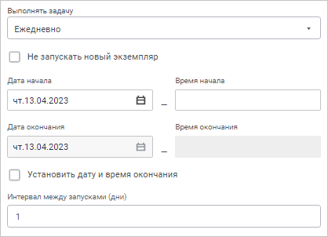

			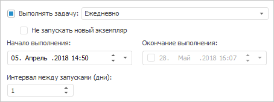

	Доступны следующие настройки:

		- Не запускать новый экземпляр.
		 Установка данного флажка позволяет избежать одновременного выполнения
		 нескольких экземпляров одной и той же задачи: задача не будет
		 запущена, пока не завершится выполнение предыдущего экземпляра
		 этой задачи. Если при выполнении задачи пропущены один или несколько
		 её очередных запусков, то они будут выполнены в порядке очереди;

		- Дата начала/Начало выполнения.
		 Задаёт дату запуска задачи. В настольном приложении задаётся дата
		 и время запуска задачи;

		- Время начала. Задаёт
		 время запуска задачи. Доступно только в веб-приложении;

		- Дата окончания/Окончание
		 выполнения. Задаёт дату последнего выполнения задачи, если
		 установлен флажок «Установить
		 дату и время окончания». В настольном приложении установка
		 флажка «Окончание выполнения»
		 позволяет задать дату и время последнего выполнения задачи, после
		 наступления которых задача не будет больше запускаться на выполнение.
		 По умолчанию настройка не активна;

		- Время окончания.
		 Задаёт время последнего выполнения задачи. Доступно только в веб-приложении;

		- Интервал между запусками.
		 Задаёт количество дней, через которое будет производиться запуск
		 задачи на выполнение.

	После выполнения действий задача будет запускаться на выполнение
	 каждый день в заданный временной промежуток.

## Еженедельно

	Набор параметров при выборе варианта «Еженедельно».

		Веб-приложение Настольное приложение

			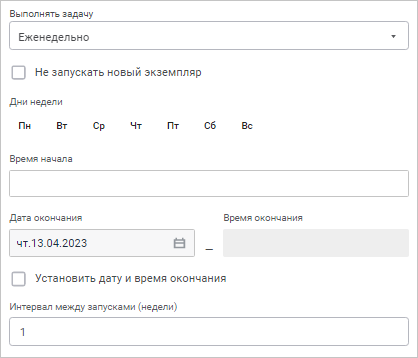

			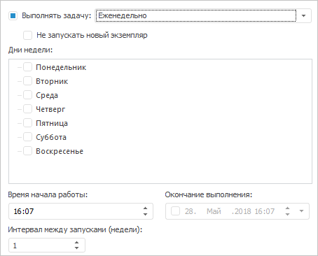

	Доступны следующие настройки:

		- Не запускать новый экземпляр.
		 Установка данного флажка позволяет избежать одновременного выполнения
		 нескольких экземпляров одной и той же задачи: задача не будет
		 запущена, пока не завершится выполнение предыдущего экземпляра
		 этой задачи. Если при выполнении задачи пропущены один или несколько
		 её очередных запусков, то они будут выполнены в порядке очереди;

		- Дни недели. Задача
		 будет рассчитана в отмеченные дни недели;

		- Время начала/Время начала
		 работы. Задаёт время запуска задачи;

		- Дата окончания/Окончание
		 выполнения. Задаёт дату последнего выполнения задачи, если
		 установлен флажок «Установить
		 дату и время окончания». В настольном приложении установка
		 флажка «Окончание выполнения»
		 позволяет задать дату и время последнего выполнения задачи, после
		 наступления которых задача не будет больше запускаться на выполнение.
		 По умолчанию настройка не активна;

		- Время окончания.
		 Задаёт время последнего выполнения задачи. Доступно только в веб-приложении;

		- Интервал между запусками.
		 Задаёт количество недель, через которое будет производиться запуск
		 задачи на выполнение.

	После выполнения действий задача будет запускаться на выполнение
	 каждую неделю в заданный временной промежуток.

## Ежемесячно

	Набор параметров при выборе варианта «Ежемесячно».

		Веб-приложение
		 Настольное
		 приложение

			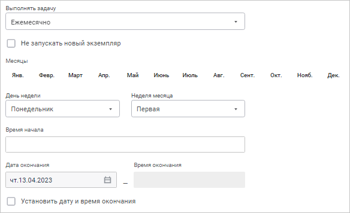

			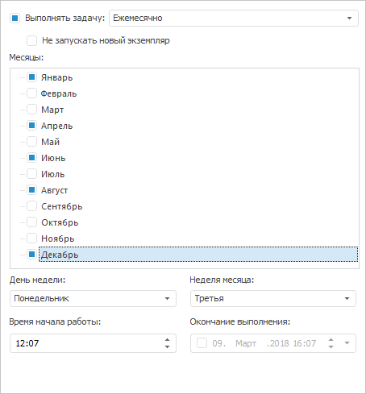

	Доступны следующие настройки:

		- Не запускать новый экземпляр.
		 Установка данного флажка позволяет избежать одновременного выполнения
		 нескольких экземпляров одной и той же задачи: задача не будет
		 запущена, пока не завершится выполнение предыдущего экземпляра
		 этой задачи. Если при выполнении задачи пропущены один или
		 несколько её очередных запусков, то они будут выполнены в порядке
		 очереди;

		- Месяцы. Задача будет
		 рассчитана в те месяцы, для которых установлены флажки;

		- День недели. Задает
		 день недели, в который будет произведен запуск расчета задачи;

		- Неделя месяца. Задает
		 неделю месяца, в которую будет произведен запуск расчета задачи;

		- Время начала/Время начала
		 работы. Задает время запуска задачи;

		- Дата окончания/Окончание
		 выполнения. Задаёт дату последнего выполнения задачи, если
		 установлен флажок «Установить
		 дату и время окончания». В настольном приложении установка
		 флажка «Окончание выполнения»
		 позволяет задать дату и время последнего выполнения задачи, после
		 наступления которых задача не будет больше запускаться на выполнение.
		 По умолчанию настройка не активна;

		- Время окончания.
		 Задаёт время последнего выполнения задачи. Доступно только в веб-приложении.

	После выполнения действий задача будет запускаться на выполнение
	 каждый месяц в заданный временной промежуток.

## Однократно

	Набор параметров при выборе варианта «Однократно».

		Веб-приложение Настольное приложение

			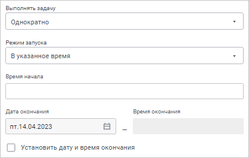

			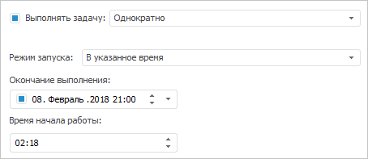

	Доступны следующие настройки:

		- Режим запуска. Задаёт
		 способ запуска задачи на выполнение:

			- Немедленно.
			 Задача будет запущена на выполнение немедленно;

			- В указанное время.
			 При выборе режима появляется поле, в котором задаётся время
			 запуска задачи;

			- При подключении к репозиторию.
			 Задача будет выполнена при подключении к репозиторию;

		- Дата окончания/Окончание
		 выполнения. Задаёт дату последнего выполнения задачи, если
		 установлен флажок «Установить
		 дату и время окончания». В настольном приложении установка
		 флажка «Окончание выполнения»
		 позволяет задать дату и время последнего выполнения задачи, после
		 наступления которых задача не будет больше запускаться на выполнение.
		 По умолчанию настройка не активна;

		- Время окончания.
		 Задаёт время последнего выполнения задачи. Доступно только в веб-приложении.

	После выполнения действий задача будет запущена на выполнение однократно
	 по выбранному режиму запуска и закончит выполнение в выбранное время,
	 если оно задано.

## Временной интервал

	Набор параметров при выборе варианта «Временной
	 интервал».

		Веб-приложение Настольное приложение

			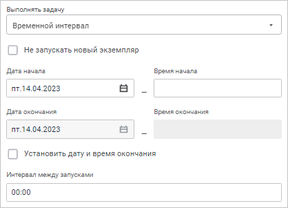

			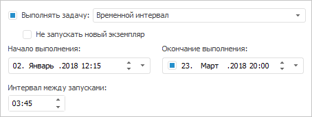

	Доступны следующие настройки:

		- Не запускать новый экземпляр.
		 Установка данного флажка позволяет избежать одновременного выполнения
		 нескольких экземпляров одной и той же задачи: задача не будет
		 запущена, пока не завершится выполнение предыдущего экземпляра
		 этой задачи. Если при выполнении задачи пропущены один или несколько
		 её очередных запусков, то они будут выполнены в порядке очереди;

		- Дата начала/Начало выполнения.
		 Задаёт дату запуска задачи. В настольном приложении задаётся дата
		 и время запуска задачи;

		- Время начала. Задаёт
		 время запуска задачи. Доступно только в веб-приложении;

		- Дата окончания/Окончание
		 выполнения. Задаёт дату последнего выполнения задачи, если
		 установлен флажок «Установить
		 дату и время окончания». В настольном приложении установка
		 флажка «Окончание выполнения»
		 позволяет задать дату и время последнего выполнения задачи, после
		 наступления которых задача не будет больше запускаться на выполнение.
		 По умолчанию настройка не активна;

		- Время окончания.
		 Задаёт время последнего выполнения задачи. Доступно только в веб-приложении;

		- Интервал между запусками.
		 Задаёт интервал времени в количестве часов и/или минут, через
		 который будет производиться запуск задачи на выполнение.

	После выполнения действий задача будет запускаться на выполнение
	 по заданному временному интервалу.

## По наступлению системного события

	Примечание.
	 Доступно только в настольном приложении.

	При выборе варианта «По наступлению
	 системного события» задача будет выполняться при наступлении
	 определенного системного события. На странице/вкладке «Расписание»
	 будет доступна настройка параметров системного события:

	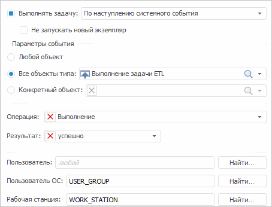

	Доступны следующие настройки:

		- Не запускать новый экземпляр.
		 Установка данного флажка позволяет избежать одновременного выполнения
		 нескольких экземпляров одной и той же задачи: задача не будет
		 запущена, пока не завершится выполнение предыдущего экземпляра
		 этой задачи. Если при выполнении задачи пропущены один или несколько
		 её очередных запусков, то они будут выполнены в порядке очереди;

		- Выбор одного или нескольких объектов, генерирующих событие:

			- Любой объект.
			 При установке данного переключателя событие будет генерироваться
			 при выполнении определенной операции над любым объектом репозитория;

			- Все объекты типа.
			 При выборе данного переключателя событие будет генерироваться
			 при выполнении определенной операции над объектами репозитория
			 выбранного типа. Выбрать объект можно из раскрывающегося списка
			 или нажать на значок поиска  и ввести
			 название объекта;

			- Конкретный объект.
			 При выборе данного переключателя событие будет генерироваться
			 при выполнении определенной операции над указанным объектом
			 репозитория. Выбрать объект можно из раскрывающегося списка
			 или нажать на значок поиска  и ввести
			 название объекта. Для удаления объекта из поля нажмите кнопку
			 ;

		- Выбор операции, генерирующей событие:

			- Операция. Из
			 раскрывающегося списка выберите операцию, при выполнении которой
			 будет генерироваться событие. Операции аналогичны [операциям
			 менеджера безопасности](Admin.chm::/05_AccessProtocol/Admin_AccessProtocol_EvetsType.htm). В раскрывающемся
			 списке доступны операции создания, чтения, редактирования,
			 изменения, изменения прав, удаления, экспорта, импорта и печати.
			 Для удаления операции из поля нажмите кнопку ;

			- Результат. Из
			 раскрывающегося списка выберите результат выполнения выбранной
			 операции, при котором будет генерироваться событие. Для удаления
			 результата из поля нажмите кнопку ;

		- Выбор пользователя, генерирующего событие:

			- Пользователь.
			 Выберите пользователя репозитория, генерирующего событие.
			 При нажатии кнопки «Найти»
			 будет открыто окно «[Выбор
			 пользователей и групп](Admin.chm::/03_Admin/Admin_UsersGroups.htm)» для поиска
			 пользователей;

			- Пользователь ОС.
			 Выберите пользователя операционной системы, генерирующего
			 событие. При нажатии кнопки «Найти»
			 будет открыто окно «[Выбор
			 пользователей и групп](Admin.chm::/03_Admin/Admin_UsersGroups.htm)» для поиска
			 пользователей;

			- Рабочая станция.
			 Выберите рабочую станцию, на которой было сгенерировано событие.
			 При нажатии кнопки «Найти»
			 будет открыто окно «[Выбор рабочих станций](Admin.chm::/04_SecurityPolicy/Security_chooseWKS.htm)»
			 для поиска рабочих станций.

	Выбор пользователя или рабочей станции
	 зависит от того, где будет генерироваться событие. Можно выбрать один
	 или несколько вариантов.

	После выполнения действий задача будет запускаться на выполнение
	 после наступление заданного системного события по заданным параметрам.

## По наступлению настраиваемого события

	Примечание.
	 Доступно только в настольном приложении.

	При выборе варианта «По наступлению
	 настраиваемого события» задача будет выполняться при наступлении
	 [пользовательского
	 события](UiDevEnv.chm::/04_NavigatorSetting/Classes_Object/Classes_Events.htm), которое вызывается из кода на Fore. На
	 странице/вкладке «Расписание»
	 будет доступен выбор пользовательского события:

	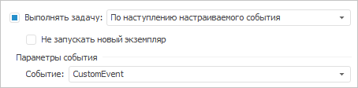

	Доступны следующие настройки:

		- Не запускать новый экземпляр.
		 Установка данного флажка позволяет избежать одновременного выполнения
		 нескольких экземпляров одной и той же задачи: задача не будет
		 запущена, пока не завершится выполнение предыдущего экземпляра
		 этой задачи;

		- Параметры события.
		 В раскрывающемся списке выберите пользовательское событие, при
		 генерации которого будет выполнена задача. В раскрывающемся
		 списке доступны события, определенные на вкладке «[Пользовательские метаданные > События](UiDevEnv.chm::/04_NavigatorSetting/Classes_Object/Classes_Events.htm)»
		 диалога настройки параметров репозитория.

	После выполнения действий задача будет запускаться на выполнение
	 после наступления пользовательского события, которое вызывается из
	 кода на Fore.

### Пример генерации события

	Указанный пример генерирует событие CustomEvent.
	 Если при выполнении примера запущен планировщик задач и в контейнере,
	 с которым работает планировщик, имеются задачи, запускаемые при выполнении
	 данного события, то они будут выполнены.

		Sub InvokeEvent;

		Var

		    MB: IMetabase;

		    CustomClassExtender: IMetabaseCustomExtender;

		    Events: IMetabaseCustomForeEvents;

		    ForeEvent: IMetabaseCustomForeEvent;

		Begin

		    MB := MetabaseClass.Active;

		    // Получение контейнера пользовательских классов

		    CustomClassExtender := Mb.SpecialObject(MetabaseSpecialObject.CustomExtender).Edit As IMetabaseCustomExtender;

		    // Получение списка событий

		    Events := CustomClassExtender.Events;

		    ForeEvent := Events.FindByName("CustomEvent");

		    // Генерация события

		    ForeEvent.Invoke;

		End Sub InvokeEvent;

## Не задано

	Расписание для выполнения задачи не задано. Вариант доступен для
	 выбора с целью совмещения функциональности с предыдущими версиями.

См. также:

[Создание
 запланированных задач](Work_Task.htm)

		Справочная
		 система на версию 10.9
		 от 18/08/2025,
		 © ООО «ФОРСАЙТ»,
