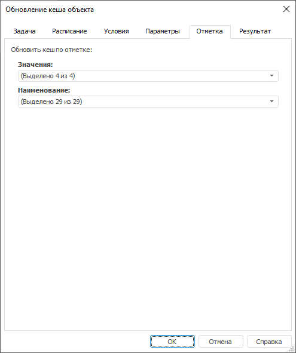

# Настройка обновления кеша объекта: Контейнер запланированных задач, настольное приложение

Настройка обновления кеша объекта: Контейнер запланированных задач, настольное приложение
-

# Настройка обновления кеша объекта

При настройке задачи [обновления
 кеша](UiNav.chm::/02_Navigator/UiNav_Cache.htm) на вкладке «[Параметры](UiAppSrv_Work_Tasks_CreateTask_Parameters.htm)»
 в [мастере
 настройки задачи](../2_Work_interface/Operations_with_tasks.htm#master) выбирается объект репозитория. Если объект параметрический,
 то там же задается набор значений параметров. При обновлении кеша многомерного
 источника данных также будет доступна вкладка «Отметка»,
 на которой можно определить отметку измерений выбранного объекта.

Примечание.
 Настройка обновления кеша объекта доступна только в настольном приложении.

[Для открытия мастера настройки задачи](javascript:TextPopup(this))

		- в веб-приложении:

			- нажмите кнопку  «Редактировать», расположенную
			 напротив задачи;

			- дважды щёлкните по задаче;

		- в настольном приложении:

			- выполните команду «Задача
			 > Редактировать» главного меню;

			- выполните команду «Редактировать»
			 в контекстном меню задачи;

			- нажмите кнопку  на панели
			 инструментов;

			- нажмите клавишу F4;

			- дважды щёлкните по задаче.

	Также мастер настройки задачи открывается при её [создании](../2_Work_interface/Operations_with_tasks.htm).

По умолчанию обновление кеша осуществляется по максимальной отметке
 всех измерений объекта. Если требуется частичное обновление кеша, то измените
 отметку по необходимым измерениям.

Процесс обновления кеша запускается и выполняется на том компьютере,
 где запущен планировщик задач. При необходимости запуск процесса можно
 перенести на какой-либо BI-сервер. Для этого необходимо задать настройку
 UpdCache раздела [Service](Setup.chm::/UiWebSetup/03_Setup_Web/BI_Server_Registry_Key.htm#service)
 в реестре или файле [settings.xml](Setup.chm::/UiWebSetup/03_Setup_Web/BI_Server_Settings_XML.htm#service).

Если для объекта кеш еще не создан, то он будет создан при первом выполнении
 задачи.

Примечание.
 Вкладка «Отметка» доступна, если
 в репозитории используется [режим
 работы кеширования](Setup.chm::/UiWebSetup/03_Setup_Web/BI_Server_Registry_Key.htm#inmem) данных.

См. также:

[Настройка
 объекта задачи](UiAppSrv_Work_Tasks_CreateTask_Parameters.htm) | [Создание запланированных
 задач](Work_Task.htm) | [Кеширование](UiNav.chm::/02_Navigator/UiNav_Cache.htm)

		Справочная
		 система на версию 10.9
		 от 18/08/2025,
		 © ООО «ФОРСАЙТ»,
