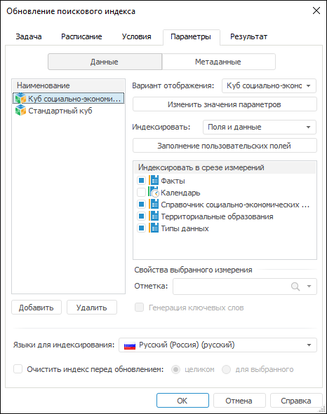
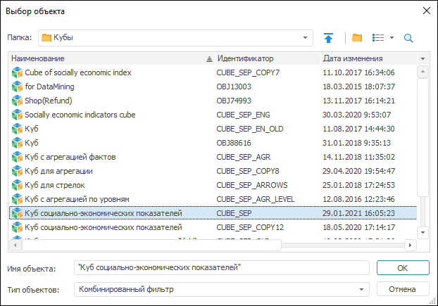
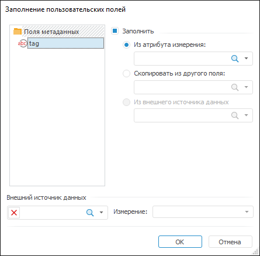
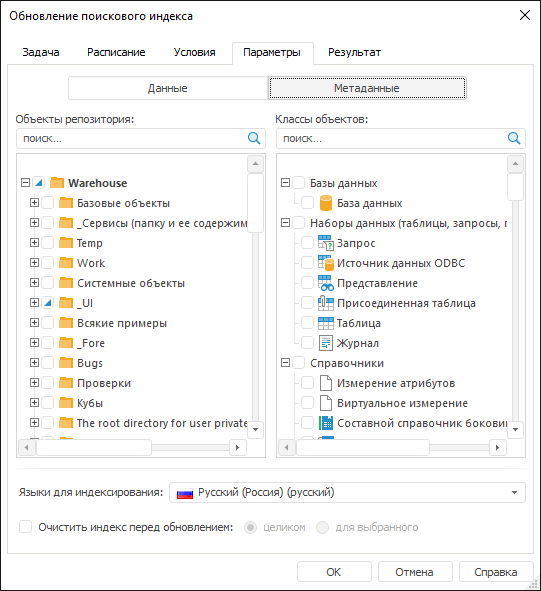

# Настройка обновления поискового индекса: Настольное приложение

Настройка обновления поискового индекса: Настольное приложение
-

# Настройка обновления поискового индекса

Задача обновления поискового индекса используется, если в репозитории
 настроен [BI-поиск](Setup.chm::/BISearch/Desktop_application_setting.htm).
 При настройке задачи на вкладке «[Параметры](UiAppSrv_Work_Tasks_CreateTask_Parameters.htm)»
 в [мастере
 настройки задачи](../2_Work_interface/Operations_with_tasks.htm#master) добавляются дополнительные параметры.

Примечание.
 Настройка обновления поискового индекса доступна только в настольном приложении.

[Для открытия мастера настройки задачи](javascript:TextPopup(this))

		- в веб-приложении:

			- нажмите кнопку  «Редактировать», расположенную
			 напротив задачи;

			- дважды щёлкните по задаче;

		- в настольном приложении:

			- выполните команду «Задача
			 > Редактировать» главного меню;

			- выполните команду «Редактировать»
			 в контекстном меню задачи;

			- нажмите кнопку  на панели
			 инструментов;

			- нажмите клавишу F4;

			- дважды щёлкните по задаче.

	Также мастер настройки задачи открывается при её [создании](../2_Work_interface/Operations_with_tasks.htm).

На вкладке имеется две группы настроек: «Данные»
 и «Метаданные». Настройка данных
 и метаданных отличается, за исключением настроек:

	- Языки для индексирования.
	 В раскрывающемся списке выберите язык. В соответствии с этим языком
	 будут выбраны экземпляры Solr, в области которых будут создаваться
	 все необходимые файлы с индексированными данными. По умолчанию для
	 выбора доступны русский и английский язык, если требуется дополнительные
	 языки, то [добавьте
	 их вручную](setup.chm::/BISearch/Add_Language.htm);

Важно. По
 умолчанию язык для индексирования не выбран. Выберите его, иначе источники
 не будут проиндексированы.

	- Очистить индекс перед обновлением.
	 Позволяет произвести очистку индексных файлов в области экземпляров
	 Solr, работающих с выбранным языком. Доступны следующие варианты очистки:

		- Целиком. Будут удалены
		 все индексированные данные для экземпляров Solr, работающих с
		 выбранным языком;

		- Для выбранного.
		 Будут удалены все индексированные данные только для тех источников,
		 которые добавлены в список. Актуально, если производится повторная
		 индексация выбранных источников и необходимо сохранить индексированные
		 данные других источников.

Примечание.
 При индексации источников также будут проиндексированы их метаданные.

## Данные

Для индексации элементов измерений, которые формируют срезы данных,
 нажмите кнопку «Добавить» и в
 окне выберите стандартные кубы или базы данных временных рядов:

Для каждого источника:

	- в раскрывающемся списке выберите [вариант
	 отображения](UiNavObj.chm::/cube/createcube/master_standart/uimd_cube_createcube_master_standart_7.htm#agr) источника;

	- если источник параметрический, то нажмите кнопку «Изменить
	 значение параметров», чтобы определить параметры;

	- в раскрывающемся списке «Индексировать»
	 выберите, какие именно данные будут индексироваться:

		- поля и данные;

		- пользовательские поля;

		- системные поля;

		- пользовательские и системные поля;

	- для задания значений [пользовательских
	 полей](Setup.chm::/BISearch/Desktop_application_setting.htm#fields) на базе значений каких-либо атрибутов измерений
	 нажмите кнопку «Заполнение пользовательских
	 полей». Будет открыто одноименное окно:

В окне выберите поле в разделе «Поля
 данных», установите флажок «Заполнить»,
 и выберите способ заполнения:

		- Из атрибута измерения.
		 В качестве значения поля для каждого индексируемого элемента измерения
		 будут указываться значения выбранного атрибута. Из раскрывающегося
		 списка выберите пользовательские поля или нажмите на значок поиска
		  и введите название объекта;

		- Скопировать из другого
		 поля. В качестве значения поля для каждого индексируемого
		 элемента измерения будут указываться значения другого выбранного
		 поля противоположного назначения, то есть поля с данными могут
		 быть привязаны только к полям с метаданными и наоборот. Из раскрывающегося
		 списка выберите пользовательские или системные поля или нажмите
		 на значок поиска  и
		 введите название объекта. Данный вариант используется для переноса
		 данных между схемами Solr, в которых хранятся индексированные
		 данные/метаданные источника;

		- Из внешнего источника данных.
		 Данный вариант доступен, если выбран внешний источник данных и
		 его измерение. Структура внешнего источника должна быть такая
		 же, как и у индексируемого источника, а также в нем должно быть
		 одно дополнительное измерение. Из раскрывающегося списка выберите
		 элементы измерения или нажмите на значок поиска  и введите название
		 элемента измерения внешнего источника данных. В качестве связи
		 с полем выбирается один из доступных элементов измерения. При
		 индексации в качестве значений поля будут подставляться данные
		 по этому элементу;

		- Внешний источник данных.
		 Из раскрывающегося списка выберите стандартные кубы или базы данных
		 временных рядов или нажмите на значок поиска 
		 и введите название объекта. Для удаления объекта из поля нажмите
		 кнопку ;

			- Измерение. Из
			 раскрывающегося списка выберите измерение выбранного источника
			 данных;

	- в группе «Индексировать в срезе
	 измерений» отметьте измерения, элементы которых будут присутствовать
	 в наименовании результата поиска. Выделите необходимое измерение и
	 настройте:

		- Отметка. В раскрывающемся
		 списке отметьте элементы по каждому измерению. Индексация будет
		 производиться только по отмеченным элементам;

		- Генерация ключевых слов.
		 Позволяет формировать список слов для измерения, повышающих
		 релевантность поиска по данному измерению. По умолчанию в список
		 измерений включены все измерения, кроме календарного, и по всем
		 измерениям выставлена максимальная отметка. Календарное измерение
		 всегда индексируется как свободное. Если в списке для него установить
		 флажок, то его элементы будут сгруппированы и проиндексированы
		 по уровням.

## Метаданные

Если задача используется для обновления метаданных источников, то нажмите
 кнопку «Метаданные» в верхней
 части вкладки для указания дополнительных параметров:

На странице отметьте источники, классы объектов и выберите язык для
 индексирования:

	- Объекты
	 репозитория. В дереве объектов флажками отметьте источники,
	 метаданные которых необходимо индексировать. Для поиска источника
	 введите его название в поле после чего он будет отображен в дереве
	 объектов;

	- Классы
	 объектов. В дереве классов отметьте классы объектов. В соответствии
	 с этими классами будут отобраны все объекты и проиндексированы их
	 метаданные. Для класса объекта введите его название в поле после чего
	 он будет отображен в дереве классов.

См. также:

[Настройка
 объекта задачи](UiAppSrv_Work_Tasks_CreateTask_Parameters.htm) | [Создание запланированных
 задач](Work_Task.htm)

		Справочная
		 система на версию 10.9
		 от 18/08/2025,
		 © ООО «ФОРСАЙТ»,
