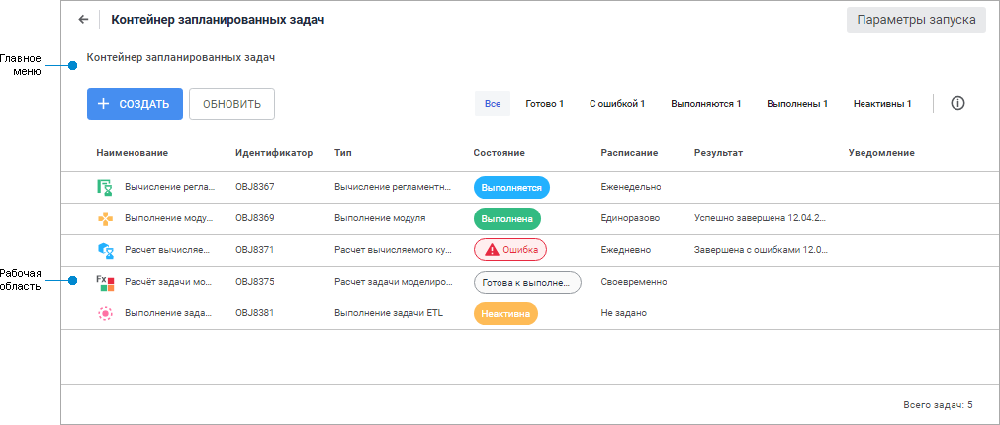
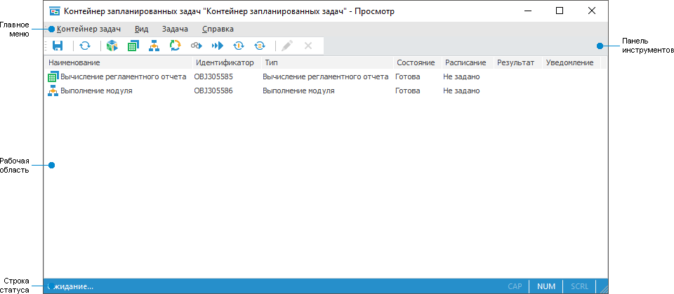

# Начало работы с инструментом «Планировщик задач»

Начало работы с инструментом «Планировщик задач»
-

# Начало работы с инструментом «Планировщик задач»

Для начала работы создайте новый или откройте готовый контейнер запланированных
 задач.

[Создание нового
 контейнера запланированных задач](javascript:TextPopup(this))

	Для создания нового контейнера запланированных задач в [навигаторе
	 объектов](GetStarted.chm::/Interface/interface_navigator.htm):

		- в веб-приложении нажмите кнопку  «Создать» в главном меню и выберите
		 тип объекта на боковой панели «[Новый объект](UiNav.chm::/02_Navigator/General_Principles_of_Work.htm#add_object)»;

		- в настольном приложении выполните одно из действий:

			- нажмите кнопку «Новый
			 объект > Другие > Контейнер задач» в группе «Создать» на вкладке «Главная» ленты инструментов;

			- выполните команду «Создать
			 > Другие
			 > Контейнер
			 задач» в контекстном меню навигатора объектов.

[Открытие готового
 контейнера запланированных задач](javascript:TextPopup(this))

	Для открытия готового контейнера запланированных задач на просмотр
	 в [навигаторе
	 объектов](GetStarted.chm::/Interface/Interface_Navigator.htm) выделите контейнер запланированных задач
	 и выполните одно из действий:

		- в веб-приложении:

			- выполните команду «Открыть»
			 в контекстном меню контейнера запланированных задач;

			- выполните команду «Открыть
			 в новой вкладке» в контекстном меню контейнера запланированных
			 задач;

			- выполните команду «Открыть
			 в новом окне» в контекстном меню контейнера запланированных
			 задач;

			- дважды щёлкните по контейнеру запланированных задач;

			- нажмите клавишу ENTER;

		- в настольном приложении:

			- нажмите кнопку 
			 «Открыть» в группе
			 «Открыть» на вкладке
			 «Главная» ленты инструментов;

			- выполните команду «Открыть»
			 в контекстном меню контейнера запланированных задач;

			- дважды щёлкните по контейнеру запланированных задач.

Для создания задач смотрите статью
 «[Создание
 запланированных задач](3_Work_Tasks/Work_Task.htm)».

Для запуска задач на выполнение
 смотрите статью «[Запуск
 задач на выполнение](1_Work_AppSrv/UiAppSrv_Work_Run.htm)».

Если остались вопросы, то смотрите
 статью «[Вопросы
 и ответы](AppSrv_FAQ.htm)».

Функциональность планировщика задач может быть расширена за счёт использования
 специальных параметров в реестре, описание которых представлено в разделе
 «[Расширенное
 логирование и получение дополнительной отладочной информации](KnowledgeBase.chm::/01_Fore/KB000030/KnowledgeBase_KB000030_1.htm)».

Основные окна инструмента «Планировщик
 задач»:

	- Контейнер запланированных задач.
	 Предназначен для настройки отложенных задач над различными [объектами](3_Work_Tasks/UiAppSrv_Work_Tasks_CreateTask_Parameters.htm);

	- Планировщик задач. Предназначен
	 для выполнения задач по расписанию из заданных контейнеров.

Примечание.
 В ОС Linux планировщик задач используется в виде консольного приложения
 Scheduler.

	 Контейнер запланированных задач в веб-приложении Контейнер запланированных задач в настольном приложении Планировщик задач

		

		

		

[Элементы окна
 контейнера запланированных задач в веб-приложении](javascript:TextPopup(this))

		- Главное меню. Содержит
		 список команд, предназначенных для выполнения различных операций
		 над задачами и контейнером запланированных задач;

		- Рабочая область.
		 Предназначена для работы с задачами.

[Элементы окна
 контейнера запланированных задач в настольном приложении](javascript:TextPopup(this))

		- [Главное
		 меню](GetStarted.chm::/Interface/Interface_Description.htm#main_menu)
		 Содержит список команд, предназначенных для выполнения различных
		 операций над задачами и контейнером запланированных задач;

		- [Панель
		 инструментов](GetStarted.chm::/Interface/Interface_Description.htm#toolbars). Содержит команды и элементы
		 управления для выполнения различных операций над задачами и контейнером
		 запланированных задач;

		- Рабочая область.
		 Предназначена для работы с задачами;

		- [Строка
		 статуса](GetStarted.chm::/Interface/Interface_Description.htm#status_line). Отображает процесс и результат
		 выполнения задачи, а также дублирует названия пунктов меню.

[Элементы окна
 планировщика задач](javascript:TextPopup(this))

		- Параметры запуска.
		 Содержит время запуска планировщика задач и параметры, с которыми
		 планировщик был запущен;

		- Список выполняемых контейнеров.
		 Содержит список контейнеров, выполняемых планировщиком;

		- Панель управления.
		 Предназначена проверки наличия новой версии конфигурационного
		 файла и закрытия окна планировщика.

См. также:

[Планирование
 задач и выполнение их по расписанию](UiAppSrv_purpose.htm)

		Справочная
		 система на версию 10.9
		 от 18/08/2025,
		 © ООО «ФОРСАЙТ»,
